

  

<h2 style="text-align: center;"> Universidad Peruana de Ciencias Aplicadas </h2>

<h4 style="text-align: center"> Ingeniería de Software </h4>

<h4 style="text-align: center"> Periodo: 202620 </h4>

<h4 style="text-align: center"> 1ASI0732 | Diseño de Experimentos de Ingeniería de Software </h4>

<h4 style="text-align: center"> NRC: 9082 </h4>

<h4 style="text-align: center"> Docente: Juan Fernando Ysen Paiba </h4>

<h3 style="text-align: center;"> Informe del Trabajo Final </h3>

<h4 style="text-align: center"> Startup: RichStudent</h4>

<h4 style="text-align: center"> Producto: UPC-X</h4>

<h4 style="text-align: center">Integrantes:</h4>

   <table style="margin-left: auto; margin-right: auto;">
      <tr>
         <td>u202312109</td>
         <td>Eduardo Jose Cossar Sanchez</td>
      </tr>
      <tr>
         <td></td>
         <td>Gilbert Alonso Huarcaya Matias</td>
      </tr>
      <tr>
         <td>u201821684</td>
         <td>Luis Manuel Espinoza Navarrete</td>
      </tr>
      <tr>
         <td></td>
         <td>Manuel Alejandro Molina Vásquez</td>
      </tr>
      <tr>
         <td>U202022211</td>
         <td>Mathias Javier Murillo</td>
      </tr>
   </table>

 

<h5 style="text-align: center; font-style: italic;"> 2026 </h5>

# Registro de Versiones del Informe

| Version | Fecha | Autor | Descripción de modificación |
|---------|-------|-------|-----------------------------|
| 1.0 | 31/08/2026 | Eduardo Jose Cossar Sanchez | Creación del repositorio del informe y estructura inicial del documento: carátula, registro de versiones y tabla de contenidos. |
| 1.1 | 31/08/2026 | Eduardo Jose Cossar Sanchez | Redacción inicial del Capítulo I: descripción de la startup RichStudent y primera versión del Solution Profile. |
| 1.2 | 01/09/2026 | Luis Manuel Espinoza Navarrete | Desarrollo del Capítulo I para RichStudent y UPC-X: análisis 5W+2H completo, Lean UX Process (Problem Statements, Assumptions e Hypothesis Statements) y segmentos objetivo. |
| 1.3 | 01/09/2026 | Mathias Javier Murillo | Actualización de la tabla de perfiles de integrantes del equipo en la sección 1.1.2. |
| 1.4 | 01/09/2026 | Luis Manuel Espinoza Navarrete | Incorporación de la sección Student Outcome con el cuadro del ABET Student Outcome 4 e integración de la imagen del Lean UX Canvas en la sección 1.2.2.4. |
| 1.5 | 03/09/2026 | Eduardo Jose Cossar Sanchez | Incorporación de las fotografías de los integrantes del equipo en la sección 1.1.2. |
| 1.6 | 04/09/2026 | Gilbert Alonso Huarcaya Matias | Incorporación del marco ético profesional ACM/IEEE Computer Society en la sección Student Outcome, con sus referencias bibliográficas, y desglose del registro de versiones por autor. |

# Project Report Collaboration Insights

## AV1

### Tareas

   <table style="margin-left: auto; margin-right: auto;">
      <tr>
         <td>Eduardo Jose Cossar Sanchez</td>
         <td>Desarrollo Capitulo 1, 2, 3, 4 y 5</td>
      </tr>
      <tr>
         <td>Gilbert Alonso Huarcaya Matias</td>
         <td>Desarrollo Capitulo 1, 2, 3, 4 y 5</td>
      </tr>
      <tr>
         <td>Luis Manuel Espinoza Navarrete</td>
         <td>Desarrollo Capitulo 1, 2, 3, 4 y 5</td>
      </tr>
      <tr>
         <td>Manuel Alejandro Molina Vásquez</td>
         <td>Desarrollo Capitulo 1, 2, 3, 4 y 5</td>
      </tr>
      <tr>
         <td>Mathias Javier Murillo</td>
         <td>Desarrollo Capitulo 1, 2, 3, 4 y 5</td>
      </tr>
   </table>

### GitHub Collaboration Insights

# Contenido

- [Registro de Versiones del Informe](#registro-de-versiones-del-informe)
- [Project Report Collaboration Insights](#project-report-collaboration-insights)
  - [AV1](#av1)
- [Contenido](#contenido)
- [Student Outcome](#student-outcome)
  - [ABET – EAC - Student Outcome 4](#abet-eac-student-outcome-4)
  - [Marco ético profesional: IEEE Computer Society y ACM](#marco-ético-profesional-ieee-computer-society-y-acm)
- [Capítulo I: Introducción](#capítulo-i-introducción)
  - [1.1. Startup Profile](#11-startup-profile)
    - [1.1.1. Descripción de la Startup](#111-descripción-de-la-startup)
    - [1.1.2. Perfiles de integrantes del equipo](#112-perfiles-de-integrantes-del-equipo)
  - [1.2. Solution Profile](#12-solution-profile)
    - [1.2.1. Antecedentes y problemática](#121-antecedentes-y-problemática)
      - [What (¿Qué?)](#what-qué)
      - [Who (¿Quién?)](#who-quién)
      - [Where (¿Dónde?)](#where-dónde)
      - [When (¿Cuándo?)](#when-cuándo)
      - [Why (¿Por qué?)](#why-por-qué)
      - [How (¿Cómo?)](#how-cómo)
      - [How much (¿Cuánto?)](#how-much-cuánto)
    - [1.2.2. Lean UX Process](#122-lean-ux-process)
      - [1.2.2.1. Lean UX Problem Statements](#1221-lean-ux-problem-statements)
      - [1.2.2.2. Lean UX Assumptions](#1222-lean-ux-assumptions)
      - [1.2.2.3. Lean UX Hypothesis Statements](#1223-lean-ux-hypothesis-statements)
      - [1.2.2.4. Lean UX Canvas](#1224-lean-ux-canvas)
  - [1.3. Segmentos objetivo](#13-segmentos-objetivo)
- [Capítulo II: Requirements Elicitation \& Analysis](#capítulo-ii-requirements-elicitation-analysis)
  - [2.1. Competidores](#21-competidores)
    - [2.1.1. Análisis competitivo](#211-análisis-competitivo)
      - [Competitive Analysis Landscape](#competitive-analysis-landscape)
    - [2.1.2. Estrategias y tácticas frente a competidores](#212-estrategias-y-tácticas-frente-a-competidores)
      - [Afrontando las fortalezas de nuestros competidores:](#afrontando-las-fortalezas-de-nuestros-competidores)
      - [Comprendemos que nuestras fortalezas son:](#comprendemos-que-nuestras-fortalezas-son)
      - [Estrategias](#estrategias)
      - [Tácticas](#tácticas)
      - [Afrontando las debilidades de nuestros competidores:](#afrontando-las-debilidades-de-nuestros-competidores)
      - [Comprendemos que nuestras debilidades son:](#comprendemos-que-nuestras-debilidades-son)
      - [Estrategias](#estrategias-1)
      - [Tácticas](#tácticas-1)
      - [Afrontando las oportunidades de nuestros competidores:](#afrontando-las-oportunidades-de-nuestros-competidores)
      - [Comprendemos que nuestras oportunidades son:](#comprendemos-que-nuestras-oportunidades-son)
      - [Estrategias](#estrategias-2)
      - [Tácticas](#tácticas-2)
      - [Afrontando las amenazas de nuestros competidores:](#afrontando-las-amenazas-de-nuestros-competidores)
      - [Comprendemos que nuestras amenazas son:](#comprendemos-que-nuestras-amenazas-son)
      - [Estrategias](#estrategias-3)
      - [Tácticas](#tácticas-3)
  - [2.2. Entrevistas](#22-entrevistas)
    - [2.2.1. Diseño de entrevistas](#221-diseño-de-entrevistas)
      - [Preguntas generales](#preguntas-generales)
      - [Segmento Objetivo 1: Estudiantes vendedores](#segmento-objetivo-1-estudiantes-vendedores)
      - [Segmento Objetivo 2: Estudiantes compradores](#segmento-objetivo-2-estudiantes-compradores)
      - [Criterios para la selección de entrevistados](#criterios-para-la-selección-de-entrevistados)
    - [2.2.2. Registro de entrevistas](#222-registro-de-entrevistas)
    - [Segmento Objetivo 1](#segmento-objetivo-1)
      - [Datos del Entrevistado #1](#datos-del-entrevistado-1)
      - [Datos del Entrevistado #2](#datos-del-entrevistado-2)
      - [Datos del Entrevistado #3](#datos-del-entrevistado-3)
    - [Segmento Objetivo 2](#segmento-objetivo-2)
      - [Datos del Entrevistado #1](#datos-del-entrevistado-1-1)
      - [Datos del Entrevistado #2](#datos-del-entrevistado-2-1)
      - [Datos del Entrevistado #3](#datos-del-entrevistado-3-1)
    - [2.2.3. Análisis de entrevistas](#223-análisis-de-entrevistas)
  - [2.3. Needfinding](#23-needfinding)
    - [2.3.1. User Personas](#231-user-personas)
    - [2.3.2. User Task Matrix](#232-user-task-matrix)
    - [2.3.3. User Journey Mapping](#233-user-journey-mapping)
    - [2.3.4. Empathy Mapping](#234-empathy-mapping)
    - [2.3.5. As-is Scenario Mapping](#235-as-is-scenario-mapping)
  - [2.4. Ubiquitous Language](#24-ubiquitous-language)
- [Capítulo III: Requirements Specification](#capítulo-iii-requirements-specification)
  - [3.1. To-Be Scenario Mapping](#31-to-be-scenario-mapping)
  - [3.2. User Stories](#32-user-stories)
    - [3.2.1 User Stories](#321-user-stories)
  - [3.3. Product Backlog](#33-product-backlog)
  - [3.4. Impact Mapping](#34-impact-mapping)
- [Capítulo IV: Product Design](#capítulo-iv-product-design)
  - [4.1. Style Guidelines](#41-style-guidelines)
    - [4.1.1. General Style Guidelines](#411-general-style-guidelines)
    - [4.1.2. Web Style Guidelines](#412-web-style-guidelines)
    - [4.1.3. Mobile Style Guidelines](#413-mobile-style-guidelines)
      - [4.1.3.1. iOS Mobile Style Guidelines](#4131-ios-mobile-style-guidelines)
      - [4.1.3.2. Android Mobile Style Guidelines](#4132-android-mobile-style-guidelines)
  - [4.2. Information Architecture](#42-information-architecture)
    - [4.2.1. Organization Systems](#421-organization-systems)
    - [4.2.2. Labeling Systems](#422-labeling-systems)
    - [4.2.3. SEO Tags and Meta Tags](#423-seo-tags-and-meta-tags)
    - [4.2.4. Searching Systems](#424-searching-systems)
    - [4.2.5. Navigation Systems](#425-navigation-systems)
  - [4.3. Landing Page UI Design](#43-landing-page-ui-design)
    - [4.3.1. Landing Page Wireframe](#431-landing-page-wireframe)
    - [4.3.2. Landing Page Mock-up](#432-landing-page-mock-up)
  - [4.4. Mobile Applications UX/UI Design](#44-mobile-applications-uxui-design)
    - [4.4.1. Mobile Applications Wireframes](#441-mobile-applications-wireframes)
    - [4.4.2. Mobile Applications Wireflow Diagrams](#442-mobile-applications-wireflow-diagrams)
    - [4.4.3. Mobile Applications Mock-ups](#443-mobile-applications-mock-ups)
    - [4.4.4. Mobile Applications User Flow Diagrams](#444-mobile-applications-user-flow-diagrams)
  - [4.5. Mobile Applications Prototyping](#45-mobile-applications-prototyping)
    - [4.5.1. Android Mobile Applications Prototyping](#451-android-mobile-applications-prototyping)
    - [4.5.2. iOS Mobile Applications Prototyping](#452-ios-mobile-applications-prototyping)
  - [4.6. Web Applications UX/UI Design](#46-web-applications-uxui-design)
    - [4.6.1. Web Applications Wireframes](#461-web-applications-wireframes)
    - [4.6.2. Web Applications Wireflow Diagrams](#462-web-applications-wireflow-diagrams)
    - [4.6.3. Web Applications Mock-ups](#463-web-applications-mock-ups)
    - [4.6.4. Web Applications User Flow Diagrams](#464-web-applications-user-flow-diagrams)
  - [4.7. Web Applications Prototyping](#47-web-applications-prototyping)
  - [4.8. Domain-Driven Software Architecture](#48-domain-driven-software-architecture)
    - [4.8.1. Software Architecture Context Diagram](#481-software-architecture-context-diagram)
    - [4.8.2. Software Architecture Container Diagrams](#482-software-architecture-container-diagrams)
    - [4.8.3. Software Architecture Components Diagrams](#483-software-architecture-components-diagrams)
  - [4.9. Software Object-Oriented Design](#49-software-object-oriented-design)
    - [4.9.1. Class Diagrams](#491-class-diagrams)
    - [4.9.2. Class Dictionary](#492-class-dictionary)
  - [4.10. Database Design](#410-database-design)
    - [4.10.1. Relational/Non-Relational Database Diagram](#4101-relationalnon-relational-database-diagram)
- [Capítulo V: Product Implementation](#capítulo-v-product-implementation)
  - [5.1. Software Configuration Management](#51-software-configuration-management)
    - [5.1.1. Software Development Environment Configuration](#511-software-development-environment-configuration)
      - [Project Management](#project-management)
      - [Requirements Management](#requirements-management)
      - [Product UX/UI Design](#product-uxui-design)
      - [Software Development](#software-development)
      - [Software Deployment](#software-deployment)
      - [Software Documentation](#software-documentation)
    - [5.1.2. Source Code Management](#512-source-code-management)
    - [5.1.3. Source Code Style Guide \& Conventions](#513-source-code-style-guide-conventions)
      - [HTML](#html)
      - [CSS](#css)
      - [JavaScript (Landing)](#javascript-landing)
      - [TypeScript (Angular Web App)](#typescript-angular-web-app)
      - [Dart (Flutter)](#dart-flutter)
      - [Java (Spring Boot)](#java-spring-boot)
      - [Gherkin](#gherkin)
    - [5.1.4. Software Deployment Configuration](#514-software-deployment-configuration)
      - [Landing Page (GitHub Pages):](#landing-page-github-pages)
  - [5.2. Product Implementation \& Deployment](#52-product-implementation-deployment)
    - [5.2.1. Sprint Backlogs](#521-sprint-backlogs)
      - [Sprint 1](#sprint-1)
      - [Sprint Planning Background](#sprint-planning-background)
      - [Aspect Leaders and Collaboration (LACX)](#aspect-leaders-and-collaboration-lacx)
    - [5.2.2. Implemented Landing Page Evidence](#522-implemented-landing-page-evidence)
    - [5.2.3. Implemented Frontend-Web Application Evidence](#523-implemented-frontend-web-application-evidence)
    - [5.2.4. Implemented Native-Mobile Application Evidence](#524-implemented-native-mobile-application-evidence)
    - [5.2.5. Implemented RESTful API and/or Serverless Backend Evidence](#525-implemented-restful-api-andor-serverless-backend-evidence)
    - [5.2.6. RESTful API documentation](#526-restful-api-documentation)
    - [5.2.7. Team Collaboration Insights](#527-team-collaboration-insights)
  - [5.3. Video About-the-Product](#53-video-about-the-product)
- [Bibliografía](#bibliografía)

# Student Outcome

Cada participante del equipo debe sustentar evidencia de cómo las actividades realizadas en el trabajo final han ayudado a desarrollar las dimensiones del student outcome. Por ello en esta sección debe haber una subsección por cada alumno donde éste describa por escrito la relación entre el outcome, sus dimensiones y el trabajo que ha realizado. Esto se complementa con lo reflejado en los testimonios expuestos que forman parte del video About The Team.

El curso contribuye al cumplimiento del Student Outcome ABET:

#### ABET – EAC - Student Outcome 4

**Criterio:** La capacidad de reconocer responsabilidades éticas y profesionales en situaciones de ingeniería y hacer juicios informados, que deben considerar el impacto de las soluciones de ingeniería en contextos globales, económicos, ambientales y sociales.

#### Marco ético profesional: IEEE Computer Society y ACM

El equipo reconoce que el ejercicio de la ingeniería de software se rige por marcos éticos
establecidos por las sociedades profesionales de la disciplina. El *Software Engineering
Code of Ethics and Professional Practice*, aprobado conjuntamente por la **ACM** y la
**IEEE Computer Society**, establece que el ingeniero de software debe actuar de manera
consistente con el interés público y con los intereses legítimos de sus clientes y
usuarios (ACM/IEEE-CS Joint Task Force on Software Engineering Ethics and Professional
Practices, 1999). A ello se suma el *ACM Code of Ethics and Professional Conduct*, que
exige respetar la privacidad y la confidencialidad de la información de las personas
(Association for Computing Machinery, 2018).

Estos marcos tuvieron consecuencias concretas en el diseño de UPC-X:

- **Privacidad por diseño.** La verificación de identidad se resuelve mediante el correo
  institucional `@upc.edu.pe` y un código de un solo uso, en lugar de solicitar documentos
  de identidad (DNI) por chat. Se recoge el dato mínimo necesario para acreditar la
  pertenencia a la comunidad UPC, en línea con el principio de respeto a la privacidad del
  *ACM Code of Ethics* (1.6) y con la Ley N.° 29733 de Protección de Datos Personales.
- **Interés público sobre métrica de adopción.** El aviso permanente de coordinar la
  entrega dentro del campus y de no adelantar montos elevados prioriza la seguridad del
  estudiante por encima del volumen de transacciones, atendiendo al principio 1.03 del
  código conjunto ACM/IEEE-CS: aprobar software solo si es seguro y no amenaza la calidad
  de vida.
- **Honestidad en las afirmaciones.** Las hipótesis del Lean UX Process se formularon con
  criterios de éxito medibles y falsables, y no como promesas de resultado, siguiendo el
  principio de no hacer declaraciones engañosas sobre el producto (principio 1.06).

La adhesión a estos códigos no es un requisito puntual de la entrega: define el estándar
profesional de largo plazo al que el equipo aspira como futuros ingenieros de software, y
orienta las decisiones de diseño que se documentan en los capítulos siguientes.

En el siguiente cuadro se describe las acciones realizadas y enunciados de conclusiones por parte del grupo, que permiten sustentar el haber alcanzado el logro del ABET – EAC - Student Outcome 4.

<table>
  <thead>
    <tr>
      <th>Criterio específico</th>
      <th>Acciones realizadas</th>
      <th>Conclusiones</th>
    </tr>
  </thead>
  <tbody>
    <tr>
      <td rowspan="5"><strong>4.c.1 Reconoce responsabilidad ética y profesional en situaciones de ingeniería de software</strong></td>
      <td><strong>Eduardo Jose Cossar Sanchez</strong> <b>AV1:</b> Durante el AV1 elaboré la descripción de la startup RichStudent con su misión y visión, y redacté los perfiles del equipo en el Capítulo I. Al construir el Startup Profile apliqué el framework 5W+2H para enmarcar antecedentes y problemática de UPC-X, sustentando las afirmaciones con fuentes verificables (INDECOPI, La República, Gothelf y Seiden). Procuré no dramatizar el riesgo de estafa ni minimizarlo: documenté el caso documentado de suplantación de identidad en Marketplace como ilustración del vacío que la verificación <code>@upc.edu.pe</code> busca cerrar, sin pedir DNI en chat. Sobre esa base redacté los Lean UX Problem Statements para compradores y vendedores, formulé Assumptions, Hypothesis Statements con criterios de éxito medibles y consolidé el Lean UX Canvas. Finalmente definí los segmentos objetivo (estudiantes vendedores y compradores) con criterios demográficos, geográficos y psicográficos.</td>
      <td rowspan="5"><b>AV1:</b> En el AV1, el equipo reconoció su responsabilidad ética y profesional al fundamentar UPC-X con evidencia verificable y no con suposiciones: el Startup Profile (RichStudent, misión, visión y perfiles del equipo), el Solution Profile con antecedentes estructurados bajo 5W+2H —citando INDECOPI, prensa y datos de precios entre pares— y el Lean UX Process completo (Problem Statements, Assumptions, Hypothesis Statements y Lean UX Canvas). Se priorizó la verificación institucional <code>@upc.edu.pe</code> como filtro de confianza en lugar de intercambiar documentos de identidad por WhatsApp, alineado con el riesgo documentado de suplantación. La segmentación de estudiantes vendedores y compradores, la decisión de entrega en campus y el experimento de mínimo esfuerzo con demo Figma dejaron trazabilidad entre problema, hipótesis y validación pendiente. Estos artefactos del Capítulo I constituyen la base sobre la que se construirán Needfinding, Product Design e Implementación en entregas posteriores.</td>
    </tr>
    <tr>
      <td><strong>Gilbert Alonso Huarcaya Matias</strong> <b>AV1:</b> Durante el AV1 participé en la redacción colaborativa del Capítulo I, revisando que la descripción de RichStudent y UPC-X fuera coherente con el dominio del marketplace universitario. Apoyé la elaboración de los segmentos objetivo, verificando que los aspectos demográficos, geográficos y psicográficos reflejaran a la comunidad UPC real (sedes Monterrico, San Miguel, San Isidro y Villa) y no a un mercado genérico. Revisé las Lean UX Assumptions y User Assumptions para asegurar que cada feature propuesta (login verificado, chat, voucher Yape, rating, puntos de encuentro) quedara enunciada como un supuesto sujeto a validación empírica, con su criterio de éxito medible, y no como una necesidad dada por confirmada. Esta distinción es una exigencia metodológica del Lean UX Process: sostenerla evita que el equipo construya sobre afirmaciones no verificadas. Incorporé el marco ético profesional de la ACM y la IEEE Computer Society en esta sección, derivando de él tres decisiones concretas de diseño (verificación por correo institucional en lugar de solicitar DNI por chat, prioridad de la seguridad del estudiante sobre la métrica de adopción, y formulación de hipótesis falsables en lugar de promesas de resultado). Colaboré en el Registro de Versiones, desglosándolo por autor según exige el enunciado, y en la sección Project Report Collaboration Insights.</td>
    </tr>
    <tr>
      <td><strong>Luis Manuel Espinoza Navarrete</strong> <b>AV1:</b> Durante el AV1 me encargué de redactar mi perfil de integrante con las habilidades técnicas que aporto al equipo (DevOps, CI/CD, AWS/GCP) y de mantener alineados los artefactos del informe con la implementación futura del producto. Integré la imagen del Lean UX Canvas en la sección 1.2.2.4 y verifiqué que la estructura del README —portada, registro de versiones, tabla de contenidos y Student Outcome— cumpliera con el formato del enunciado del curso. Al documentar las Business Assumptions y el experimento de mínimo esfuerzo (demo navegable + post en grupo de sede), procuré que las métricas de éxito propuestas (200 usuarios activos, 50 transacciones en el primer mes) fueran aspiracionales pero medibles, evitando prometer resultados sin experimento. Reconocí que configurar el repositorio y el flujo de trabajo del equipo con trazabilidad es una obligación profesional previa a cualquier entrega.</td>
    </tr>
    <tr>
      <td><strong>Manuel Alejandro Molina Vásquez</strong> <b>AV1:</b> Durante el AV1 colaboré en la redacción del análisis 5W+2H del Solution Profile, profundizando en las dimensiones Who, Where y When para delimitar el alcance a estudiantes UPC en sedes de Lima y al ciclo académico. Apoyé la formulación de las Lean UX Hypothesis Statements con criterios de éxito cuantificables (60% de chats iniciados tras registro, bounce rate menor al 30%, 40% de chats con voucher Yape, 50% con punto de encuentro acordado), procurando que cada hipótesis fuera falsable y no una afirmación de marketing. Revisé que las User Benefits para vendedores y compradores reflejaran el valor real del campus cerrado —reputación portable, precios entre pares, coordinación en sede— con responsabilidad profesional frente al segmento objetivo.</td>
    </tr>
    <tr>
      <td><strong>Mathias Javier Murillo</strong> <b>AV1:</b> Durante el AV1 participé en la elaboración del Lean UX Process, en particular las Business Outcomes y Business Assumptions, articulando cómo la adopción inicial (200 usuarios activos, 50 transacciones) se vincula con la propuesta de valor de UPC-X. Colaboré en la redacción de los segmentos objetivo y en la revisión cruzada del Capítulo I para garantizar consistencia terminológica (marketplace, verificación institucional, economía circular en campus). Al documentar las restricciones deliberadas del primer incremento —solo correo <code>@upc.edu.pe</code>, encuentro en sede, Yape/Plin— reconocí que acotar el alcance es una decisión profesional que protege al equipo de sobreingeniería antes de validar la hipótesis central de confianza.</td>
    </tr>
    <tr>
      <td rowspan="5"><strong>4.c.2 Emite juicios informados considerando el impacto de las soluciones de ingeniería de software en contextos globales, económicos, ambientales y sociales</strong></td>
      <td><strong>Eduardo Jose Cossar Sanchez</strong> <b>AV1:</b> Al redactar la sección How much del análisis 5W+2H, emití juicios informados sobre el impacto económico y social del marketplace informal entre estudiantes: la brecha entre un texto nuevo (~S/280) y usado (~S/100) explica la demanda existente, mientras que la ausencia de verificación institucional concentra riesgos de fraude documentados por INDECOPI y la prensa. Consideré que UPC-X impacta positivamente en la economía circular del campus —reutilización de textos, calculadoras y artículos— y en la confianza social entre pares, sin depender de envíos nacionales ni courier en la primera versión, lo que reduce huella logística frente a compras retail con delivery.</td>
      <td rowspan="5"><b>AV1:</b> En el AV1, el equipo emitió juicios informados al reconocer que UPC-X incide en contextos económicos y sociales concretos: precios entre pares accesibles para estudiantes, circularidad de bienes en campus y reducción de exposición a estafas en canales abiertos. La decisión de limitar el mercado a upecinos verificados y de preferir encuentro presencial en sede ponderó el impacto social (confianza entre pares) frente al económico (ahorro frente al retail) y al ambiental (menos envíos que un marketplace nacional). El aprendizaje sobre Lean UX, segmentación y formulación de hipótesis con métricas exige actualización constante; las fuentes citadas (INDECOPI, casos de prensa, Gothelf y Seiden) sustentaron afirmaciones sobre fraude digital y metodología UX. Esta base permitirá en AV2 y TB1 evaluar con usuarios reales si la verificación <code>@upc.edu.pe</code> genera más confianza que Facebook Marketplace para una primera compra en campus.</td>
    </tr>
    <tr>
      <td><strong>Gilbert Alonso Huarcaya Matias</strong> <b>AV1:</b> Al revisar los segmentos objetivo, evalué cómo las necesidades de ingresos complementarios de estudiantes vendedores (clases B y C) y la sensibilidad al precio de compradores se traducen en una propuesta con impacto económico directo en la vida universitaria. Consideré que concentrar la oferta en cuatro sedes UPC de Lima Metropolitana delimita el impacto geográfico inicial de forma realista para una startup en fase de validación, priorizando profundidad en la comunidad antes de escalar a otras universidades.</td>
    </tr>
    <tr>
      <td><strong>Luis Manuel Espinoza Navarrete</strong> <b>AV1:</b> Al documentar las restricciones del primer incremento y el experimento de mínimo esfuerzo, emití juicios informados sobre el impacto de desplegar infraestructura cloud solo después de validar la hipótesis con una demo Figma, evitando inversión prematura en servicios con costo recurrente. Evalué que la trazabilidad del repositorio y las convenciones de trabajo del equipo impactan la calidad social del producto entregado: software verificable beneficia a compradores y vendedores que confían en transacciones coordinadas por la app.</td>
    </tr>
    <tr>
      <td><strong>Manuel Alejandro Molina Vásquez</strong> <b>AV1:</b> Al formular las hipótesis con métricas cuantificables, ponderé el impacto social de la reputación visible (rating y “Puede repetir compra”) en la recurrencia de transacciones entre pares, frente a grupos de Facebook donde el historial no viaja con el vendedor. Consideré que integrar Yape/Plin —métodos ya dominantes en el segmento— reduce fricción económica y evita imponer pasarelas de pago ajenas al contexto peruano universitario.</td>
    </tr>
    <tr>
      <td><strong>Mathias Javier Murillo</strong> <b>AV1:</b> Al articular los Business Outcomes, evalué el impacto económico esperado de 50 transacciones completadas en el primer mes como indicador de activación real frente a registros vacíos. Consideré que la propuesta de economía circular en campus —textos, apuntes, tutorías, comida casera— tiene impacto social al fortalecer lazos entre upecinos y al democratizar acceso a materiales académicos a menor costo, alineado con la misión de RichStudent.</td>
    </tr>
  </tbody>
</table>

# Capítulo I: Introducción

En este capítulo se presenta la startup RichStudent, su equipo, el perfil de la solución UPC-X y los segmentos objetivo a los que está dirigida la propuesta. La solución se entrega como una **aplicación móvil** exclusiva para la comunidad UPC, de modo que estudiantes verificados con correo institucional `@upc.edu.pe` puedan comprar, vender e intercambiar productos, servicios y tutorías entre pares, con identidad garantizada y coordinación de encuentros en campus.

## 1.1. Startup Profile

### 1.1.1. Descripción de la Startup

RichStudent es una startup de tecnología educativa fundada por estudiantes de la Universidad Peruana de Ciencias Aplicadas (UPC). Desarrollamos UPC-X, un marketplace móvil exclusivo para la comunidad UPC que permite a estudiantes verificados comprar y vender productos, servicios y tutorías entre pares, con identidad garantizada mediante correo institucional `@upc.edu.pe`. Nuestra propuesta busca generar confianza y circularidad económica dentro del campus universitario, reduciendo la dependencia de canales abiertos —como Facebook Marketplace o grupos de WhatsApp— donde no existe verificación institucional.

Como empresa, buscamos aportar valor a la vida universitaria mediante una aplicación móvil que concentre ofertas entre upecinos, facilite la coordinación de entregas en sede y haga visible la reputación de quien vende. El portafolio inicial se centra en un único producto, UPC-X, diseñado para el ciclo académico: textos, calculadoras y tecnología de segunda mano al inicio del periodo, y comida, apuntes, tutorías e intercambios a lo largo del ciclo.

**Misión:** Desarrollar y ofrecer un marketplace verificado para la comunidad UPC que permita a estudiantes transar productos, servicios y tutorías entre pares con identidad institucional, coordinación en campus y reputación visible, fortaleciendo la confianza y la economía circular dentro de la universidad.

**Visión:** Consolidarnos como la plataforma de referencia para compra, venta e intercambio entre estudiantes UPC, reconocida por la verificación `@upc.edu.pe`, la seguridad de las coordinaciones en sede y la circularidad económica en el campus.

### 1.1.2. Perfiles de integrantes del equipo

| Foto | Nombre | Código | Carrera | Descripción de habilidades y conocimientos |
|------|--------|--------|---------|--------------------------------------------|
|  | Eduardo Jose Cossar Sanchez | u202312109 | Ingeniería de Software |Mi nombre es Eduardo Cossar. Soy estudiante de la carrera de Ingeniería de Software, tengo 20 años y actualmente estoy cursando el septimo ciclo en la UPC. Me considero una persona responsable y comprometida con un gran interés por la tecnología. Como integrante de este equipo, me comprometo a brindar todo mi apoyo y participación activa para afrontar los desafíos que se presenten y dar lo mejor de mí para lograr el éxito de este proyecto |
| | Gilbert Alonso Huarcaya Matias | u202322187 | Ingeniería de Software | Soy estudiante de séptimo ciclo de Ingeniería de Software en la UPC. Trabajo principalmente en desarrollo backend con .NET y C#, aplicando arquitectura por capas, inyección de dependencias y acceso a datos parametrizado, y tengo experiencia en frontend con Angular y Vue. Me interesa la calidad del software: automatización de pruebas, revisión de código y trazabilidad entre los artefactos del informe y la implementación real. Aporto al equipo en el diseño de la API RESTful, en la coherencia técnica entre lo documentado y lo construido, y en la verificación de que las afirmaciones del informe estén sustentadas en fuentes citadas. |
|  | Luis Manuel Espinoza Navarrete | u201821684 | Ingeniería de Software | Soy estudiante de 7mo semestre de Ingeniería de Software en la UPC. Me especializo en DevOps y pipelines CI/CD para llevar el código a producción de forma automatizada en servicios Cloud como AWS y GCP. Me caracterizo por ser ordenado al documentar decisiones técnicas, riguroso al alinear los artefactos del informe con la implementación real, y por buscar siempre que el equipo tenga claridad sobre el estado del producto. Aporto al equipo desde la configuración del entorno de desarrollo hasta la entrega de evidencias de Sprint y la articulación de acuerdos de servicio.|
| | Manuel Alejandro Molina Vásquez | | Ingeniería de Software |  |
| | Mathias Javier Murillo | U202022211 | Ingeniería de Software | Soy estudiante de 7mo ciclo de Ingeniería de Software en la UPC. Me especializo en desarrollo full stack de webs y aplicaciones móviles. Me caracterizo por ser una persona muy responsable, puntual y organizada. Aporto al equipo apoyo en el diseño, organización y desarrollo de los Sprints. |

## 1.2. Solution Profile

UPC-X es un marketplace móvil exclusivo para estudiantes de la Universidad Peruana de Ciencias Aplicadas. La aplicación permite publicar y encontrar productos, servicios y tutorías entre upecinos, con login verificado mediante correo `@upc.edu.pe`, chat para coordinar la transacción, evidencia de pago con voucher de Yape y puntos de encuentro en campus. A diferencia de Facebook Marketplace o grupos de WhatsApp, nadie de fuera de la universidad entra: la identidad institucional es el filtro de confianza inicial, y la reputación del vendedor (rating y recurrencia de compra) refuerza las siguientes transacciones.

### 1.2.1. Antecedentes y problemática

El enunciado del curso solicita aplicar la técnica de las 5W y 2H (Who, What, Where, When, Why, How y How Much) para describir los antecedentes y la problemática (Universidad Peruana de Ciencias Aplicadas, 2026). Esta técnica permite definir el problema —y no la solución— a partir de siete preguntas, lo que facilita focalizar las causas (Progressa Lean, s. f.). A continuación se presenta el análisis para el dominio de UPC-X.

#### What (¿Qué?)

**¿Cuál es el problema?**

El problema principal es la ausencia de un canal confiable, exclusivo de la comunidad UPC, para comprar y vender productos, servicios y tutorías entre pares. Hoy los estudiantes publican en Facebook Marketplace, grupos de Facebook de la universidad y chats de WhatsApp, espacios donde no se verifica el correo institucional. Esa falta de filtro genera desconfianza, coordinaciones fallidas y exposición a estafas o suplantación de identidad. El Instituto Nacional de Defensa de la Competencia y de la Protección de la Propiedad Intelectual (INDECOPI, s. f.) ha habilitado Reclama Virtual precisamente porque las compras por internet y entre particulares concentran reclamos por incumplimiento y fraude (La República, 2025a).

**¿Cuál es la relación con la persona en cuestión?**

UPC-X busca resolver este problema ofreciendo una aplicación móvil con verificación `@upc.edu.pe`, catálogo con foto, chat integrado y coordinación de puntos de encuentro en sede. Al acotar el mercado a upecinos verificados se reduce la incertidumbre de “quién está al otro lado”, se facilita el encuentro en Monterrico, San Miguel, San Isidro o Villa, y se habilita un historial de reputación que los canales abiertos no ofrecen para este contexto.

#### Who (¿Quién?)

**¿Quiénes están involucrados?**

Los principales involucrados son estudiantes de UPC en dos roles que a menudo se alternan: vendedores (quien publica comida casera, apuntes, tutorías, textos o artículos de segunda mano) y compradores (quien busca precio menor al retail y prefiere tratar con alguien del campus). También intervienen, de forma indirecta, los canales actuales —administradores de grupos de Facebook y contactos de WhatsApp— que no asumen responsabilidad sobre la identidad de los participantes.

**¿A quiénes le sucede el problema?**

El problema afecta a ambos segmentos. El comprador no puede confirmar que el vendedor pertenece a UPC; el vendedor no puede filtrar interesados ajenos al campus ni construir reputación portable entre publicaciones. Un caso documentado en Perú muestra cómo un estudiante que vendió por Marketplace terminó con su identidad suplantada y demandas asociadas, tras compartir fotos de su DNI como “prueba de confianza” (La República, 2025b). Ese patrón —pedir DNI por WhatsApp porque la plataforma no verifica— es exactamente el vacío que UPC-X ataca con correo institucional, no con documento de identidad compartido en chat.

#### Where (¿Dónde?)

**¿En dónde ocurre el problema?**

El problema ocurre en las interacciones de compra-venta entre estudiantes UPC que hoy se coordinan fuera de un canal institucional: Marketplace, grupos de Facebook y WhatsApp, y encuentros improvisados en o cerca de las sedes.

**¿En dónde nos enfocaremos?**

Nos enfocaremos en las sedes UPC de Lima: Monterrico, San Miguel, San Isidro y Villa. El encuentro en campus es el modo de entrega preferido: no depende de courier, reduce el costo de envío y aprovecha que comprador y vendedor ya coinciden en horarios y espacios universitarios.

#### When (¿Cuándo?)

**¿Cuándo sucede el problema?**

El problema se agudiza al inicio de cada ciclo académico, cuando aumenta la demanda de textos, calculadoras y materiales, y se mantiene durante el ciclo en ofertas recurrentes de comida, apuntes, tutorías e intercambios.

**¿Cuándo utiliza el cliente el producto?**

El comprador usaría UPC-X cuando necesita un bien o servicio a menor precio que el retail y quiere contactar a un upecino verificado. El vendedor lo usaría al publicar una oferta y al negociar en el chat hasta acordar punto de encuentro y pago (Yape/Plin). Ambos lo usarían de forma intensiva en las primeras semanas del ciclo y de forma continua para categorías de menor ticket.

#### Why (¿Por qué?)

**¿Cuál es la causa del problema?**

Los canales actuales para estos acuerdos no verifican pertenencia a UPC. La confianza se improvisa: fotos del producto, “se ve serio en el perfil” o, en el peor caso, intercambio de DNI. No hay reputación acumulada específica del campus ni coordinación de puntos de encuentro como parte del producto. La causa no es la falta de demanda —los estudiantes ya transan entre pares—, sino la falta de un recinto digital cerrado a `@upc.edu.pe` con chat, evidencia de pago y rating.

Las herramientas genéricas fallan por desajuste tarea-tecnología: sirven para un mercado abierto, no para un campus con identidad institucional, sedes físicas y métodos de pago ya dominantes (Yape/Plin).

#### How (¿Cómo?)

**¿En qué condiciones los clientes usan nuestro producto?**

Desde un smartphone con conexión a internet, el estudiante ingresa con correo `@upc.edu.pe`, recibe un código de verificación y accede al catálogo. Publica o busca con foto, inicia un chat, acuerda un punto de encuentro en su sede y adjunta el voucher de Yape cuando corresponde. La condición de uso es ser miembro verificado de la comunidad UPC; nadie de fuera entra (RichStudent, 2026).

#### How much (¿Cuánto?)

**Estadísticas que sustentan la problemática.**

INDECOPI mantiene el canal Reclama Virtual para que consumidores presenten reclamos por compras por internet, incumplimiento y posibles fraudes, las 24 horas, sin acudir a una oficina (INDECOPI, s. f.; La República, 2025a). Ese dispositivo institucional confirma que el comercio electrónico y entre particulares en Perú concentra conflictos de confianza y cumplimiento.

En agosto de 2025, La República documentó la suplantación de identidad de un estudiante peruano que ofreció una laptop en Marketplace: tras enviar fotos de su DNI para “generar confianza”, terceros usaron esos datos para estafar por más de S/20 000. El mismo reportaje señala que en Marketplace no existe un filtro de verificación que permita saber si la contraparte es confiable (La República, 2025b). El caso no es una encuesta nacional, pero ilustra el mecanismo de riesgo que UPC-X elimina al no pedir DNI y al exigir `@upc.edu.pe`.

En el campus, el incentivo económico es concreto. Un texto de referencia como Stewart (Cálculo, 9.ª edición) suele cotizarse nuevo en librería en el orden de S/280, mientras que entre pares el ejemplar usado circula cerca de S/100, según consulta de precios en librerías de Lima y avisos estudiantiles (septiembre 2026). Esa brecha explica por qué los estudiantes ya compran y venden al inicio del ciclo: el problema no es la disposición a transar, sino hacerlo sin canal verificado.

Los estudiantes de UPC ya operan un mercado informal de segunda mano, tutorías y servicios. Lo hacen porque el retail universitario es caro y porque el campus concentra oferta y demanda en las mismas sedes. El canal, sin embargo, es prestado: grupos de Facebook, estados de WhatsApp y Marketplace. Ahí la identidad no está atada al correo institucional, el historial de ventas no viaja con el vendedor y la coordinación del encuentro queda en mensajes sueltos.

Esa informalidad tiene un costo. El comprador duda antes de Yape; el vendedor recibe contactos que no son de UPC; ambos improvisan “pruebas de confianza” que pueden ser precisamente el vector de una estafa, como el envío del DNI. INDECOPI canaliza reclamos por compras digitales (INDECOPI, s. f.); la prensa ha mostrado cómo un estudiante puede pasar de vendedor a víctima de suplantación en el mismo flujo de Marketplace (La República, 2025b).

UPC-X responde acotando el mercado a upecinos verificados, incorporando chat, voucher de Yape y reputación en el producto, y usando el campus como lugar de entrega. El alcance inicial se delimita a las sedes de Lima y a transacciones entre pares; no se pretende competir con retail formal ni con envíos a todo el país.

Las restricciones del primer incremento son deliberadas: solo correo `@upc.edu.pe`, encuentro en sede, y evidencia de pago por billetera ya usada por el segmento. Con ello se busca validar primero si la verificación institucional aumenta la confianza en una primera transacción, antes de ampliar categorías, sedes o métodos de envío.

### 1.2.2. Lean UX Process

El enfoque de Lean UX se basa en la colaboración para crear productos de alta calidad, priorizando la experiencia del usuario y el aprendizaje validado sobre la perfección del diseño. Esta metodología integra la visión del negocio con hipótesis comprobables y entrega iterativa de soluciones (Gothelf y Seiden, 2021). A continuación se aplican Problem Statements, Assumptions, Hypothesis Statements y el Lean UX Canvas sobre el dominio de UPC-X.

#### 1.2.2.1. Lean UX Problem Statements

**Problem Statement — segmento compradores**

Nuestra solución UPC-X, una **aplicación móvil** exclusiva para la comunidad UPC, fue diseñada para satisfacer las necesidades de estudiantes compradores que desean adquirir productos, servicios y tutorías entre pares de forma segura dentro del campus. Hemos observado que los canales actuales (grupos de Facebook, WhatsApp y Facebook Marketplace) no verifican la identidad institucional de los vendedores, lo que genera desconfianza, miedo a estafas y coordinaciones fallidas en la entrega. ¿Cómo podríamos diseñar un marketplace verificado con correo `@upc.edu.pe` que permita a los compradores transar con confianza, ver foto y reputación del vendedor, coordinar entregas en campus y calificar la experiencia?

**Problem Statement — segmento vendedores**

Nuestra solución UPC-X fue diseñada para satisfacer las necesidades de estudiantes vendedores que desean publicar productos y servicios propios —comida casera, apuntes, tutorías, textos y artículos de segunda mano— y cobrar con Yape/Plin sin exponerse a interesados ajenos a la universidad. Hemos observado que en Marketplace y WhatsApp no existe un recinto cerrado a UPC, ni un rating portable, ni un flujo de chat con evidencia de pago y punto de encuentro en sede. ¿Cómo podríamos diseñar un canal verificado `@upc.edu.pe` que permita a los vendedores publicar con foto, negociar en chat, recibir voucher de Yape y construir reputación (“puede repetir compra”) dentro del campus?

#### 1.2.2.2. Lean UX Assumptions

##### Features

- Login y verificación con correo institucional `@upc.edu.pe` (código de verificación; nadie de fuera entra).
- Catálogo de productos, servicios y tutorías con foto antes de comprometer la transacción.
- Chat integrado entre comprador y vendedor.
- Envío de voucher de Yape como evidencia de pago dentro del chat.
- Rating del vendedor y señal de recurrencia (“Puede repetir compra”).
- Coordinación de puntos de encuentro en sedes UPC (Monterrico, San Miguel, San Isidro, Villa).
- Publicación de ofertas por el estudiante vendedor (comida, apuntes, tutorías, segunda mano).

##### Business Outcomes

- Adopción inicial de la aplicación por estudiantes UPC verificados. Se espera alcanzar **200 usuarios activos** en el primer mes.
- Activación de transacciones reales entre pares, no solo registros. Se espera **50 transacciones completadas** en el primer mes.
- Mayor confianza percibida frente a Facebook Marketplace para una primera compra en campus, medida por conversaciones de chat iniciadas tras el registro y por comentarios a la demo navegable.
- Construcción de una comunidad recurrente de vendedores con reputación visible, de modo que UPC-X se posicione como el canal por defecto para transar entre upecinos.

##### User Benefits

Para los estudiantes vendedores:

- Publicar ofertas a un público ya filtrado por `@upc.edu.pe`.
- Cobrar con Yape/Plin y adjuntar voucher en el mismo hilo de coordinación.
- Acumular rating y la señal “Puede repetir compra”.
- Coordinar entregas en la sede, sin courier ni exposición a extraños ajenos al campus.

Para los estudiantes compradores:

- Confirmar que el vendedor es upecino verificado antes de Yape.
- Ver foto del producto y reputación en el detalle de la publicación.
- Coordinar el encuentro en campus por chat.
- Acceder a precios entre pares (por ejemplo, textos usados frente al precio de librería).

##### Business Assumptions

- Los estudiantes UPC están dispuestos a pagar por productos de segunda mano si el vendedor está verificado institucionalmente.
- La verificación por `@upc.edu.pe` es suficiente para generar confianza inicial.
- El chat con foto de confirmación y Yape como método de pago reduce la fricción de la transacción.
- Los estudiantes prefieren encontrarse en el campus antes que hacer envíos.
- Un vendedor con rating visible cierra más tratos que el mismo anuncio en un grupo de Facebook sin reputación portable.
- La demo navegable y un post en grupos de sede bastan para aprender si la propuesta genera más confianza que Marketplace, antes de construir el backend completo.

##### User Assumptions

1. **¿Quién es el usuario?**
   - Los usuarios de UPC-X son estudiantes de la UPC que venden (ingresos complementarios durante el ciclo) o compran (precio menor al retail) productos, servicios y tutorías entre pares.

2. **¿Dónde encaja nuestro producto en su trabajo o vida?**
   - UPC-X se inserta en la rutina universitaria: al inicio del ciclo para textos y calculadoras, y a lo largo del periodo para comida, apuntes, tutorías e intercambios, siempre con entrega en la sede donde ya estudian.

3. **¿Qué problemas tiene nuestro producto y cómo se pueden resolver?**
   - El riesgo de baja adopción si la verificación tarda o si el catálogo está vacío al inicio. Se mitiga con un onboarding menor a dos minutos, semilla de publicaciones del propio equipo y validación previa con la [demo Figma](https://modem-palm-13537798.figma.site/).

4. **¿Cuándo y cómo es usado nuestro producto?**
   - Desde el celular, entre clases o al publicar una oferta. El flujo típico es: verificar correo, explorar o publicar con foto, chatear, Yape y encontrarse en campus.

5. **¿Qué características son importantes?**
   - **Verificación `@upc.edu.pe`:** filtro de identidad institucional.
   - **Foto del producto:** el comprador necesita verla antes de comprometerse.
   - **Chat:** más importante que la búsqueda avanzada para el primer uso.
   - **Reputación:** rating y “Puede repetir compra”.
   - **Voucher Yape y punto de encuentro:** cierran la transacción sin salir a un canal informal.

6. **¿Cómo debe verse nuestro producto y cómo debe comportarse?**
   - Interfaz móvil clara, centrada en confianza (correo UPC, foto, rating). Debe ser rápida: si la verificación tarda más de dos minutos, el usuario abandona. El comportamiento esperado es fluidez del chat y claridad del detalle de producto, no un marketplace genérico saturado de filtros.

#### 1.2.2.3. Lean UX Hypothesis Statements

- Creemos que implementar la verificación `@upc.edu.pe` en el login para estudiantes compradores logrará aumentar su confianza al iniciar una transacción. Sabremos que hemos tenido éxito cuando el 60% de usuarios complete una conversación de chat tras registrarse.
- Creemos que mostrar el rating y el número de ventas del vendedor para compradores nuevos logrará reducir el abandono en el detalle de producto. Sabremos que hemos tenido éxito cuando el bounce rate del detalle sea menor al 30%.
- Creemos que integrar el voucher de Yape en el chat para compradores logrará aumentar las transacciones completadas. Sabremos que hemos tenido éxito cuando el 40% de chats termine con un voucher enviado.
- Creemos que ofrecer puntos de encuentro en sede (en lugar de envío) para compradores y vendedores UPC logrará mayor cierre presencial. Sabremos que hemos tenido éxito cuando al menos el 50% de chats que superen el primer mensaje acuerden un punto de encuentro en campus.

#### 1.2.2.4. Lean UX Canvas

El Lean UX Canvas resume en nueve celdas el problema de negocio, los resultados esperados, los usuarios, los beneficios, la solución, las hipótesis, lo más importante a aprender primero, el experimento de mínimo esfuerzo y los supuestos (Gothelf y Seiden, 2021). Para UPC-X, la pregunta más importante no es si “hace falta otra app de avisos”, sino si **los estudiantes confían más en UPC-X que en Facebook Marketplace para una primera compra**, gracias a la verificación `@upc.edu.pe`. El experimento de menor costo es la [demo navegable](https://modem-palm-13537798.figma.site/) más un post en grupo de Facebook o WhatsApp de sede con siete capturas, midiendo reacciones y comentarios.

## 1.3. Segmentos objetivo

Los segmentos objetivos son las personas a las cuales está destinada nuestra solución. A continuación se describen aquellos que abarca nuestra propuesta.

**Segmento 1: Estudiantes vendedores**

*Aspectos demográficos:*

- Rango de edad: 18 a 25 años.
- Sexo: masculino y femenino.
- Nivel socioeconómico: clases B y C (media-alta y media), con necesidad de ingresos complementarios durante el ciclo.
- Ocupación: estudiantes universitarios de la UPC.

*Aspectos geográficos:*

- Nacionalidad: peruana o extranjera matriculada en UPC.
- Zona geográfica: Lima Metropolitana.
- Sedes de interés: Monterrico, San Miguel, San Isidro y Villa.

*Aspectos psicográficos:*

- Usan Yape o Plin como método de cobro principal.
- Publican de forma informal en grupos de Facebook o WhatsApp cuando tienen excedente (textos del ciclo anterior, comida casera, cupos de tutoría).
- Valoran un recinto cerrado a upecinos y una reputación que se conserve entre publicaciones.
- Ejemplos de oferta: comida casera, apuntes, tutorías, artículos de segunda mano.

**Segmento 2: Estudiantes compradores**

*Aspectos demográficos:*

- Rango de edad: 17 a 26 años.
- Sexo: masculino y femenino.
- Nivel socioeconómico: clases B y C, sensibles al precio frente al retail de librería y tecnología.
- Ocupación: estudiantes universitarios de la UPC.

*Aspectos geográficos:*

- Nacionalidad: peruana o extranjera matriculada en UPC.
- Zona geográfica: Lima Metropolitana.
- Sedes de interés: las mismas cuatro sedes, con preferencia de encuentro en la sede donde cursan.

*Aspectos psicográficos:*

- Buscan precios menores al retail para libros, calculadoras y tecnología; dato de sustento: Stewart 9.ª edición nuevo en el orden de S/280 frente a ~S/100 entre pares.
- Prefieren comprar a alguien conocido o verificable del campus por confianza, no a un perfil anónimo de Marketplace.
- Necesitan ver foto del producto y señales de reputación antes de transferir por Yape.
- Usan la app sobre todo al inicio del ciclo y cuando aparece una necesidad puntual (tutoría, comida, material).

# Capítulo II: Requirements Elicitation & Analysis

En este capítulo se presenta el proceso de obtención y análisis de información relacionado con los segmentos objetivo de UPC-X. En primer lugar, se estudian productos digitales que compiten directamente dentro del mercado de compraventa universitaria, con el propósito de identificar fortalezas, debilidades, oportunidades y amenazas relevantes para la propuesta. Posteriormente, se plantea el diseño de entrevistas dirigido a los segmentos de estudiantes vendedores y estudiantes compradores definidos previamente, con el objetivo de conocer su comportamiento actual, necesidades, motivaciones y principales dificultades al realizar transacciones entre pares.

## 2.1. Competidores

Para el análisis competitivo de UPC-X se seleccionaron plataformas digitales cuyo modelo de negocio presenta similitudes directas con la propuesta de un marketplace orientado a comunidades universitarias. Los competidores identificados son UniPedidos, Appetite y E-UPSJB, debido a que permiten a estudiantes ofrecer, descubrir o adquirir productos y servicios dentro de entornos universitarios.

UniPedidos constituye el competidor más cercano dentro del contexto peruano. La plataforma se encuentra orientada principalmente a la comunidad de la Pontificia Universidad Católica del Perú (PUCP) y permite a estudiantes acceder mediante correo institucional, encontrar productos y servicios, realizar coordinaciones entre usuarios y utilizar medios de pago adaptados al contexto peruano, como Yape y Plin.

Appetite es un marketplace universitario disponible mediante aplicación móvil que permite comprar, vender e intercambiar productos y servicios dentro de diferentes comunidades y campus universitarios. Entre sus funcionalidades destacan la verificación de vendedores, chat en tiempo real, categorías de productos y servicios, herramientas orientadas a estudiantes emprendedores y selección de campus.

E-UPSJB es una propuesta peruana orientada a la comunidad de la Universidad Privada San Juan Bautista, particularmente a su filial Chincha. Su modelo plantea un marketplace universitario con vendedores verificados, reseñas, publicaciones de productos y servicios, pagos mediante medios como Yape o Plin y entregas coordinadas dentro de la universidad. Actualmente se encuentra en una etapa inicial de captación de usuarios mediante una lista de espera, por lo que se considera un competidor directo emergente.

### 2.1.1. Análisis competitivo

El análisis competitivo busca responder la siguiente pregunta:

¿Cómo puede UPC-X diferenciarse frente a otros marketplaces universitarios digitales en términos de confianza, adaptación al contexto universitario, experiencia de transacción y atención de las necesidades específicas de los estudiantes UPC?

Para responder esta pregunta se desarrolla el siguiente Competitive Analysis Landscape, comparando UPC-X con los tres competidores directos identificados.

#### Competitive Analysis Landscape

| Criterio | UPC-X | UniPedidos | Appetite | E-UPSJB |
|---|---|---|---|---|
| Logo |  |  |  |  |
| Overview | Marketplace móvil exclusivo para estudiantes UPC que permite comprar, vender e intercambiar productos, servicios y tutorías entre miembros verificados de la comunidad universitaria. | Plataforma web universitaria orientada a conectar estudiantes con productos, servicios y experiencias dentro del campus. Su presencia pública actual está centrada principalmente en la comunidad PUCP. | Marketplace móvil que permite comprar, vender e intercambiar productos y servicios dentro de comunidades universitarias y diferentes campus. | Marketplace web orientado principalmente a estudiantes y emprendedores vinculados a la UPSJB Filial Chincha. Actualmente se encuentra en etapa de waitlist. |
| Ventaja competitiva / ¿Qué valor ofrece a los clientes? | Especialización en el ecosistema UPC mediante verificación con `@upc.edu.pe`, coordinación en sus sedes, reputación del vendedor y un flujo de transacción pensado específicamente para estudiantes UPC. | Adaptación al mercado universitario peruano, verificación institucional, sistema de calificaciones, pagos adaptados al contexto local y un ecosistema que también incorpora eventos y tiendas oficiales. | Capacidad multi-campus, vendedores verificados, aplicación móvil, analíticas para emprendedores, moderación asistida por IA y funcionalidades orientadas a mejorar el descubrimiento de productos dentro del campus. | Modelo sin comisión por venta, acceso mediante web, vendedores verificados, reputación mediante reseñas y conexión rápida entre comprador y vendedor mediante WhatsApp. |
| Mercado objetivo | Estudiantes UPC de las sedes Monterrico, San Miguel, San Isidro y Villa, tanto compradores como vendedores. | Estudiantes universitarios; su oferta pública actual se encuentra principalmente orientada a estudiantes PUCP. | Estudiantes activos pertenecientes a instituciones y campus disponibles en Appetite, tanto compradores como emprendedores universitarios. | Comunidad UPSJB y emprendedores orientados principalmente a estudiantes de la filial Chincha. |
| Estrategias de marketing | Penetración inicial dentro de la comunidad UPC mediante grupos y comunidades de sede, demostración del producto y concentración en necesidades propias del ciclo académico. | Construcción de comunidad mediante identidad universitaria, eventos, tiendas oficiales, actividades dentro del campus y promociones. | Posicionamiento como plataforma desarrollada por estudiantes para estudiantes, crecimiento multi-campus y contenido orientado al emprendimiento universitario. | Incentivo de ingreso mediante créditos gratuitos, visibilidad basada en anuncios y posicionamiento como alternativa a la venta dispersa mediante grupos de WhatsApp. |
| Productos & Servicios | Productos nuevos o usados, textos, tecnología, comida, apuntes, servicios, tutorías e intercambios entre estudiantes. | Productos, servicios, pedidos, tiendas y experiencias o eventos relacionados con la comunidad universitaria. | Productos y servicios agrupados en categorías como comida, tecnología, libros, ropa, cursos, talleres y servicios. | Productos y servicios ofrecidos por estudiantes y emprendedores, como comida, material académico y otros productos dirigidos a la comunidad universitaria. |
| Precios & Costos | Los precios de los productos y servicios están orientados a adecuarse al presupuesto de los estudiantes universitarios. Los costos o comisiones asociados al uso de UPC-X podrán definirse posteriormente de acuerdo con la evolución y validación del producto. | Para determinadas transacciones utiliza Mercado Pago y contempla modalidades de pago completo o reserva según el precio del producto. También permite que comprador y vendedor acuerden directamente pagos mediante efectivo, Yape o Plin. | Descargar y utilizar la aplicación como comprador es gratuito. Actualmente vender también es gratuito, aunque la plataforma contempla la posibilidad de incorporar planes para vendedores en el futuro. | No cobra comisión sobre las ventas. Publicar es gratuito y utiliza un sistema de créditos orientado a proporcionar mayor visibilidad y contactos mediante WhatsApp. |
| Canales de distribución (Web y/o Móvil) | Aplicación móvil como canal principal. | Aplicación web. | Aplicaciones móviles para iOS y Android. | Plataforma web accesible desde navegador, sin necesidad de instalar una aplicación. |
| Fortalezas | Alta especialización en UPC; verificación institucional; conocimiento de sedes y dinámica académica; chat, reputación y coordinación en campus dentro de una experiencia diseñada para la comunidad objetivo. | Producto adaptado al contexto peruano; uso de correo institucional; pagos locales; reputación; integración de productos, servicios y experiencias universitarias. | Mayor alcance multi-campus; aplicación móvil; amplia variedad de categorías; verificación de vendedores; analíticas y herramientas específicas para estudiantes emprendedores. | Ausencia de comisiones por venta; funcionamiento web ligero; reputación de vendedores; orientación local y contacto sencillo mediante WhatsApp. |
| Debilidades | Producto nuevo sin base de usuarios consolidada; riesgo de falta de oferta y demanda inicial; propuesta todavía pendiente de validación mediante entrevistas y experimentos. | Su propuesta pública actual se encuentra muy vinculada al ecosistema PUCP, por lo que una expansión requeriría construir nuevas comunidades y oferta local. | La verificación de vendedores requiere documentación académica y revisión humana, lo que puede introducir fricción en el proceso de registro. Los pagos y entregas son acordados directamente entre usuarios. | Se encuentra en una etapa temprana de captación de usuarios; la negociación sale de la plataforma hacia WhatsApp y no ofrece un flujo transaccional tan integrado como otras alternativas. |
| Oportunidades | Existencia de compraventa informal entre estudiantes UPC; uso extendido de billeteras digitales; concentración física de compradores y vendedores en campus y necesidades recurrentes durante cada ciclo académico. | Expandir el modelo hacia otras universidades peruanas y ampliar tiendas, eventos y servicios vinculados a cada campus. | Continuar su expansión hacia nuevas universidades y países aprovechando su funcionamiento multi-campus. | Convertir la comunidad inicial de UPSJB en un marketplace activo y posteriormente adaptar el modelo a otras comunidades universitarias. |
| Amenazas | Entrada de marketplaces universitarios existentes al ecosistema UPC; baja masa crítica inicial y pérdida de confianza ante malas experiencias entre usuarios. | Aparición de competidores enfocados en otras comunidades universitarias peruanas y plataformas con mayor capacidad de expansión multi-campus. | Aparición de plataformas locales capaces de ofrecer experiencias mejor adaptadas a los medios de pago, cultura y necesidades particulares de cada universidad o país. | Competidores universitarios con mayor madurez tecnológica, aplicaciones móviles y flujos de comunicación y reputación completamente integrados. |

El análisis evidencia que la verificación universitaria por sí sola no representa una diferenciación suficiente para UPC-X. Los competidores estudiados ya incorporan diferentes mecanismos destinados a restringir o verificar la participación de estudiantes. De manera similar, características como reputación, comunicación entre compradores y vendedores o coordinación dentro del campus se encuentran presentes total o parcialmente en las alternativas analizadas.

Por esta razón, la diferenciación de UPC-X debe apoyarse principalmente en su especialización en el ecosistema UPC. La propuesta no busca competir inicialmente en cantidad de universidades o amplitud geográfica, sino diseñar una experiencia alrededor de una comunidad específica: estudiantes identificados mediante `@upc.edu.pe`, publicaciones relacionadas con sus necesidades académicas, coordinación de encuentros en sedes UPC y reputación construida dentro de dicha comunidad.

Dentro de los competidores evaluados, UniPedidos representa el referente más cercano para UPC-X debido a su adaptación al entorno universitario peruano, el uso de verificación institucional y la incorporación de medios de pago utilizados localmente. Appetite constituye un referente relevante respecto al crecimiento multi-campus y las herramientas ofrecidas a estudiantes vendedores, mientras que E-UPSJB permite observar un modelo emergente y ligero basado en web, reputación y contacto mediante WhatsApp.

### 2.1.2. Estrategias y tácticas frente a competidores

A partir del análisis competitivo se establecen estrategias y tácticas preliminares destinadas a fortalecer el posicionamiento de UPC-X frente a los competidores identificados. Estas acciones buscan aprovechar la especialización en la comunidad UPC sin asumir que características como la verificación universitaria o la reputación constituyen por sí mismas ventajas exclusivas.

#### Afrontando las fortalezas de nuestros competidores:

Los principales competidores cuentan con fortalezas que UPC-X debe considerar. UniPedidos posee una propuesta adaptada a una comunidad universitaria peruana y a medios de pago locales; Appetite destaca por su alcance multi-campus y sus herramientas dirigidas a estudiantes emprendedores; mientras que E-UPSJB propone una experiencia sencilla, accesible desde web y sin comisiones por venta.

Intentar competir inicialmente en cantidad de universidades o número total de funcionalidades colocaría a UPC-X en desventaja. Por ello, la propuesta buscará competir mediante especialización y conocimiento del contexto particular de la UPC.

#### Comprendemos que nuestras fortalezas son:

- Enfoque exclusivo en estudiantes pertenecientes a la comunidad UPC.
- Verificación mediante el dominio institucional `@upc.edu.pe`.
- Conocimiento de las sedes y dinámicas de encuentro de la universidad.
- Orientación hacia necesidades propias del ciclo académico, como libros, calculadoras, tecnología, apuntes y tutorías.
- Integración de comunicación, reputación y coordinación de la transacción dentro de la propuesta.
- Posibilidad de desarrollar una reputación relevante específicamente dentro de la comunidad UPC.

#### Estrategias

- Aplicar una estrategia de diferenciación focalizada, priorizando profundidad dentro de UPC antes que expansión hacia otras universidades.
- Diseñar la experiencia alrededor de las necesidades y comportamientos de los estudiantes UPC.
- Convertir la identidad institucional y la reputación dentro de la comunidad en componentes centrales de la confianza entre usuarios.

#### Tácticas

- Utilizar el correo `@upc.edu.pe` como mecanismo principal de ingreso y verificación.
- Organizar publicaciones y coordinaciones considerando las diferentes sedes UPC.
- Dar especial visibilidad durante el inicio del ciclo a categorías como textos, calculadoras y tecnología.
- Mantener dentro de UPC-X la comunicación y las señales de reputación necesarias para evaluar al vendedor.
- Mostrar de forma clara la valoración e historial relevante del vendedor antes de continuar con una transacción.

#### Afrontando las debilidades de nuestros competidores:

El análisis también identifica limitaciones que UPC-X puede aprovechar. La propuesta actual de UniPedidos se encuentra concentrada principalmente en la comunidad PUCP; Appetite utiliza un proceso documental y revisión manual para verificar vendedores; y E-UPSJB deriva parte importante de la interacción hacia WhatsApp y todavía se encuentra en una etapa inicial.

Estas características generan la oportunidad de construir una experiencia de ingreso y transacción específicamente optimizada para estudiantes UPC.

#### Comprendemos que nuestras debilidades son:

- UPC-X todavía no cuenta con una comunidad activa de compradores y vendedores.
- Existe riesgo de baja cantidad inicial de publicaciones y usuarios.
- Las hipótesis planteadas sobre confianza todavía deben ser contrastadas con estudiantes reales.
- El producto aún no posee reconocimiento dentro de la comunidad UPC.
- El modelo de monetización todavía no se encuentra completamente definido.

#### Estrategias

- Reducir el riesgo de entrada concentrándose inicialmente en generar suficiente actividad dentro de la comunidad UPC.
- Validar primero los supuestos relacionados con confianza y adopción antes de aumentar la complejidad funcional.
- Reducir la fricción del ingreso y de las principales acciones realizadas por compradores y vendedores.

#### Tácticas

- Incorporar publicaciones iniciales antes de las primeras campañas de adquisición para evitar un catálogo vacío.
- Captar estudiantes vendedores antes o simultáneamente al ingreso de los primeros compradores.
- Realizar entrevistas y pruebas con el prototipo para identificar qué señales generan confianza realmente.
- Ejecutar campañas dentro de comunidades digitales de las diferentes sedes en momentos de alta demanda.
- Medir registros, conversaciones iniciadas y transacciones completadas durante las primeras etapas de utilización.

#### Afrontando las oportunidades de nuestros competidores:

El crecimiento de marketplaces universitarios demuestra que existe interés por concentrar actividades de compraventa que normalmente se encuentran dispersas entre diferentes redes sociales, grupos y servicios de mensajería dentro de espacios especializados para comunidades universitarias.

Para UPC-X, la principal oportunidad es que los estudiantes ya realizan transacciones entre pares. Por ello, la propuesta no necesita crear una nueva necesidad, sino ofrecer un canal adaptado específicamente al contexto UPC.

#### Comprendemos que nuestras oportunidades son:

- Existencia de compraventa informal entre estudiantes UPC.
- Uso habitual de Yape y Plin para transacciones de bajo valor.
- Necesidades recurrentes relacionadas con cada etapa del ciclo académico.
- Concentración física de compradores y vendedores dentro de las sedes universitarias.
- Posibilidad de desarrollar un marketplace diseñado específicamente alrededor del ecosistema UPC.
- Posibilidad de generar efectos de red a medida que aumenten las publicaciones, compradores y reputaciones.

#### Estrategias

- Ingresar al mercado aprovechando periodos académicos en los que aumenta la demanda entre estudiantes.
- Posicionar UPC-X como un punto de encuentro digital para las transacciones entre estudiantes UPC.
- Priorizar inicialmente categorías cuya utilidad pueda ser percibida rápidamente por la comunidad.

#### Tácticas

- Promocionar libros, calculadoras y artículos tecnológicos durante las primeras semanas del ciclo.
- Mantener durante el resto del periodo categorías recurrentes como comida, apuntes, servicios y tutorías.
- Difundir la propuesta en grupos y comunidades digitales utilizadas por estudiantes de las diferentes sedes.
- Utilizar las primeras experiencias satisfactorias como evidencia para atraer nuevos usuarios.
- Medir qué categorías generan mayor cantidad de interés y transacciones para orientar la evolución del producto.

#### Afrontando las amenazas de nuestros competidores:

La existencia de plataformas universitarias ya desarrolladas demuestra que UPC-X no opera en un espacio sin competencia. Plataformas existentes podrían ampliar su alcance hacia nuevas universidades, mientras que UPC-X deberá afrontar inicialmente el reto de generar suficiente oferta y demanda dentro de su propia comunidad.

Asimismo, una experiencia negativa o fraudulenta puede afectar especialmente a una plataforma nueva cuyo valor se encuentra estrechamente relacionado con la confianza.

#### Comprendemos que nuestras amenazas son:

- Posible expansión de marketplaces universitarios existentes hacia la comunidad UPC.
- Preferencia de los estudiantes por continuar utilizando los canales que forman parte de sus hábitos actuales.
- Dificultad para alcanzar suficiente oferta y demanda simultáneamente.
- Riesgo de comportamientos fraudulentos incluso dentro de una comunidad verificada.
- Pérdida de confianza ante publicaciones engañosas, incumplimientos o malas experiencias.

#### Estrategias

- Construir reconocimiento y densidad de usuarios dentro de UPC antes de considerar una expansión.
- Convertir la confianza y reputación comunitaria en elementos que incentiven la permanencia de los usuarios.
- Mantener mecanismos de prevención y respuesta frente a comportamientos que puedan deteriorar la confianza en el marketplace.

#### Tácticas

- Ejecutar activaciones específicas por sede para generar concentración de oferta y demanda.
- Incentivar la calificación después de las transacciones para construir reputación desde las primeras operaciones.
- Establecer reglas claras respecto a publicaciones y conductas permitidas.
- Incorporar mecanismos para reportar publicaciones o usuarios problemáticos durante la evolución del producto.
- Evaluar periódicamente la percepción de confianza de los estudiantes al utilizar UPC-X.

## 2.2. Entrevistas

La investigación mediante entrevistas tiene como objetivo conocer cómo los estudiantes UPC realizan actualmente actividades de compra y venta entre pares, qué canales utilizan, qué elementos consideran al evaluar la confianza de otra persona y cuáles son las principales dificultades que encuentran durante una transacción.

Las entrevistas estarán dirigidas a los dos segmentos identificados en el Capítulo I: estudiantes vendedores y estudiantes compradores. Se utilizará un formato semiestructurado que permita mantener un conjunto común de preguntas y, al mismo tiempo, profundizar en determinadas respuestas cuando resulte necesario.

Las sesiones tendrán una duración aproximada máxima de tres minutos. La investigación se enfocará inicialmente en el comportamiento actual de los participantes, evitando presentar las funcionalidades específicas de UPC-X desde el comienzo de la entrevista para reducir el riesgo de influir en sus respuestas.

### 2.2.1. Diseño de entrevistas

El diseño de entrevistas busca recolectar información objetiva y subjetiva de los participantes. Se consideran características demográficas, contexto universitario, canales digitales utilizados, métodos de pago, experiencias previas, objetivos, dificultades y factores relacionados con la confianza durante una transacción.

La información recopilada servirá posteriormente como base para el análisis de entrevistas y para la elaboración de artefactos como User Personas, User Task Matrix, User Journey Maps, Empathy Maps y As-Is Scenario Maps.

#### Preguntas generales

Las siguientes preguntas serán realizadas a los participantes de ambos segmentos:

1. ¿Qué edad tienes, qué carrera y ciclo estudias, en qué sede UPC estudias principalmente y en qué distrito resides?
2. ¿Qué aplicaciones o redes sociales utilizas normalmente para comprar, vender o comunicarte con otras personas y qué medio de pago digital utilizas con mayor frecuencia?
3. Cuéntame brevemente sobre la última vez que compraste o vendiste algo a otra persona por internet o mediante una comunidad universitaria.

#### Segmento Objetivo 1: Estudiantes vendedores

El objetivo de las preguntas dirigidas a este segmento es comprender cómo los estudiantes UPC venden actualmente productos o servicios, cómo encuentran compradores, generan confianza, coordinan pagos y entregas, y cuáles son las principales dificultades que experimentan durante este proceso.

1. ¿Qué productos o servicios sueles vender y con qué frecuencia lo haces?
2. ¿Dónde los publicas normalmente y por qué prefieres ese canal?
3. ¿Qué haces para que un comprador confíe en ti antes de realizar la compra?
4. ¿Cómo coordinas normalmente el pago y la entrega con el comprador?
5. ¿Qué problema o situación incómoda has experimentado al vender de esta manera?
6. ¿Qué es lo que más te gustaría mejorar del proceso actual de venta entre estudiantes?
7. Si existiera una plataforma exclusiva para estudiantes UPC verificados, ¿qué tendría que ofrecerte para que prefieras vender mediante ella?

#### Segmento Objetivo 2: Estudiantes compradores

El objetivo de las preguntas dirigidas a este segmento es comprender cómo los estudiantes UPC buscan productos o servicios, qué factores utilizan para decidir si un vendedor es confiable, cómo coordinan sus transacciones y cuáles son sus principales dificultades durante una compra.

1. ¿Qué tipo de productos o servicios sueles comprar a otras personas y dónde los buscas normalmente?
2. ¿Qué información necesitas ver antes de decidir contactar a un vendedor?
3. ¿Qué hace que confíes o desconfíes de una persona que vende por internet?
4. ¿Cómo prefieres realizar el pago y coordinar la entrega del producto?
5. ¿Has tenido alguna mala experiencia o has dejado de comprar algo por falta de confianza?
6. ¿Qué es lo que más te gustaría mejorar del proceso actual de compra entre estudiantes?
7. Si existiera una plataforma exclusiva para estudiantes UPC verificados, ¿qué tendría que ofrecerte para que prefieras comprar mediante ella?

#### Criterios para la selección de entrevistados

Con el propósito de obtener información basada en experiencias reales, se considerarán participantes que tengan experiencia reciente relacionada con el segmento al que representan.

Para el segmento de estudiantes vendedores se seleccionarán estudiantes UPC que hayan publicado, ofrecido o vendido al menos un producto o servicio mediante algún canal digital.

Para el segmento de estudiantes compradores se seleccionarán estudiantes UPC que hayan buscado o adquirido productos o servicios ofrecidos por otras personas mediante redes sociales, marketplaces o comunidades digitales.

Cuando sea posible, se procurará contar con estudiantes de diferentes ciclos y sedes UPC para obtener una mayor diversidad de experiencias dentro de la comunidad universitaria.

### 2.2.2. Registro de entrevistas

### Segmento Objetivo 1

#### Datos del Entrevistado #1

#### Datos del Entrevistado #2

#### Datos del Entrevistado #3

### Segmento Objetivo 2

#### Datos del Entrevistado #1

#### Datos del Entrevistado #2

#### Datos del Entrevistado #3

### 2.2.3. Análisis de entrevistas

## 2.3. Needfinding

### 2.3.1. User Personas

### 2.3.2. User Task Matrix

### 2.3.3. User Journey Mapping

### 2.3.4. Empathy Mapping

### 2.3.5. As-is Scenario Mapping

## 2.4. Ubiquitous Language

El Ubiquitous Language es un vocabulario compartido y sin ambigüedad que reúne los términos y conceptos propios del dominio del negocio, de modo que todos los miembros del equipo y los stakeholders se comuniquen con el mismo significado. Evans (2003) plantea que este lenguaje se modela dentro de un contexto delimitado, en el cual se identifican los términos y conceptos del dominio y no debe existir ambigüedad entre ellos. Mantener este glosario completo y actualizado a lo largo del ciclo de vida del proyecto evita que un mismo concepto reciba nombres distintos en las entrevistas, en las historias de usuario y en la implementación.

El glosario que se presenta a continuación corresponde al dominio del marketplace universitario de UPC-X: la compraventa e intercambio de productos, servicios y tutorías entre estudiantes verificados de la comunidad UPC. Siguiendo las indicaciones del curso, los términos se expresan en inglés —con su equivalente en español entre paréntesis— y se incluyen únicamente conceptos del dominio del negocio, excluyendo los términos técnicos propios de la ingeniería de software.

| Term (English) | Definición |
|---|---|
| **Listing** (*Aviso*) | Publicación mediante la cual un estudiante vendedor ofrece un producto o servicio a la comunidad. Está compuesta por fotografías, título, precio, categoría, campus de entrega, condición y descripción. |
| **Institutional Verification** (*Verificación institucional*) | Proceso por el cual un estudiante acredita su pertenencia a la UPC mediante su correo institucional `@upc.edu.pe`. Constituye el requisito de acceso a la comunidad. |
| **UPC Verified Badge** (*Sello UPC verificado*) | Distintivo que acredita que la identidad de un estudiante fue validada mediante la verificación institucional. Es la señal visible de pertenencia a la comunidad y condición para publicar avisos o contactar a otros miembros. |
| **Student Seller** (*Estudiante vendedor*) | Miembro verificado de la comunidad UPC que publica avisos para ofrecer productos, servicios o tutorías a otros estudiantes. |
| **Student Buyer** (*Estudiante comprador*) | Miembro verificado de la comunidad UPC que busca, evalúa y adquiere los productos o servicios ofrecidos por otros estudiantes. |
| **Category** (*Categoría*) | Clasificación de un aviso según el tipo de oferta: comida y bocaditos, libros y apuntes, calculadoras, tecnología o tutorías. |
| **Item Condition** (*Condición*) | Estado declarado por el vendedor respecto del bien ofrecido, por ejemplo "usado — muy buen estado" o "recién hechos". |
| **Delivery Campus** (*Campus de entrega*) | Sede UPC —Monterrico, San Miguel, San Isidro o Villa— en la que el vendedor y el comprador acuerdan concretar la entrega. |
| **Meeting Point** (*Punto de encuentro*) | Lugar específico dentro del campus de entrega, acordado durante la conversación, donde ocurre el intercambio del bien. |
| **Peer-to-Peer Transaction** (*Transacción entre pares*) | Intercambio de un producto o servicio acordado directamente entre dos estudiantes de la comunidad, sin un intermediario que custodie el pago. |
| **Payment Voucher** (*Voucher de pago*) | Constancia de una transferencia realizada mediante billetera digital, compartida dentro de la conversación como evidencia del pago. Incluye monto, fecha, hora y número de operación. |
| **Seller Rating** (*Rating del vendedor*) | Reputación de un estudiante vendedor, expresada en una escala de hasta 5.0 y construida a partir de las transacciones que ha concretado dentro de la comunidad. |
| **Sales Count** (*Número de ventas*) | Cantidad acumulada de transacciones concretadas por un estudiante vendedor. Junto con el rating conforma su historial de reputación. |
| **Repeat Purchase Mark** (*Marca de compra recurrente*) | Indicador sobre un aviso que señala que el producto o servicio es recurrente y puede volver a adquirirse al mismo vendedor. |
| **Featured Listing** (*Aviso destacado*) | Aviso resaltado dentro del descubrimiento debido a su demanda reciente en la comunidad. |
| **Safety Notice** (*Aviso de seguridad*) | Recomendación permanente sobre las buenas prácticas de la transacción: coordinar dentro del campus, pagar al momento de la entrega y no adelantar montos elevados a desconocidos. |
| **No-Show** (*Plantón*) | Situación en la que una de las partes no acude al punto de encuentro acordado, dejando la transacción sin concretar. |

La disciplina de mantener este vocabulario no es una preferencia del equipo, sino una práctica reconocida por las sociedades profesionales de la disciplina. El *Software Engineering Body of Knowledge* de la **IEEE Computer Society** identifica la especificación de requisitos y la construcción de un vocabulario consistente entre stakeholders como parte del área de conocimiento de Requirements Engineering (Bourque y Fairley, 2014). Adoptar esta práctica desde el Capítulo II permite que las historias de usuario del Capítulo III y los artefactos de diseño del Capítulo IV reutilicen los mismos términos, en lugar de introducir sinónimos que fragmenten el entendimiento del dominio.

# Capítulo III: Requirements Specification

## 3.1. To-Be Scenario Mapping

## 3.2. User Stories

### 3.2.1 User Stories

## 3.3. Product Backlog

## 3.4. Impact Mapping

# Capítulo IV: Product Design

## 4.1. Style Guidelines

### 4.1.1. General Style Guidelines

### 4.1.2. Web Style Guidelines

### 4.1.3. Mobile Style Guidelines

#### 4.1.3.1. iOS Mobile Style Guidelines

#### 4.1.3.2. Android Mobile Style Guidelines

## 4.2. Information Architecture

### 4.2.1. Organization Systems

### 4.2.2. Labeling Systems

### 4.2.3. SEO Tags and Meta Tags

### 4.2.4. Searching Systems

### 4.2.5. Navigation Systems

## 4.3. Landing Page UI Design
Para el desarrollo de los wireframes y mockups del landing page de UPC-X, utilizaremos <b>Figma</b> como herramienta principal de diseño. Los wireframes definirán la estructura básica y navegación, mientras que los mockups mostrarán el diseño final con la identidad visual de la landing page.

### 4.3.1. Landing Page Wireframe
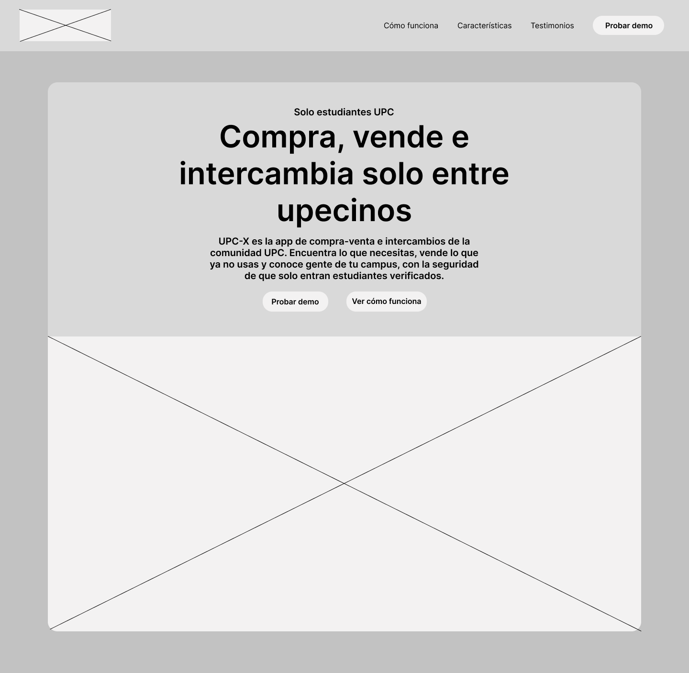
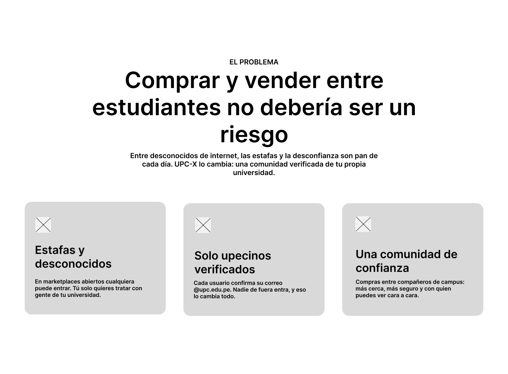
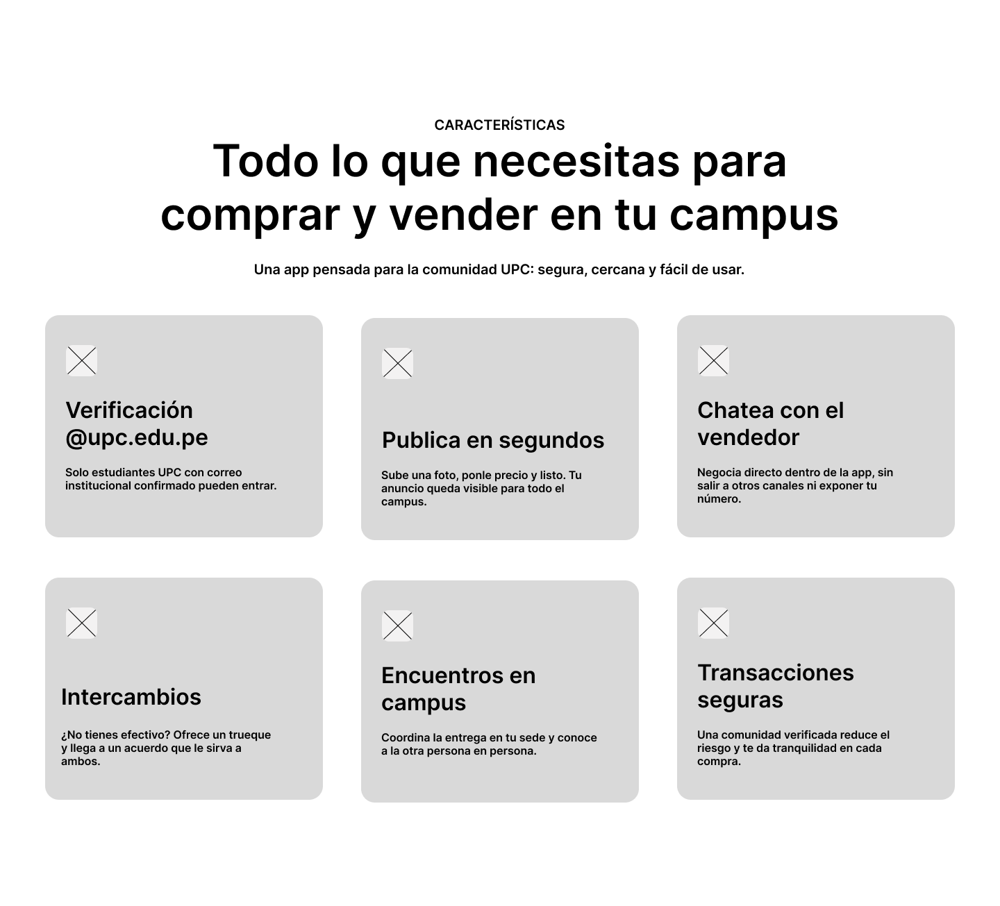
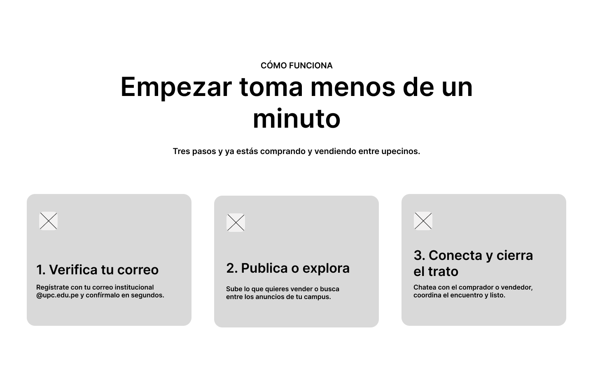
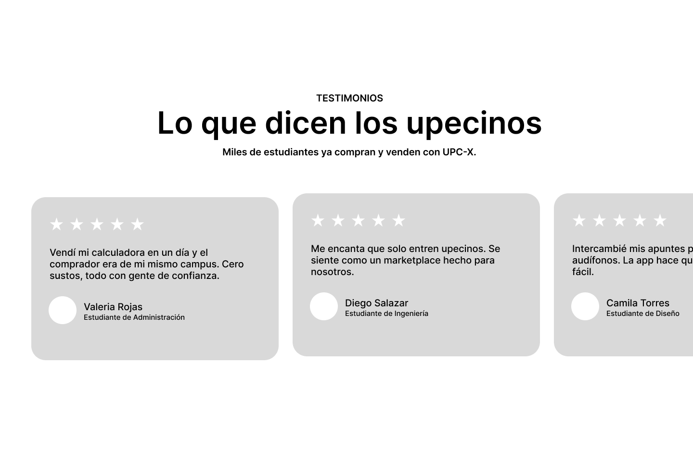
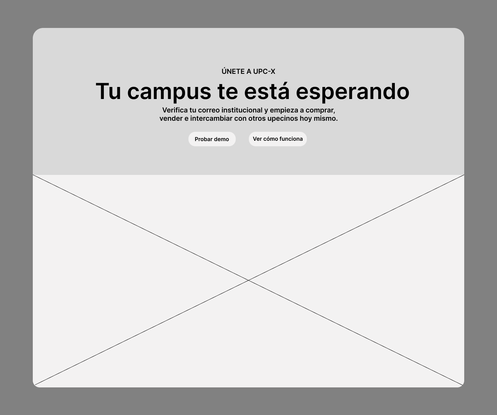
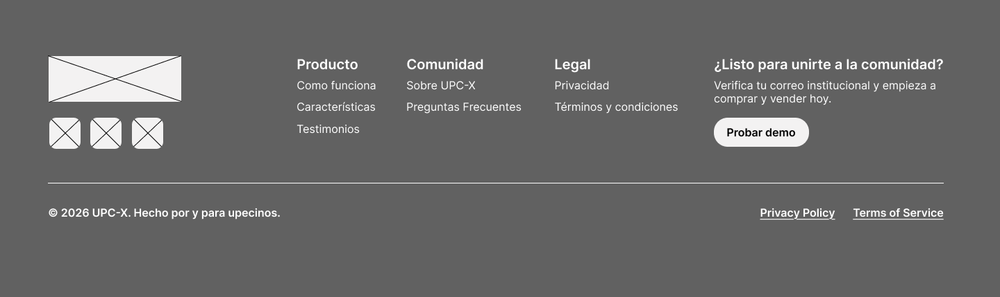
### 4.3.2. Landing Page Mock-up
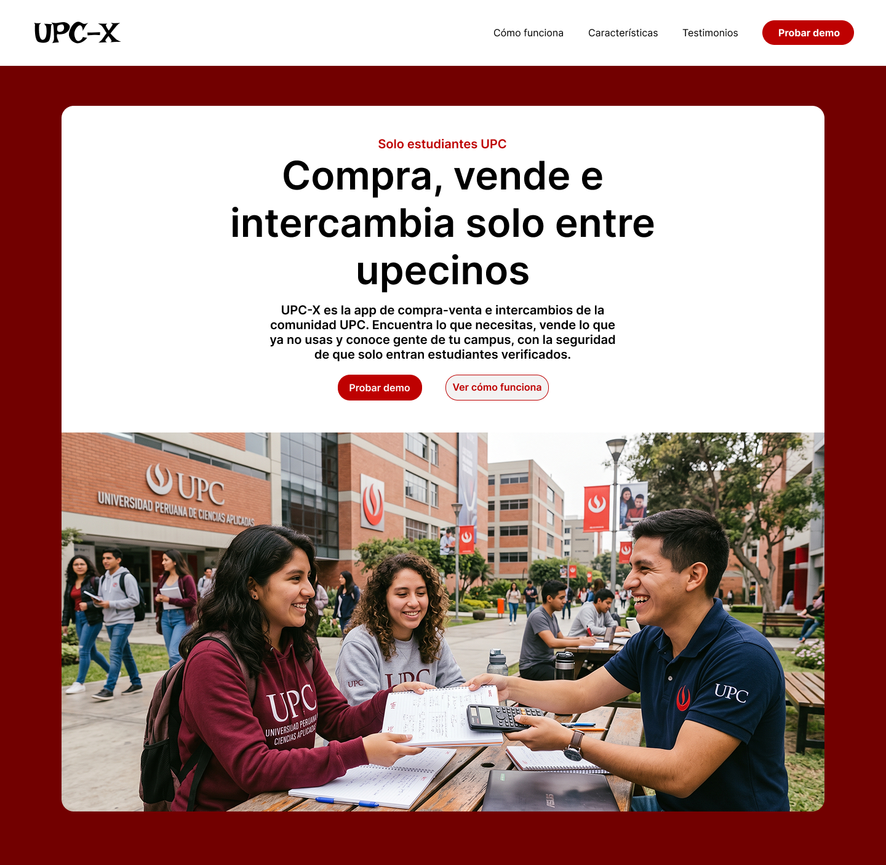
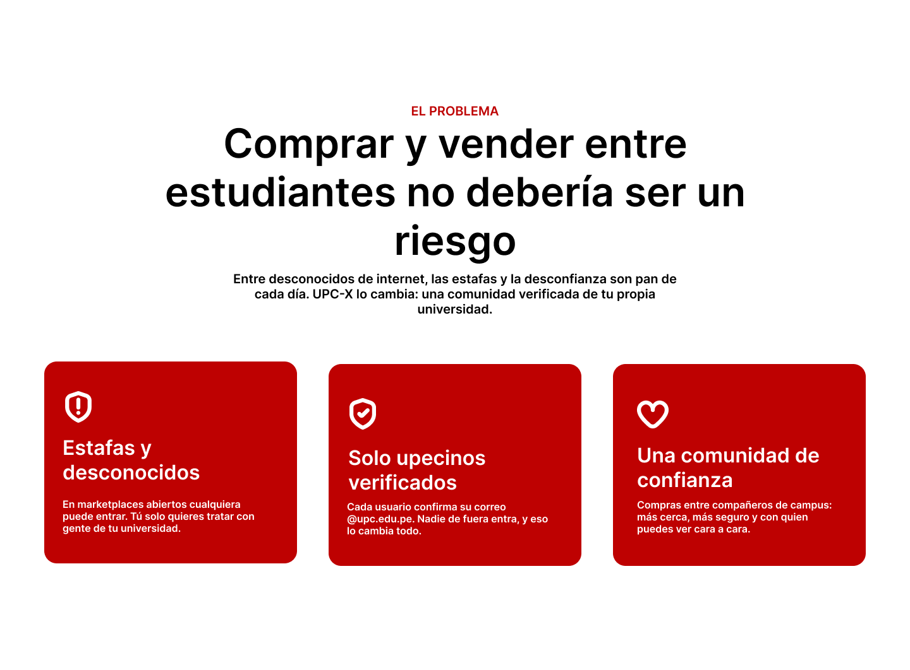
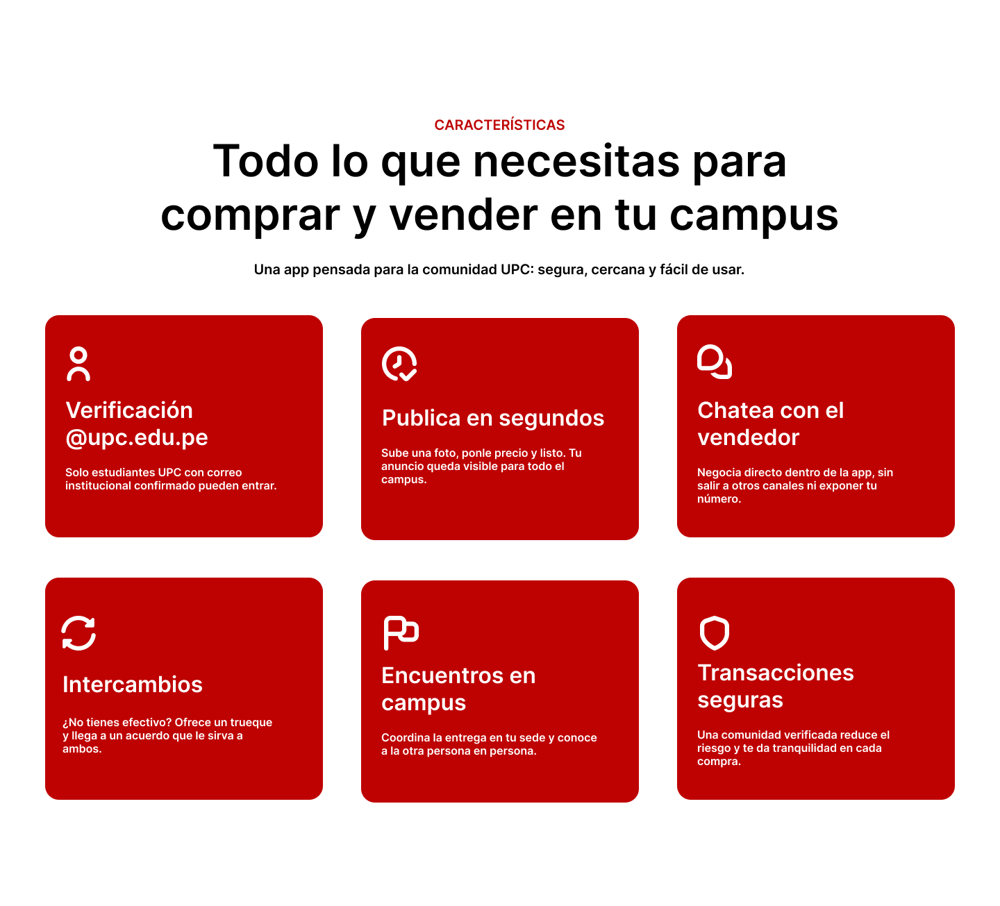
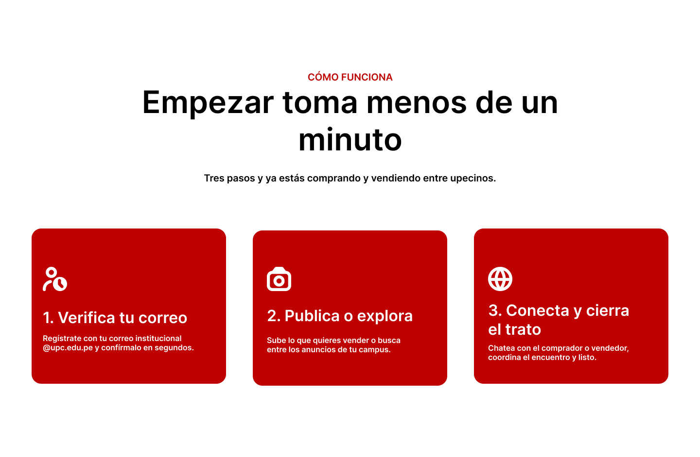
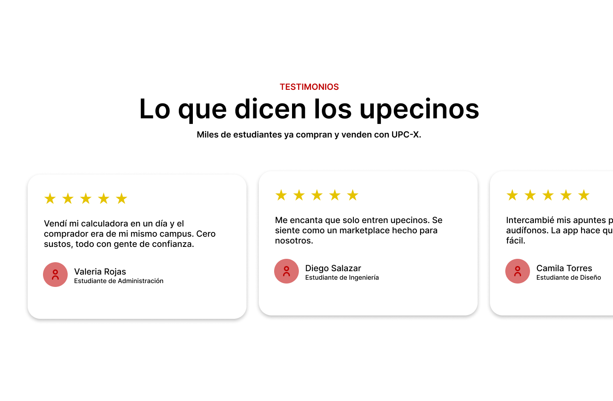
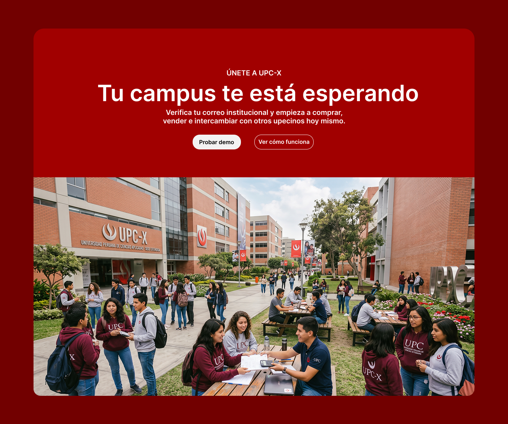
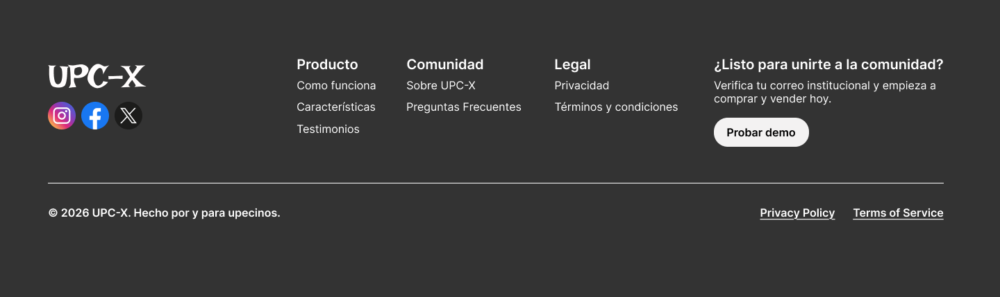

## 4.4. Mobile Applications UX/UI Design

### 4.4.1. Mobile Applications Wireframes

### 4.4.2. Mobile Applications Wireflow Diagrams

### 4.4.3. Mobile Applications Mock-ups

### 4.4.4. Mobile Applications User Flow Diagrams

## 4.5. Mobile Applications Prototyping

### 4.5.1. Android Mobile Applications Prototyping

### 4.5.2. iOS Mobile Applications Prototyping

## 4.6. Web Applications UX/UI Design

### 4.6.1. Web Applications Wireframes

### 4.6.2. Web Applications Wireflow Diagrams

### 4.6.3. Web Applications Mock-ups

### 4.6.4. Web Applications User Flow Diagrams

## 4.7. Web Applications Prototyping

## 4.8. Domain-Driven Software Architecture

### 4.8.1. Software Architecture Context Diagram

### 4.8.2. Software Architecture Container Diagrams

### 4.8.3. Software Architecture Components Diagrams

## 4.9. Software Object-Oriented Design

### 4.9.1. Class Diagrams

### 4.9.2. Class Dictionary

## 4.10. Database Design

### 4.10.1. Relational/Non-Relational Database Diagram

# Capítulo V: Product Implementation
En esta capitulo se describe la implementación del producto <b>UPC-X</b> por parte de la startup <b>RichStudent</b>, abarcando la configuración del entorno de desarrollo, la gestión del código fuente, las convenciones de estilo, la configuración de despliegue y las evidencia de ejecución del Sprint #1, así como los acuerdos de servicio y los enlaces a los productos desplegados.

## 5.1. Software Configuration Management
El equipo ha establecido el siguiente conjunto de herramientas para asegurar una configuración de entorno de desarrollo unificada, que permita una colaboración efectiva y el cumplimiento de los objetivos del proyecto. Esas herramientas cubren las diferentes actividades del ciclo de vida del producto digital.

### 5.1.1. Software Development Environment Configuration
#### Project Management
* **Discord** - plataforma para la comunicación en tiempo real entre los miembros del equipo. A través de canales organizados por temas y funciones se realizan reuniones, coordinación diaria y soporte instantáneo durante todo el desarrollo. Ruta de referencia: https://discord.com
#### Requirements Management
* **GitHub Issues** - usado para registrar, etiquetar y dar trazabilidad a los requerimientos funcionales y no funcionales junto con los bugs y mejoras detectadas durante el desarrollo. Ruta de referencia: https://github.com
#### Product UX/UI Design
* **Figma** - herramienta principal para el diseño de interfaces gráficas (UI) y la experiencia de usuario (UX). Permite que varios miembros colaboren simultáneamente en prototipos interactivos, estructuras visuales y pruebas de diseño. Ruta de referencia: https://www.figma.com
* **UXPressia** - complementa el trabajo de UX al permitir la creación y documentación de User Personas, Customer Journey Maps y Empathy Maps, alineando las decisiones de diseño con las necesidades del usuario. Ruta de referencia: https://uxpressia.com
* **Trello** - facilita la organización visual de tareas, ideas y flujos de trabajo mediante tableros, listas y tarjetas. Permite priorizar funcionalidades centradas en el usuario y dar seguimiento al progreso. Ruta de referencia: https://trello.com
#### Software Development
* **Landing Page:** <B>HTML5 + CSS3 + Bootstrap</b>, editada en Webstorm y desplegada en GitHub Pages. Es la vitrina comercial del producto y el primer entregable del Sprint #1. Ruta de referencia: https://www.jetbrains.com/webstorm
* **Web Frontend (Aplicación Web):** <b>Angular</b> sobre WebStorm, conforme a las wireframes y prototipos definidos en §4.6 y §4.7. Brinda al cliente y al administrador del salón el acceso desde navegador a los flujos de búsqueda, reserva, gestión de servicios y panel de control. Ruta de referencia: https://angular.dev
* **Mobile App:** <b>Flutter (Dart)</b> sobre <b>Android Studio</b> como IDE; codebase orientado a Android 7.0 o superior. Implementa los flujos del segmento de clientes (búsqueda de salones, reserva, pagos, perfil) descritos en §4.4. Ruta de referencia: https://flutter.dev
* **Backend / API** — Spring Boot (Java) sobre IntelliJ IDEA Ultimate. IntelliJ provee soporte avanzado para Java/Kotlin, frameworks modernos y herramientas integradas de base de datos. Ruta de referencia: https://www.jetbrains.com/idea
* **Fake API (mocks)** — json-server sobre Node.js, usado durante las primeras iteraciones para desbloquear el desarrollo de la aplicación web y las aplicaciones móviles mientras el backend Spring Boot se construye.
* **Base de datos** — PostgreSQL gestionada en Neon (servicio cloud serverless), con Spring Data JPA como capa de acceso, conforme al diagrama de despliegue del producto. Ruta de referencia: https://neon.tech
#### Software Deployment
* **Git** — sistema de control de versiones para gestionar el historial de cambios. Ruta de referencia: https://git-scm.com
* **GitKraken** — cliente Git con interfaz gráfica para gestionar visualmente ramas, commits, conflictos y flujos de trabajo. Ruta de referencia: https://www.gitkraken.com
* **GitHub Pages** — hosting estático para desplegar la Landing Page y los frontends estáticos. Ruta de referencia: https://pages.github.com
* **Render** — plataforma de despliegue para APIs y servicios durante las etapas de desarrollo y pruebas. Ruta de referencia: https://render.com
#### Software Documentation
* **GitHub** — repositorio remoto centralizado, revisiones por Pull Request, registro de incidencias y documentación viva del proyecto. Ruta de referencia: https://github.com
* **Swagger / OpenAPI** — para documentar de forma interactiva los endpoints del backend RESTful.
### 5.1.2. Source Code Management

### 5.1.3. Source Code Style Guide & Conventions

#### HTML
* **Cierre de etiquetas:** Cerrar todos los elementos de forma explícita.
* **Sintaxis:** Usar minúsculas para nombres de elementos y atributos para mantener la legibilidad.
* **Atributos:** Usar comillas dobles cuando los atributos contengan espacios.
* **Accesibilidad y dimensiones:** Especificar `alt`, `width` y `height` en imágenes: ``.

#### CSS
* **Nombres de clases:** Utilizar nombres breves y autodescriptivos.
* **Nomenclatura:** Separar nombres de clases e IDs con guiones (`#video-id`, `.hero-shadow`).
* **Valores nulos:** No especificar la unidad de medida cuando el valor sea `0`.
* **Estructura:** Separar declaraciones y selectores en líneas distintas para favorecer la legibilidad.

#### JavaScript (Landing)
* **Guía de estilo:** Se siguen las recomendaciones de [Airbnb JavaScript Style Guide](https://github.com/airbnb/javascript).
* **Nomenclatura:**
  * `camelCase` para variables y funciones.
  * `PascalCase` para clases.
  * `kebab-case` para nombres de archivos.
* **Framework / UI:** La landing utiliza **Bootstrap 5** como base de componentes y sistema de grid.

#### TypeScript (Angular Web App)
* **Guía de estilo:** Se sigue la [Angular Style Guide](https://angular.dev/style-guide) oficial.
* **Nomenclatura:**
  * `kebab-case` para selectores y nombres de archivos.
  * `PascalCase` para clases y componentes.
  * `camelCase` para identificadores.
* **Linter:** Configuración recomendada mediante `@angular-eslint`.

#### Dart (Flutter)
* **Guía de estilo:** Se sigue la [Effective Dart Style Guide](https://dart.dev/effective-dart) de la documentación oficial.
* **Nomenclatura:**
  * `PascalCase` para nombres de clases.
  * `camelCase` para identificadores.
  * `snake_case` para nombres de archivos y carpetas.
* **Linter:** Paquete `flutter_lints` activado por defecto.

#### Java (Spring Boot)
* **Guía de estilo:** Se aplica la [Google Java Style Guide](https://google.github.io/styleguide/javaguide.html).
* **Formato:** Indentación estándar de 4 espacios.
* **Nomenclatura:**
  * `PascalCase` para nombres de clases.
  * `camelCase` para métodos y variables.
  * Minúsculas continuas para nombres de paquetes.

#### Gherkin
* **Uso:** Lenguaje específico de dominio (DSL) para Behavior-Driven Development (BDD).
* **Estructura:** Uso de saltos de línea para separar escenarios y las palabras clave `Given`, `When`, `Then` y `And` para estructurar cada criterio de aceptación.

### 5.1.4. Software Deployment Configuration
El despliegue del producto se realiza diferenciando los componentes estáticos de los servicios backend.
#### Landing Page (GitHub Pages):
1. Mantener una carpeta `docs/` que aloje los archivos públicos de la landing.
2. Asegurar la nomenclatura `index.html`, `style.css`y una carpeta `img/` con los recursos.
3. Cargar los archivos al repositorio mediante commits a la rama de  despliegue (típicamente `main`).
4. En GitHub: <b>Setting > Pages</b> y seleccionar la rama (`main`) y la carpeta `/docs` como fuente.
5. Esperar la verificación de GitHub. Una vez completado, se obtiene una URL pública del tipo `https://<org>.github.io/<repo>/`.

## 5.2. Product Implementation & Deployment

### 5.2.1. Sprint Backlogs
#### Sprint 1
#### Sprint Planning Background
Dentro del framework Scrum, un Sprint representa un plazo fijo y reducido de tiempo en el que el equipo desarrolla todo el trabajo necesario para alcanzar el objetivo final del proyecto, denominado Product Goal. El Sprint #1 tiene como meta elaborar una landing page atractiva para UPC-X que capte la atención de los usuarios visitantes y comunique con claridad los principales beneficios ofrecidos por el producto.

| Campo | Detalle |
| :--- | :--- |
| **Date** | 2026-08-31 |
| **Time** | 11:00 PM |
| **Location** | Reunión virtual mediante Discord |
| **Prepared By** | Murillo, Mathias Javier |
| **Attendees** | Mathias Javier Murillo, Eduardo Jose Cossar Sanchez, Gilbert Alonso Huarcaya Matias, Luis Manuel Espinoza Navarette, Manuel Alejandro Molina Vásquez |
| **Sprint N°1 Review Summary** | Primer sprint del proyecto; no existe revisión previa. |
| **Sprint N°1 Retrospective Summary** | Al ser el primer sprint no se cuenta con retrospectiva previa. La retroalimentación y oportunidades de mejora se evaluarán al cierre del sprint. |
| **Sprint Goal** | **Our focus is on delivering a functional and engaging landing page for UPC-X. We believe it delivers a clear value proposition and generates user interest and trust in potential customers. This will be confirmed when visitors can access the site and interact with all key landing-page sections (services overview, benefits, pricing, testimonials, CTA's and support) on both desktop and mobile devices.** |
| **Sprint N°1 Velocity** | 13 |
| **Sum of Story Points** | 13 |

#### Aspect Leaders and Collaboration (LACX)
Para mejorar la organización y la comunicación se elaboró la matriz Leadership and Collaboration Matrix (LACX), donde se define quién asume el rol de líder (L) y quiénes participan como Colaboradores (C) en cada aspecto clave de la lading page.

| Team Member | Hero Section | Propuesta de Valor | Funcionalidades | Cómo Funciona | Testimonios | CTA Final |
| :--- | :---: | :---: | :---: | :---: | :---: | :---: |
| **Murillo, Mathias Javier** | **L** | C | C | C | C | **L** |
| **Eduardo Jose Cosar Sanchez** | C | **L** | C | C | L | C |
| **Gilbert Alonso Huarcaya Matias** | C | C | **L** | C | C | C |
| **Luis Manuel Espinoza Navarette** | C | C | C | **L** | C | C |
| **Manuel Alejandro Molina Vásquez** | C | C | C | C | **L** | C |

### 5.2.2. Implemented Landing Page Evidence

  <b>Landing Page desplegada — UPC-X</b>

  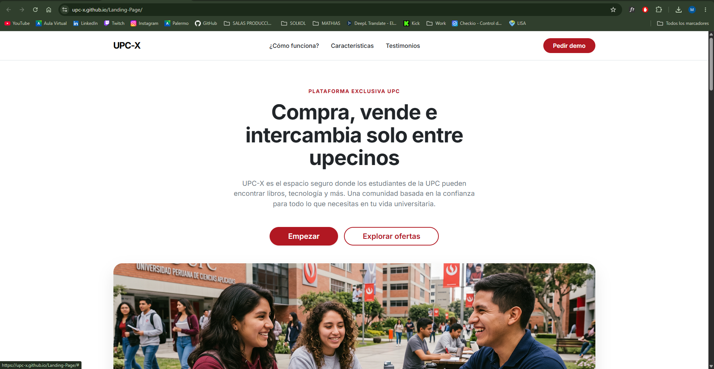

  <a href="https://tu-landing-url.com">Acceder a la Landing Page de UPC-X</a> · <a href="https://github.com/UPC-X/Landing-Page">Repositorio</a>

### 5.2.3. Implemented Frontend-Web Application Evidence

### 5.2.4. Implemented Native-Mobile Application Evidence

### 5.2.5. Implemented RESTful API and/or Serverless Backend Evidence

### 5.2.6. RESTful API documentation

### 5.2.7. Team Collaboration Insights

## 5.3. Video About-the-Product

# Bibliografía

ACM/IEEE-CS Joint Task Force on Software Engineering Ethics and Professional Practices. (1999). *Software engineering code of ethics and professional practice* (versión 5.2). Association for Computing Machinery e IEEE Computer Society. https://www.acm.org/code-of-ethics/software-engineering-code

Association for Computing Machinery. (2018). *ACM code of ethics and professional conduct*. https://www.acm.org/code-of-ethics

Bourque, P., y Fairley, R. E. (Eds.). (2014). *Guide to the software engineering body of knowledge (SWEBOK): Version 3.0*. IEEE Computer Society. https://www.computer.org/education/bodies-of-knowledge/software-engineering

Evans, E. (2003). *Domain-driven design: Tackling complexity in the heart of software*. Addison-Wesley.

Gothelf, J., y Seiden, J. (2021). *Lean UX: Designing great products with agile teams* (3.ª ed.). O’Reilly Media.

Instituto Nacional de Defensa de la Competencia y de la Protección de la Propiedad Intelectual. (s. f.). *Reclama Virtual*. https://enlinea.indecopi.gob.pe/reclamavirtual/

La República. (2025a, 9 de marzo). *Reclama Virtual: conoce la plataforma de Indecopi para realizar reclamos en caso de tener problemas con una compra por internet*. https://larepublica.pe/economia/2025/03/09/reclama-virtual-conoce-la-plataforma-de-indecopi-para-realizar-reclamos-en-caso-de-tener-problemas-con-una-compra-por-internet-atmp-476010

La República. (2025b, 3 de agosto). *Suplantan identidad de estudiante peruano para estafar en Marketplace y roban más de S/20.000*. https://larepublica.pe/sociedad/2025/08/03/suplantan-identidad-de-estudiante-peruano-para-estafar-en-marketplace-y-roban-mas-de-s20000-me-han-demandado-evat-ntpe-104940

Progressa Lean. (s. f.). *5W+2H: Técnica de análisis de problemas*. https://www.progressalean.com/5w2h-tecnica-de-analisis-de-problemas/

RichStudent. (2026). *UPC-X* [Prototipo Figma]. https://modem-palm-13537798.figma.site/

Universidad Peruana de Ciencias Aplicadas. (2026). *1ASI0732 Diseño de Experimentos de Ingeniería de Software: Final project statement* (Periodo 202620, NRC 9082) [Documento de enunciado del curso].

