# Capítulo IV: Product Design

Este capítulo reúne las decisiones de diseño, la arquitectura de información, los artefactos de interfaz y el modelo de software de UPC-X. La entrega local contiene 51 wireframes y 51 mock-ups móviles, seis wireflows y seis User Flows móviles; además, 96 vistas web exportadas como 192 wireframes y 192 mock-ups para escritorio/navegador móvil, ocho wireflows y ocho User Flows web. Se conservan los recursos de landing y los modelos de arquitectura, clases y datos.

**Acceso a los artefactos:** [galería de mock-ups](design/mobile/index.html), [vista general de las 14 pantallas](img/mobile-mockups/overview.png), [galería de wireframes](img/mobile-wireframes/index.html) y [guía de revisión y entrega](docs/chapter-4-handoff.md). Las galerías se abren en un navegador desde la carpeta descargada; permiten buscar por ID o nombre y mostrar pantallas principales o estados derivados. GitHub muestra las imágenes individuales, pero no ejecuta las galerías HTML dentro del README.

**Estado de la evidencia:** wireframes, mock-ups y flujos ilustrados están disponibles como artefactos locales. Los mock-ups definen la apariencia final propuesta, mientras que la interacción del prototipo Android/iOS y su demostración en video constituyen la siguiente etapa. Los controles de las maquetas estáticas no envían mensajes, validan OTP, publican avisos ni persisten datos.

**Diseño web 4.6:** [galería de escritorio y navegador móvil](design/web/index.html), [trazabilidad y decisiones](docs/web-design.md) y [matriz historia/pantalla](docs/web-screen-inventory.md).

**Criterio de herramientas actualizado:** según la indicación del docente comunicada por el equipo el 14 de septiembre de 2026, se admite el uso de herramientas y lenguajes de programación libremente. Esta entrega adopta SVG para wireframes y HTML/CSS/JavaScript con exportaciones PNG para mock-ups; no requiere migración a Figma o Adobe XD. La restricción de herramientas del PDF inicial queda sustituida por ese criterio comunicado.

## 4.1. Style Guidelines

Las decisiones de estilo de UPC-X se centralizan en este capítulo y deben trasladarse al prototipo navegable y a sus componentes reutilizables. El objetivo es que la landing page y la aplicación móvil comuniquen una experiencia cercana a la comunidad UPC, pero también segura y clara para transacciones entre pares. Los lineamientos de esta sección se aplican a los flujos priorizados: verificación institucional, exploración de avisos, detalle de una publicación, contacto, conversación y publicación de avisos.

El sistema se especifica mediante tokens de color y tipografía, componentes reutilizables y una escala de espaciado consistente. Esto permite que una decisión visual se replique sin redefinirse en cada pantalla.

### 4.1.1. General Style Guidelines

#### Branding y tono de comunicación

UPC-X utiliza una identidad sobria y contemporánea. El granate es el color de acción y conexión con la identidad UPC; el verde se reserva para comunicar confianza, verificación y confirmación. El tono es cercano, directo y respetuoso: se usan etiquetas cortas y verbos de acción como **Publicar aviso**, **Contactar a Camila**, **Entrar al marketplace** y **Ver en el feed**. Los mensajes de seguridad o de éxito deben explicar el siguiente paso y no depender únicamente del color.

#### Color

| Token | Valor | Uso principal |
|---|---:|---|
| `background` | `#F6F5F3` | Fondo general de la interfaz. |
| `foreground` | `#1C1B1A` | Texto principal e iconografía de alto contraste. |
| `card` | `#FFFFFF` | Tarjetas, superficies y campos. |
| `primary` | `#A6192E` | CTAs, acciones principales, enlaces destacados y foco. |
| `secondary` | `#ECEBE8` | Superficies secundarias. |
| `muted` / `muted-foreground` | `#F0EFEC` / `#68635F` | Fondos y texto secundario; el texto se oscureció para lectura sobre fondo cálido. |
| `accent` | `#0B6B5B` | Cuenta UPC verificada y estados de confianza. |
| `yape` | `#742384` | Representación visual de evidencia de pago Yape. |
| `border` | `#E4E2DD` | Separadores, inputs y límites de tarjetas. |

El acceso usa una base granate `#360C16` a `#641023`, con una luz secundaria `#82313D`; el resto de vistas prioriza fondos cálidos y superficies blancas. Las combinaciones principales superan el mínimo 4.5:1 establecido por [WCAG 2.2 para texto normal](https://www.w3.org/WAI/WCAG22/Understanding/contrast-minimum): `primary` sobre blanco alcanza 7.50:1, `accent` 6.43:1 y `muted-foreground` 5.93:1. Este último alcanza 5.45:1 sobre `background`. Estos valores describen esas parejas concretas, no una certificación global de accesibilidad. Los estados combinan texto, icono y color.

#### Tipografía, espaciado y forma

Los títulos, precios y énfasis usan **Plus Jakarta Sans**; los párrafos, etiquetas, controles y textos de apoyo usan **Inter**. Esta separación mantiene jerarquía sin introducir más familias tipográficas. Los tamaños se basan en una escala legible y deben evitar valores arbitrarios cuando exista un equivalente de la escala definida.

La nueva propuesta usa CSS compartido: margen lateral habitual de 22 px, separaciones de 8, 12, 16 y 20 px, controles de 48–50 px de altura y tarjetas de 17–25 px de radio según jerarquía. Los títulos de pantalla usan 22–26 px; precios destacados, 24–28 px; párrafos de interfaz, 12–13 px. Los avatares son circulares y los chips distinguen filtros activos mediante relleno, texto y selección explícita. Las fuentes se incluyen localmente para reproducir las exportaciones sin conexión.

Los componentes reutilizables definidos para el producto son `Avatar`, `CampusBadge`, `VerifiedBadge`, `Rating`, `BottomNav`, `ProductCard`, `FilterChip`, `BottomSheet`, `ConfirmationDialog`, `Snackbar` y `PaymentEvidenceCard`. Las etiquetas de campus, categoría y estado se presentan como chips compactos; las acciones principales usan botones granate con texto explícito. `PaymentEvidenceCard` es un componente propio de UPC-X: no reproduce la interfaz de Yape o Plin y deja claro que la plataforma solo conserva una constancia compartida por el estudiante.

#### Diseño inclusivo e interacción

- Mantener texto legible sobre cada superficie y un indicador de foco visible en controles interactivos.
- Ofrecer objetivos táctiles amplios; los botones de navegación inferior y CTAs no deben depender de iconos sin etiqueta accesible.
- Identificar productos, campus y estados mediante texto además de color, iconos o imágenes.
- Incluir texto alternativo significativo en imágenes de publicaciones y no usar el voucher de pago como única prueba comprensible de una transacción.
- Externalizar los textos para soportar español latinoamericano (`es_419`) e inglés (`en_US`). En la aplicación móvil, `es_419` es el idioma predeterminado y fallback, mientras que `en_US` es seleccionable desde el ingreso y el perfil. Los importes se muestran en soles peruanos de acuerdo con el locale activo.

### 4.1.2. Web Style Guidelines

La aplicación web autenticada de 4.6 comparte los tokens del producto y adapta la organización a navegador: encabezado con Inicio, Guardados, Chats, Perfil y Publicar; filtros laterales en el catálogo; detalle en dos columnas y chat con bandeja, conversación y contexto. A 390 px los bloques se apilan, los filtros tienen su propia vista y Publicar conserva un acceso central etiquetado. Los puntos de adaptación son 1150 y 700 px. Las fuentes editables están en `design/web/`; las capturas se entregan para 1440 y 390 px. La landing mantiene su función informativa y su composición independiente.

La landing page traduce el mismo sistema visual a una pantalla amplia: navegación superior, hero con propuesta de valor, secciones informativas, testimonios y llamados a la acción. Las capturas de diseño se elaboraron sobre un lienzo de escritorio de 1440 px de ancho y conservan el contraste entre fondo claro, tarjetas blancas y CTAs granate.

En web, la jerarquía prioriza primero la propuesta de valor y el CTA **Probar demo**, después la explicación de funcionamiento y las características, y finalmente la prueba social y el cierre. La navegación usa etiquetas breves —**Cómo funciona**, **Características** y **Testimonios**— que dirigen a secciones reconocibles de la misma página. Los CTA deben llevar a un destino concreto: abrir la demostración o desplazar a la explicación correspondiente.

La implementación responsive debe conservar esta jerarquía: el contenido se reordena verticalmente, las imágenes no contienen información esencial sin una alternativa textual y la navegación se adapta a controles táctiles sin reducir la legibilidad. El prototipo de demostración mantendrá `noindex,nofollow` mientras sea una versión de prueba; para la landing pública se definirán metadatos localizados y un atributo `lang` dinámico (`en` o `es-419`) dentro de la arquitectura de información.

### 4.1.3. Mobile Style Guidelines

La aplicación móvil comparte tokens, tono y componentes con la landing, pero prioriza tareas frecuentes de una sola mano: explorar publicaciones, aplicar filtros, revisar un detalle, contactar al vendedor, conversar y publicar un aviso. La referencia visual del prototipo utiliza un marco de hasta 420 px de ancho, navegación inferior persistente y tarjetas de lectura rápida.

La navegación inferior objetivo contiene cinco posiciones simétricas: **Inicio**, **Guardados**, **Publicar**, **Chats** y **Perfil**. **Publicar** ocupa la posición central y se distingue como la acción de creación; el badge de Chats se deriva de los mensajes no leídos. Los detalles, conversaciones y formularios secundarios se presentan dentro de una pila de navegación que conserva el contexto y responde al control de retroceso de la plataforma.

Los flujos móviles especificados por esta entrega son:

1. Correo institucional `@upc.edu.pe` → código de verificación → cuenta verificada → marketplace.
2. Feed con buscador y filtros de campus/categoría → detalle de producto → contacto con el vendedor.
3. Conversación → envío de mensaje o evidencia de pago → coordinación del encuentro.

4. Publicación en dos pasos → previsualización → confirmación → administración del aviso.
5. Guardados → detalle → conversación; perfil → historial, publicaciones, preferencias y salida.

El marco de referencia de las láminas mide 412 × 915 unidades; el lienzo completo mide 760 × 980 e incluye una columna de anotaciones. M-03 conserva el diseño aprobado por el equipo. Las pantallas nuevas emplean el mismo vocabulario de grises, bordes, placeholders y notas numeradas. La aplicación de tokens de marca corresponde a los mock-ups, no a esta etapa de wireframes.

#### 4.1.3.1. iOS Mobile Style Guidelines

En iOS, el diseño respeta las áreas seguras, el teclado nativo y las convenciones de retorno mediante un botón visible de navegación. Los controles de acción conservan etiquetas textuales, mientras que los iconos de apoyo cuentan con nombres accesibles. Las capas de detalle y conversación deberán poder cerrarse sin depender de un gesto exclusivo y los avisos de éxito, como **¡Cuenta verificada!**, deben anunciarse también mediante texto.

#### 4.1.3.2. Android Mobile Style Guidelines

En Android, la aplicación mantiene la misma estructura visual y admite la navegación de retroceso del sistema para cerrar detalle o conversación antes de abandonar la sección actual. Los componentes táctiles conservan estados de presión y foco; la navegación inferior, los filtros y el CTA de publicación mantienen áreas de interacción adecuadas. La apariencia se mantiene coherente con el sistema UPC-X, sin sustituir señales de identidad, verificación o seguridad por convenciones exclusivamente visuales.

## 4.2. Information Architecture

La arquitectura de información de UPC-X parte de una sola identidad `Student`. “Comprador” y “vendedor” no son tipos de cuenta ni modos que el estudiante deba seleccionar: son roles contextuales que surgen cuando consulta un aviso ajeno o administra uno propio. Esta decisión evita duplicar perfiles, configuraciones y reputación.

El contenido se organiza alrededor de cinco objetos: estudiantes, avisos, conversaciones, transacciones y reseñas. Cada conversación conserva el aviso y los participantes que la originaron; de ese modo, el título, el precio, el vendedor y los mensajes permanecen coherentes durante todo el recorrido.

### 4.2.1. Organization Systems

UPC-X combina tres sistemas de organización:

- **Jerárquico:** acceso → navegación principal → vistas de detalle o tareas secundarias.
- **Secuencial:** verificación, publicación y cierre de una transacción se resuelven mediante pasos ordenados.
- **Matricial:** el catálogo puede explorarse combinando búsqueda, campus, categoría, tipo, condición y rango de precio.

La estructura objetivo es la siguiente:

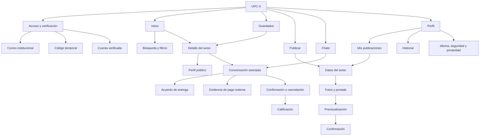

El sistema prioriza las tareas de mayor frecuencia en la barra inferior. Las páginas de detalle no se convierten en destinos principales porque dependen de un aviso, conversación o transacción específicos.

### 4.2.2. Labeling Systems

Las etiquetas usan sustantivos breves para destinos y verbos explícitos para acciones. Se evita emplear “venta” como sinónimo de publicación y “pago verificado” cuando UPC-X no puede comprobar una operación externa.

| Elemento | Etiqueta principal | Criterio |
|---|---|---|
| Catálogo | **Inicio** | Punto de entrada para explorar la oferta. |
| Lista personal | **Guardados** | Describe avisos marcados, no una compra confirmada. |
| Creación | **Publicar** / **Publicar aviso** | Acción explícita disponible para cualquier estudiante verificado. |
| Mensajería | **Chats** | Término breve y conocido por el segmento. |
| Cuenta | **Perfil** | Reúne identidad, reputación, historial y configuración. |
| Confianza | **Correo UPC verificado** | Comunica exactamente qué se verificó, sin garantizar identidad civil o conducta. |
| Constancia | **Evidencia de pago** | Evita afirmar que UPC-X procesó o validó el pago. |
| Oferta | **Aviso** | Abarca productos, servicios y tutorías. |
| Resultado | **Entrega completada** / **No se concretó** | Distingue éxito y cancelación sin depender del color. |

Todos los textos visibles se externalizan. La aplicación móvil usa `es_419` como idioma inicial y fallback, y permite elegir `en_US` desde acceso y perfil. Cuando una traducción inglesa no existe se muestra la versión `es_419`; los datos demostrativos —categorías, condiciones, fechas relativas y mensajes— también deben localizarse.

### 4.2.3. SEO Tags and Meta Tags

La estrategia SEO se aplica a la landing pública, no a las vistas privadas de las aplicaciones móvil y web. Mientras una URL sea exclusivamente una demostración académica se mantiene `noindex,nofollow`; al publicar la landing se habilita la indexación y se definen metadatos localizados.

| Etiqueta | Español latinoamericano | Inglés |
|---|---|---|
| `title` | UPC-X — Compra, vende e intercambia entre estudiantes UPC | UPC-X — Buy, sell and exchange with UPC students |
| `description` | Marketplace móvil para estudiantes UPC verificados que coordinan compras, ventas, servicios y tutorías dentro del campus. | Mobile marketplace for verified UPC students to coordinate products, services and tutoring on campus. |
| `keywords` | marketplace UPC, estudiantes UPC, compra y venta en campus, avisos entre estudiantes, tutorías UPC | UPC marketplace, student classifieds, campus exchange, student services, tutoring |
| `lang` | `es-419` | `en` |
| `og:type` | `website` | `website` |
| `og:site_name` | `UPC-X` | `UPC-X` |
| `author` | `RichStudent` | `RichStudent` |

La landing debe incluir `canonical`, `og:title`, `og:description`, `og:image`, Twitter Card y `hreflang` para `es-419`, `en` y `x-default`. Este último identifica la versión de fallback cuando ningún idioma coincide, conforme a la [guía de versiones localizadas de Google Search Central](https://developers.google.com/search/docs/advanced/crawling/localized-versions). Los títulos y descripciones deben coincidir con el idioma activo. El nombre de la startup es RichStudent; UPC-X es el producto.

La URL canónica se fijará al elegir el dominio final; no se utiliza la URL de una demo temporal como dirección pública de producción. La imagen social tendrá texto alternativo y será coherente con el idioma de la página.

### 4.2.4. Searching Systems

La búsqueda primaria consulta el título y la descripción del aviso. Los resultados se refinan mediante filtros combinables y permanecen sincronizados con la consulta actual.

| Mecanismo | Valores iniciales | Respuesta esperada |
|---|---|---|
| Texto | Palabra o frase | Coincidencia por título y descripción. |
| Campus | Todos, Monterrico, San Miguel, San Isidro, Villa | Solo avisos con entrega en la sede seleccionada. |
| Categoría | Comida, libros, calculadoras, tecnología, tutorías | Solo avisos de la categoría. |
| Tipo | Producto, servicio, tutoría | Diferencia bienes de prestaciones. |
| Condición | Nuevo, como nuevo, usado | Aplica únicamente a productos. |
| Precio | Mínimo y máximo | Limita resultados al rango indicado. |
| Orden | Recientes, precio ascendente/descendente | Reordena sin modificar filtros. |

El sistema muestra la cantidad de resultados, los filtros activos y una acción **Limpiar filtros**. También contempla estados de carga, error, catálogo vacío y búsqueda sin coincidencias. No se muestran avisos retirados; un aviso reservado permanece identificable, pero no permite iniciar una nueva transacción.

### 4.2.5. Navigation Systems

La navegación principal se mantiene visible en las cinco áreas de primer nivel. El botón Atrás cierra primero hojas, diálogos o vistas de detalle y solo después abandona la sección. Enlaces profundos a avisos o conversaciones restauran la sección padre correspondiente.

| Origen | Acción | Destino | Retorno |
|---|---|---|---|
| Inicio/Guardados | Seleccionar aviso ajeno | Detalle | Lista y posición anteriores. |
| Detalle ajeno | Contactar | Conversación ligada al aviso | Detalle. |
| Detalle propio | Administrar | Edición/estado del aviso | Detalle propio. |
| Publicar | Confirmar | Éxito → aviso publicado | Feed o perfil. |
| Chats | Seleccionar hilo | Conversación correspondiente | Bandeja de chats. |
| Conversación | Coordinar entrega | Hoja de acuerdo | Conversación. |
| Perfil | Mis publicaciones | Avisos propios | Perfil. |

El contador de Chats se calcula a partir de mensajes no leídos. El estado seleccionado se comunica visualmente y mediante semántica accesible (`aria-current` en web o su equivalente en Flutter).

## 4.3. Landing Page UI Design
Para el desarrollo de los wireframes y mock-ups de la landing page de UPC-X se utiliza **Figma**. Los wireframes definen estructura, jerarquía y secuencia de lectura; los mock-ups incorporan el sistema visual de la sección 4.1. La landing es informativa y de captación: no reemplaza la aplicación transaccional móvil.

### 4.3.1. Landing Page Wireframe
El recorrido comienza con la propuesta de valor y el CTA principal, explica el problema y el funcionamiento, presenta las características y testimonios, y concluye con un segundo CTA y el footer. Esta secuencia permite comprender el producto antes de solicitar una acción. En pantallas angostas, las columnas se apilan sin alterar el orden semántico.

Las imágenes anteriores documentan las secciones de escritorio disponibles. Para navegador móvil, la especificación responsive dispone una sola columna: encabezado compacto y acceso al menú, propuesta de valor y CTA, imagen de apoyo, bloques informativos apilados, testimonios y cierre. Se conserva el orden de lectura y los enlaces internos. **Evidencia pendiente:** captura de la composición completa para navegador móvil; los wireframes de la app M-01–M-14 no sustituyen esa versión de la landing.

### 4.3.2. Landing Page Mock-up
Los mock-ups aplican el granate como acento primario, fondos claros, tarjetas blancas y jerarquía tipográfica coherente con UPC-X. Los CTA deben abrir la demostración o conducir a una sección identificada; ninguna imagen contiene por sí sola información indispensable. La versión pública incluirá selector de idioma, foco visible y metadatos localizados.

En el mock-up para navegador móvil se deben conservar los mismos tokens, transformar columnas en bloques verticales y permitir que títulos y botones crezcan con el texto. Las fotografías y testimonios demostrativos deben identificarse como tales en el prototipo. **Evidencia pendiente:** exportación de la landing móvil de alta fidelidad y validación conjunta con su versión de escritorio.

## 4.4. Mobile Applications UX/UI Design

El diseño móvil traduce las historias US01–US28 a una única experiencia para estudiantes. Los dos segmentos comparten cuenta, navegación y reputación; el rol depende de quién es propietario del aviso y quién inicia la conversación. Los artefactos se organizan por objetivos de usuario para conservar trazabilidad con los User Personas, el To-Be Scenario Mapping y el Product Backlog.

### 4.4.1. Mobile Applications Wireframes

Los wireframes se definen sobre una retícula móvil de una columna. El set es común para Android e iOS; las adaptaciones de plataforma se documentan en 4.5. Se incluyen **14 pantallas principales y 37 estados derivados, 51 láminas SVG en total**. Cada cambio relevante de estado tiene un identificador con sufijo, por ejemplo M-02b para código vencido y M-13a para confirmación pendiente. Los precios, nombres, correos, fechas y calificaciones visibles son datos ilustrativos.

La trazabilidad US01–US28 conserva las referencias del inventario previo de este capítulo. Los capítulos II y III no están presentes en esta carpeta: el equipo debe cotejar los nombres de Personas y los IDs con su backlog consolidado antes de la entrega académica.

| ID | Pantalla/estado | Objetivo y elementos esenciales | Historias |
|---|---|---|---|
| M-01 | Acceso | Correo institucional, idioma, términos y CTA. | US01, US04 |
| M-02 | Verificación | OTP editable, expiración, reenvío, error y éxito. | US02, US03 |
| M-03 | Inicio | Búsqueda, filtros, destacado, resultados y estados vacío/error. | US11–US15, US20 |
| M-04 | Guardados | Lista personal y estado vacío. | US16 |
| M-05 | Detalle ajeno | Galería, condición, campus, reputación, seguridad y contacto. | US14, US17, US19, US21 |
| M-06 | Detalle propio | Estado del aviso, editar, reservar, completar y retirar. | US10, US28 |
| M-07 | Publicar/editar | Paso 1: tipo, título, precio, categoría, condición y campus. M-07a: fotos, portada y descripción. | US06–US10 |
| M-08 | Previsualización/éxito | Revisión previa y confirmación del aviso publicado. | US06 |
| M-09 | Chats | Hilos con aviso, contraparte, último mensaje y no leídos. | US22 |
| M-10 | Conversación | Mensajes, imágenes, seguridad y contexto del aviso. | US21–US23 |
| M-11 | Acuerdo | Campus, punto, fecha, hora y confirmación. | US24 |
| M-12 | Evidencia de pago | Imagen adjunta, metadatos, estado, reemplazo y discrepancia. | US25 |
| M-13 | Cierre y reseña | Confirmación bilateral, no concretado y calificación. | US18, US26 |
| M-14 | Perfil | Identidad, reputación, historial, avisos propios, idioma y sesión. | US05, US27, US28 |

#### M-01 — Acceso

Presenta el correo institucional, el idioma y el consentimiento antes del envío de un código. La cuenta es única para comprar y publicar. El estado M-01a explica cómo corregir un correo inválido conservando lo escrito.

#### M-02 — Verificación

Mantiene el correo de destino visible y separa el vencimiento del código del tiempo de espera para reenviar. Se permite cambiar de correo, editar o pegar los seis dígitos. El éxito indica correo verificado, sin garantizar identidad civil.

#### M-03 — Inicio

Conserva la lámina aprobada por el equipo: búsqueda, filtros, destacado separado de resultados y cinco destinos inferiores. La hoja M-03a amplía los filtros con condición, rango de precio y orden; M-03b, M-03c y M-03d representan vacío, carga y error de red.

#### M-04 — Guardados

Reúne avisos elegidos por el estudiante y permite retirarlos de la lista. Guardar no reserva: cada tarjeta conserva la disponibilidad actual. El estado vacío propone explorar avisos y el retorno desde detalle recupera Guardados.

#### M-05 — Detalle ajeno

Ordena galería, título, precio, condición, campus y descripción antes del perfil del vendedor y la acción de contacto. El perfil público M-05c muestra reputación sin publicar el correo completo. Un aviso reservado o retirado informa su estado e impide iniciar una nueva operación.

#### M-06 — Detalle propio

Presenta acciones exclusivas del propietario: editar, reservar para una conversación, gestionar la entrega y retirar. Gestionar entrega abre M-13; completar el aviso requiere las dos confirmaciones. La retirada dispone de confirmación y pantalla de resultado, preservando mensajes históricos.

#### M-07 — Publicar o editar

La creación se divide en dos pasos para mantener controles legibles: datos del aviso en M-07, fotos y descripción en M-07a. La condición solo aplica a productos; la portada depende del orden elegido. M-07b muestra errores concretos y M-07c distingue editar un aviso existente de crear otro.

#### M-08 — Previsualización y éxito

Permite revisar el contenido antes de hacerlo visible. Volver a editar conserva los datos; publicar espera una respuesta exitosa antes de mostrar M-08a. Desde la confirmación se accede al mismo aviso en M-06.

#### M-09 — Chats

Cada fila identifica contraparte, aviso y último mensaje. Los no leídos se expresan mediante contador textual y filtro. El estado sin conversaciones explica que un hilo se inicia desde el detalle de un aviso.

#### M-10 — Conversación

Conserva el aviso, la contraparte y el estado de envío en pantalla. Desde el hilo se accede al acuerdo, a la evidencia opcional y al cierre. M-10a muestra un mensaje no enviado con opciones de reintento y edición, evitando perder o duplicar el texto.

#### M-11 — Acuerdo

Registra campus, punto, fecha, hora y precio. Enviar una propuesta no equivale a aceptarla por ambas partes. M-11a advierte diferencias con el campus del aviso y M-11b muestra el acuerdo aceptado; cualquier cambio requiere renovar la aceptación.

#### M-12 — Evidencia de pago

Combina la captura con medio, importe y referencia parcial propios de UPC-X. La evidencia es opcional y privada para los participantes. Los estados enviada, recibida y con discrepancia registran declaraciones; ninguno certifica una operación bancaria. Una corrección posterior conserva el registro previo.

#### M-13 — Cierre y reseña

Distingue las confirmaciones del estudiante y de su contraparte. Una confirmación deja la entrega pendiente; ambas habilitan una reseña por persona. Cancelar exige confirmar el motivo y no habilita calificación. Las láminas M-13a a M-13d hacen visibles estas transiciones.

#### M-14 — Perfil

Centraliza reputación, publicaciones propias, historial, datos editables, idioma y salida. Compras y ventas son filtros del historial de una misma cuenta. Cerrar sesión requiere confirmar y permite volver para guardar cambios pendientes.

#### Estados derivados y recuperación

Todos los estados están disponibles como SVG independientes en la [galería](img/mobile-wireframes/index.html). La tabla facilita acceder a cada evidencia sin confundirla con una pantalla principal nueva.

| Pantalla | Láminas de estado | Respuesta y recuperación |
|---|---|---|
| M-01 | [M-01a](img/mobile-wireframes/M-01a-invalid-email-wireframe.svg) | Corregir el dominio sin borrar el correo. |
| M-02 | [M-02a](img/mobile-wireframes/M-02a-invalid-code-wireframe.svg), [M-02b](img/mobile-wireframes/M-02b-expired-code-wireframe.svg), [M-02c](img/mobile-wireframes/M-02c-verified-wireframe.svg) | Código incorrecto, vencido y verificación exitosa. |
| M-03 | [M-03a](img/mobile-wireframes/M-03a-filters-wireframe.svg), [M-03b](img/mobile-wireframes/M-03b-no-results-wireframe.svg), [M-03c](img/mobile-wireframes/M-03c-loading-wireframe.svg), [M-03d](img/mobile-wireframes/M-03d-network-error-wireframe.svg) | Filtros completos, sin coincidencias, carga y reintento de red. |
| M-04 | [M-04a](img/mobile-wireframes/M-04a-saved-empty-wireframe.svg), [M-04b](img/mobile-wireframes/M-04b-saved-removed-wireframe.svg) | Lista vacía y eliminación con opción de deshacer. |
| M-05 | [M-05a](img/mobile-wireframes/M-05a-reserved-wireframe.svg), [M-05b](img/mobile-wireframes/M-05b-withdrawn-wireframe.svg), [M-05c](img/mobile-wireframes/M-05c-public-profile-wireframe.svg) | Reservado, retirado y perfil público. |
| M-06 | [M-06a](img/mobile-wireframes/M-06a-withdraw-confirm-wireframe.svg), [M-06b](img/mobile-wireframes/M-06b-withdraw-success-wireframe.svg), [M-06c](img/mobile-wireframes/M-06c-reserve-wireframe.svg) | Confirmar retirada, visualizar resultado y seleccionar conversación para reservar. |
| M-07 | [M-07a](img/mobile-wireframes/M-07a-publish-photos-wireframe.svg), [M-07b](img/mobile-wireframes/M-07b-publish-errors-wireframe.svg), [M-07c](img/mobile-wireframes/M-07c-edit-wireframe.svg) | Segundo paso, validación y edición del mismo aviso. |
| M-08 | [M-08a](img/mobile-wireframes/M-08a-published-wireframe.svg) | Confirmar publicación y abrir su administración. |
| M-09 | [M-09a](img/mobile-wireframes/M-09a-chats-empty-wireframe.svg) | Sin hilos: iniciar desde un aviso. |
| M-10 | [M-10a](img/mobile-wireframes/M-10a-message-error-wireframe.svg) | Conservar y reenviar un mensaje fallido. |
| M-11 | [M-11a](img/mobile-wireframes/M-11a-campus-warning-wireframe.svg), [M-11b](img/mobile-wireframes/M-11b-agreement-accepted-wireframe.svg), [M-11c](img/mobile-wireframes/M-11c-agreement-review-wireframe.svg) | Revisar campus, consultar acuerdo y aceptar desde la perspectiva de la contraparte. |
| M-12 | [M-12a](img/mobile-wireframes/M-12a-evidence-sent-wireframe.svg), [M-12b](img/mobile-wireframes/M-12b-evidence-received-wireframe.svg), [M-12c](img/mobile-wireframes/M-12c-evidence-disputed-wireframe.svg), [M-12d](img/mobile-wireframes/M-12d-evidence-review-wireframe.svg) | Evidencia enviada, recepción declarada, discrepancia y controles del receptor. |
| M-13 | [M-13a](img/mobile-wireframes/M-13a-closure-pending-wireframe.svg), [M-13b](img/mobile-wireframes/M-13b-review-wireframe.svg), [M-13c](img/mobile-wireframes/M-13c-cancel-wireframe.svg), [M-13d](img/mobile-wireframes/M-13d-review-sent-wireframe.svg) | Pendiente, reseña habilitada, cancelar y reseña enviada. |
| M-14 | [M-14a](img/mobile-wireframes/M-14a-my-listings-wireframe.svg), [M-14b](img/mobile-wireframes/M-14b-history-wireframe.svg), [M-14c](img/mobile-wireframes/M-14c-settings-wireframe.svg), [M-14d](img/mobile-wireframes/M-14d-logout-wireframe.svg) | Publicaciones propias, historial, preferencias y salida confirmada. |

#### Principios de diseño y criterios de interacción

Los wireframes aplican proximidad al agrupar etiqueta y control, jerarquía al priorizar título y CTA, y prevención de errores mediante revisión previa y confirmación de cambios sensibles. Las acciones nuevas se dibujan generalmente con 48 unidades de alto. La implementación debe reservar áreas táctiles de al menos [48 × 48 dp en Android](https://developer.android.com/guide/topics/ui/accessibility/apps) y adaptar la interacción según las [guías de accesibilidad de Apple](https://developer.apple.com/design/human-interface-guidelines/accessibility/). Los iconos pequeños, los enlaces y los chips de la referencia M-03 necesitan áreas de interacción ampliadas; el tamaño de su dibujo no demuestra por sí mismo cumplimiento.

Los SVG incorporan título y descripción accesible, y los estados se comunican mediante texto. El foco, la lectura con tecnologías de asistencia, el teclado, el escalado de texto y el desplazamiento se deben validar en el prototipo. La barra inferior pertenece a los destinos principales; detalle, conversación, hojas y confirmaciones usan retorno al contexto anterior.

**Formato de entrega:** los SVG editables y su galería constituyen los artefactos de baja fidelidad del diseño aprobado. El criterio actualizado del docente comunicado por el equipo permite producirlos y entregarlos con código, sin exigir su incorporación a otra herramienta.

### 4.4.2. Mobile Applications Wireflow Diagrams

Los seis wireflows conectan las pantallas con objetivos del estudiante. Cada SVG incluye miniaturas reales de las láminas anteriores, flechas con acciones y filas separadas para la ruta esperada y las alternativas. Una flecha con dos acciones resume pasos intermedios; los diagramas Mermaid complementarios explicitan las decisiones. Los estados con sufijo representan cambios de pantalla visibles. Los nombres de Persona se expresan como roles contextuales hasta cotejarlos con el capítulo II.

**UG-01 — Acceder como estudiante verificado.** Persona: estudiante comprador o vendedor. Objetivo: ingresar sin compartir documentos personales.

El estudiante ingresa su correo, recibe el código y verifica su propiedad. Un correo inválido devuelve a edición, un código incorrecto permite corregir y uno vencido requiere reenvío. Solo el éxito permite entrar al catálogo.

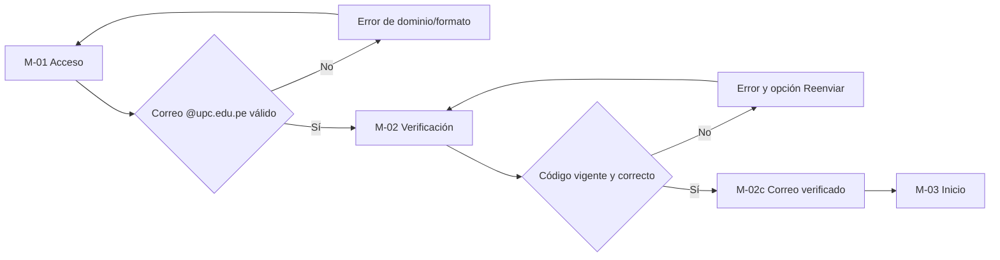

**UG-02 — Encontrar y contactar por un aviso.** Persona: estudiante comprador. Objetivo: evaluar una oferta y conversar con la persona correcta.

La búsqueda mantiene consulta y filtros durante carga, vacío o error. Desde un resultado disponible se consulta detalle y reputación antes de contactar. Los avisos reservados o retirados permiten recuperar el listado sin iniciar una nueva operación.

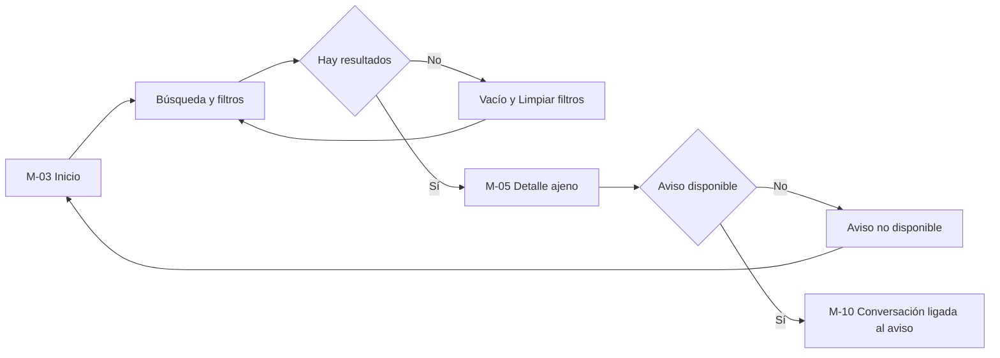

**UG-03 — Publicar y administrar una oferta.** Persona: estudiante vendedor. Objetivo: hacer visible una oferta completa y mantenerla actualizada.

El primer paso recoge los datos; el segundo, fotos, portada y descripción. La previsualización permite corregir antes de publicar. El éxito abre el detalle propio, donde editar mantiene el identificador del aviso y retirar requiere confirmación.

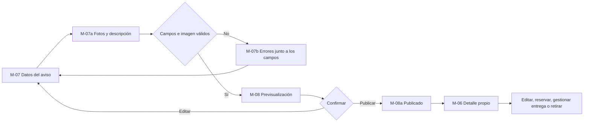

**UG-04 — Coordinar y cerrar una transacción.** Persona: ambos participantes. Objetivo: conservar contexto y evidencia sin que UPC-X procese el pago.

La propuesta de encuentro exige aceptación de ambos participantes. La evidencia de pago es opcional: desde la conversación se puede gestionar la entrega sin adjuntar captura. La confirmación individual mantiene la operación pendiente; ambas confirmaciones habilitan una reseña por estudiante. Cancelar no habilita reputación.

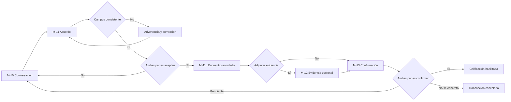

**UG-05 — Guardar y recuperar avisos.** Persona: estudiante comprador. Objetivo: mantener una lista personal para decidir después.

Guardar desde M-05 incorpora el aviso a M-04; abrirlo recupera su disponibilidad actual. Si la lista está vacía, M-04a conduce a Inicio. Un aviso reservado no se convierte en una reserva del usuario por estar guardado; quitarlo actualiza la lista y ofrece deshacer.

**UG-06 — Consultar historial y gestionar perfil.** Persona: estudiante verificado. Objetivo: administrar preferencias, publicaciones e historial desde una misma cuenta.

M-14 distribuye las tareas hacia publicaciones propias, historial y preferencias. Guardar vuelve al perfil y cerrar sesión exige M-14d antes de regresar a Acceso. El filtro compras/ventas clasifica transacciones y no cambia el tipo de cuenta.

### 4.4.3. Mobile Applications Mock-ups

Los mock-ups finales se desarrollaron como una **nueva propuesta propia en HTML, CSS y JavaScript**, tomando la estructura de los wireframes aprobados. La demo inicial queda como antecedente exploratorio. La entrega contiene **51 capturas PNG: 14 pantallas principales y 37 estados**, con correspondencia uno a uno con los IDs de 4.4.1. Cada captura mide 824 × 1830 px y representa una pantalla de 412 × 915 a escala 2×.

La [galería de alta fidelidad](design/mobile/index.html) permite revisar, filtrar, descargar y comparar cada diseño con su wireframe. La [guía de mock-ups](docs/mobile-mockups.md) documenta las fuentes, componentes y reproducción. Los archivos HTML/CSS/JavaScript son editables; las capturas permiten incorporarlos al informe sin depender de un servicio externo.

#### Identidad, componentes y contenido

El granate concentra las acciones principales; verde indica verificación o confirmación, ámbar señala espera y rose identifica errores o acciones sensibles. Las superficies cálidas dan continuidad entre catálogo, formularios y conversación. Plus Jakarta Sans define títulos y precios; Inter se utiliza en campos, navegación y lectura. Las fuentes se distribuyen con sus licencias en el repositorio.

La propuesta incluye ilustraciones vectoriales originales de calculadora, libro y audífonos, avatares con iniciales e iconografía lineal. Son contenido demostrativo acabado para estas maquetas, no fotografías de publicaciones reales. La captura de pago tiene una marca visible de muestra ilustrativa y no reproduce la interfaz de Yape o Plin. Las imágenes reales de los futuros usuarios ocuparán los mismos contenedores de producto sin alterar la jerarquía diseñada.

| Componente | Decisión visual | Aplicación |
|---|---|---|
| Navegación inferior | Cinco destinos, Publicar central y activo identificable. | M-03, M-04, M-07, M-09, M-14 y estados principales. |
| ProductCard / galería | Imagen con superficie cálida, precio prominente y campus. | Inicio, guardados, detalle y previsualización. |
| Campos y CTA | Etiqueta persistente, error cercano y acción primaria granate. | Acceso, OTP, publicación, acuerdo y perfil. |
| VerifiedBadge | Escudo y texto que limita el alcance al correo institucional. | Perfil, detalle y acceso verificado. |
| PaymentEvidenceCard | Miniatura, medio, importe, emisor y estado declarativo. | M-12 y sus cuatro estados. |
| Confirmaciones | Dos participantes visibles y estado individual. | M-13, pendiente y habilitación de reseña. |
| Diálogos | Contexto atenuado, efecto explicado y salida reversible antes de confirmar. | Retirar, cancelar entrega y cerrar sesión. |

#### M-01 — Acceso

La marca ocupa el encabezado y el formulario se presenta sobre una superficie clara. Correo, idioma y consentimiento conducen a un único CTA; el error conserva el dato introducido.

#### M-02 — Verificación

Los seis dígitos, el correo de destino y la vigencia se leen por separado. Error, vencimiento y éxito tienen tratamiento visual propio y opciones de recuperación.

#### M-03 — Inicio

La búsqueda precede a filtros y destacado. Las tarjetas muestran precio y campus, mientras que la barra inferior mantiene los cinco destinos aprobados. El producto destacado se diferencia de los recientes por composición y superficie.

#### M-04 — Guardados

Las tarjetas incorporan disponibilidad y una acción de retirada de la lista. El vacío explica el propósito de la sección y la eliminación permite deshacer.

#### M-05 — Detalle del aviso

La galería se combina con precio, condición, campus y perfil del vendedor. Contactar permanece en la zona inferior de acciones; la reserva deshabilita nuevas operaciones y explica por qué.

#### M-06 — Mi publicación

La administración separa las acciones de contenido, reserva, entrega y retirada. El estado activo es visible y retirar abre un diálogo con el título del aviso y sus consecuencias.

#### M-07 — Publicar aviso

El indicador de paso explica el avance. Datos, fotos y descripción se distribuyen en dos vistas; los errores se muestran junto al campo y mantienen el borrador. La edición distingue guardar cambios de publicar un aviso nuevo.

El [segundo paso M-07a](img/mobile-mockups/M-07a-publish-photos-mockup.png) incluye portada, fotos y descripción.

#### M-08 — Previsualización

Reutiliza el lenguaje visual del catálogo y deja explícito que el aviso todavía no está publicado. El resultado exitoso identifica el producto recién creado.

#### M-09 — Chats

Avatares, título del aviso, último mensaje y contador distinguen los hilos. El filtro de no leídos conserva una jerarquía simple y la ausencia de conversaciones propone explorar avisos.

#### M-10 — Conversación

El contexto del aviso permanece sobre los mensajes. El color y la alineación distinguen remitentes, y las acciones de acuerdo, evidencia y cierre conservan el hilo seleccionado.

#### M-11 — Acuerdo de entrega

Los campos presentan lugar, fecha, hora y precio. La contraparte dispone de una vista propia para aceptar o proponer cambios; la confirmación bilateral utiliza una superficie verde y un resumen estable.

#### M-12 — Evidencia de pago

La tarjeta híbrida mantiene la captura separada de los metadatos y del estado declarado. El receptor puede declarar recepción o discrepancia, sin atribuir esa comprobación a UPC-X.

#### M-13 — Cierre y reseña

Cada confirmación identifica a su participante. La espera mantiene la calificación bloqueada; ambas confirmaciones habilitan escala de valoración y comentario. Cancelar muestra sus consecuencias antes de confirmar.

#### M-14 — Perfil

El bloque de identidad reúne reputación y correo verificado. Publicaciones, historial y preferencias son accesos de una misma cuenta, y la salida se confirma mediante diálogo.

#### Cobertura de estados y alcance

Los 37 estados derivados mantienen sus IDs originales y están disponibles en la galería y el [inventario de mock-ups](img/mobile-mockups/inventory.json). Incluyen correo y código inválidos, expiración, carga, errores de red, vacío, reservado/retirado, validación del aviso, confirmaciones, discrepancia y salida. M-11c y M-12d muestran explícitamente la perspectiva de la contraparte.

La versión estática está presentada en español. El selector de idioma define la apariencia del control; traducir los recorridos, implementar validación, carga real de imágenes, persistencia, sesión y transiciones corresponde al prototipo interactivo. La marca “final” identifica el conjunto visual propuesto para revisión del equipo, sin implicar una aplicación productiva ni aprobación de esta nueva propuesta antes de su revisión.

### 4.4.4. Mobile Applications User Flow Diagrams

Los User Flows derivan de los wireflows y agregan decisiones, errores y recuperación. El happy path atraviesa la rama afirmativa; las ramas laterales representan unhappy paths que deben poder resolverse sin perder los datos válidos ingresados.

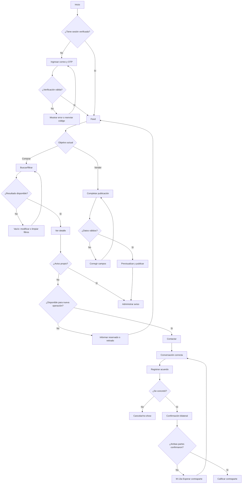

La regla de integridad central es que `Conversation`, `Transaction`, `PaymentEvidence` y `Review` conservan el mismo aviso y participantes. Si el aviso fue retirado, la conversación histórica permanece legible, pero no se puede iniciar una nueva operación.

#### Decisiones por objetivo de usuario

La siguiente matriz complementa el flujo global y vincula cada objetivo con las pantallas y condiciones de los wireflows. Los seis User Flows exportados incorporan las capturas de alta fidelidad de 4.4.3; los wireflows de 4.4.2 conservan sus miniaturas de baja fidelidad para mostrar la evolución del diseño.

| Objetivo | Ruta esperada | Alternativa y recuperación | Condición de salida |
|---|---|---|---|
| UG-01: acceder | M-01 → M-02 → M-02c → M-03 | M-01a: corregir correo; M-02a/b: corregir o reenviar. | Correo verificado y sesión activa. |
| UG-02: encontrar/contactar | M-03 → M-03a → M-05 → M-10 | M-03b/d: limpiar o reintentar; M-05a/b: volver; M-05c: revisar reputación. | Conversación con el aviso y contraparte seleccionados. |
| UG-03: publicar/administrar | M-07 → M-07a → M-08 → M-08a → M-06 | M-07b: corregir; M-07c: editar; M-06a/b: retirar con confirmación. | Aviso publicado o cambio confirmado sobre el mismo aviso. |
| UG-04: coordinar/cerrar | M-10 → M-11 → M-11b → M-13 → M-13a → M-13b → M-13d | M-12 opcional; M-11a: revisar campus; M-12c: aclarar; M-13c: cancelar. | Dos confirmaciones y reseña, o cancelación sin reseña. |
| UG-05: guardar | M-05 → M-04 → M-05 | M-04a: explorar; M-05a/b: disponibilidad; quitar permite deshacer. | Lista personal actualizada. |
| UG-06: cuenta | M-14 → M-14a/b/c → M-14 | Validación conserva preferencias; M-14d: confirmar o cancelar salida. | Consulta completada, preferencias guardadas o sesión cerrada. |

| User Flow con mock-ups | Persona / objetivo | Evidencia de decisiones |
|---|---|---|
| [UG-01 · Acceso](img/mobile-user-flows/UG-01-user-flow.png) | Estudiante comprador o vendedor que necesita ingresar. | Correo inválido, código incorrecto y vencimiento con recuperación. |
| [UG-02 · Explorar y contactar](img/mobile-user-flows/UG-02-user-flow.png) | Estudiante comprador que evalúa una oferta. | Filtros, vacío, error de red, disponibilidad y reputación. |
| [UG-03 · Publicar y administrar](img/mobile-user-flows/UG-03-user-flow.png) | Estudiante vendedor que crea o mantiene su aviso. | Dos pasos, corrección, éxito, edición, reserva y retirada. |
| [UG-04 · Coordinar y cerrar](img/mobile-user-flows/UG-04-user-flow.png) | Los dos participantes de una operación. | Aceptación, evidencia opcional, discrepancia, cierre bilateral y cancelación. |
| [UG-05 · Guardados](img/mobile-user-flows/UG-05-user-flow.png) | Estudiante comprador que conserva opciones. | Guardar, recuperar, quitar, deshacer y disponibilidad. |
| [UG-06 · Perfil](img/mobile-user-flows/UG-06-user-flow.png) | Estudiante verificado que administra su cuenta. | Historial, publicaciones, preferencias y salida confirmada. |

Cada imagen identifica la Persona, el objetivo y las acciones o condiciones entre pantallas. Las filas separan la ruta esperada de las alternativas; una flecha con varias acciones resume pasos intermedios. La matriz anterior y el flujo global explicitan las decisiones. Las imágenes pueden ampliarse sin depender del código de la galería.

## 4.5. Mobile Applications Prototyping

El prototipo navegable validará secuencias, retroalimentación y comprensión antes de implementar la aplicación Flutter. La [demo inicial](https://modem-palm-13537798.figma.site/) se conserva únicamente como antecedente exploratorio. La base visual vigente son los nuevos mock-ups locales de 4.4.3; el prototipo definitivo deberá cubrir sus rutas esperadas y alternativas con datos coherentes entre pantallas.

Las galerías de [wireframes](img/mobile-wireframes/index.html) y [mock-ups](design/mobile/index.html) facilitan revisar las 51 vistas de cada nivel de fidelidad. No simulan una sesión de estudiante ni envían datos. El contrato de navegación está definido por los flujos y la matriz de decisiones. Para convertir los mock-ups en un prototipo se deben enlazar controles, conservar el contexto al volver, simular tiempos de carga y bloquear acciones incompatibles con el estado actual. El código fuente compartido permite continuar esa etapa sin reconstruir el sistema visual en otra herramienta.

El escenario principal utiliza a Alex como estudiante actual, a Camila como contraparte y una calculadora de S/ 65.00 con entrega en Monterrico; el escenario de publicación utiliza un libro de S/ 40.00. Son datos ficticios. En la revisión del cierre se debe alternar la perspectiva de los participantes sin atribuir al usuario actual la confirmación ajena.

### 4.5.1. Android Mobile Applications Prototyping

Android es la primera variante de referencia. Se validará sobre un viewport equivalente a Pixel 8 (412 × 915), respetando barras del sistema, áreas seguras, navegación Atrás, teclado, objetivos de 48 dp y patrones de Material para sheets, diálogos y snackbars. El retorno cierra primero el teclado, después la hoja o detalle actual y finalmente cambia de destino.

Recorridos mínimos navegables: verificación correcta e incorrecta; buscar con y sin resultados; guardar; publicar con validación; editar/retirar; conversar por un aviso específico; acordar un encuentro; adjuntar evidencia; confirmar o cancelar; calificar; cambiar idioma y cerrar sesión.

**Evidencia pendiente:** URL del prototipo Android corregido, captura del prototipo en ejecución y enlace del video de navegación publicado en Microsoft Stream.

### 4.5.2. iOS Mobile Applications Prototyping

La variante iOS conserva arquitectura de información, contenido y marca, pero adapta safe areas, barra de estado, navegación hacia atrás, teclado, selectores, hojas modales y feedback a las convenciones de iOS. Los objetivos táctiles mínimos son de 44 × 44 pt y ninguna tarea depende exclusivamente de un gesto.

No se mantiene una segunda lógica funcional: ambas variantes comparten los mismos Screen IDs, historias y datos de prueba. Una lista de adaptación controla las diferencias visuales para impedir que Android e iOS se conviertan en productos divergentes.

**Evidencia pendiente:** copia iOS del prototipo corregido, captura en ejecución y enlace del video correspondiente en Microsoft Stream.

#### Matriz de adaptación y guion de demostración

| Elemento | Android | iOS | Comportamiento compartido |
|---|---|---|---|
| Marco y áreas seguras | Referencia de diseño 412 × 915; reservar barras del sistema. | Ajustar a un dispositivo iOS documentado y sus áreas seguras. | El contenido no queda debajo de barras o teclado. |
| Retorno | Botón del sistema y retorno visible en vistas secundarias. | Retorno visible y gesto de navegación como alternativa. | Restaurar lista, filtro y borrador anteriores. |
| Selección e ingreso | Teclados y selectores adaptados a Android. | Teclados y selectores adaptados a iOS. | Correo, OTP, moneda, fecha y hora con validación. |
| Hojas y diálogos | Patrones de hoja, diálogo y feedback de Android. | Presentaciones equivalentes adaptadas a iOS. | Cerrar una capa no abandona la tarea principal. |
| Accesibilidad | Revisar foco, TalkBack y áreas táctiles. | Revisar foco, VoiceOver y texto ampliado. | Etiquetas, errores y estado expresados semánticamente. |

El video de cada variante debe mostrar: ingreso con error y recuperación; búsqueda con y sin resultados; guardar y contactar; publicación en dos pasos con error y éxito; edición o retirada; acuerdo y discrepancia de evidencia; cierre pendiente y bilateral; reseña; cambio de idioma y salida. La guía de entrega contiene los casos y resultados esperados. Al grabar se incorporará una captura tomada del propio video y su enlace de Stream, sin sustituirlos por imágenes de la galería.

## 4.6. Web Applications UX/UI Design

La aplicación web de UPC-X permite a estudiantes verificados explorar, publicar, conversar y coordinar desde el navegador. Comparte el dominio y las reglas de la aplicación móvil; la landing informativa permanece documentada por separado en 4.3. Se mantiene una identidad Student: comprador y vendedor son perspectivas de una operación, no tipos de cuenta.

La propuesta se contrastó con los capítulos II y III de `origin/develop`, commit `89470fc`, consultado el 14 de septiembre de 2026. Retoma a **Camila Rojas (vendedora)** y **Sebastián Torres (comprador)**, sus tareas y escenarios To-Be. Se documenta evidencia de diseño para **US01–US44 y US48–US50**. US45–US47 pertenecen a la landing y no se declaran satisfechas mediante estas pantallas.

Se entregan **96 vistas y estados**, con **192 wireframes y 192 mock-ups**: una exportación de escritorio y otra de navegador móvil por vista y fidelidad. Incluyen las 51 correspondencias móviles y las ampliaciones del backlog. Se añaden **ocho wireflows y ocho User Flows**, uno por objetivo. La [galería web](design/web/index.html), la [guía de diseño](docs/web-design.md) y la [matriz historia/pantalla](docs/web-screen-inventory.md) reúnen las fuentes y exportaciones.

### 4.6.1. Web Applications Wireframes

Los wireframes representan jerarquía, agrupación y acciones con contornos y placeholders de imágenes. El escritorio parte de 1440 px y una retícula de contenido de hasta 1264 px; el navegador móvil se exporta a 390 px. Las páginas admiten desplazamiento vertical y conservan el orden de lectura. Las maquetas para navegador móvil son una adaptación web y no sustituyen los diseños nativos de 4.4.

| Familia | Estructura y estados | Wireframes |
|---|---|---|
| W-01 · Acceso | Registro, contraseña y recuperación de cuenta. | [Escritorio](img/web-wireframes/W-01-desktop.png) · [Móvil](img/web-wireframes/W-01-mobile.png) |
| W-02 · Verificación | OTP, vencimiento y restricciones de cuenta pendiente. | [Escritorio](img/web-wireframes/W-02-desktop.png) · [Móvil](img/web-wireframes/W-02-mobile.png) |
| W-03 · Catálogo | Búsqueda, filtros combinables, orden por precio, carga, vacío y error. | [Escritorio](img/web-wireframes/W-03-desktop.png) · [Móvil](img/web-wireframes/W-03-mobile.png) |
| W-04 · Guardados | Lista personal, quitar y deshacer. | [Escritorio](img/web-wireframes/W-04-desktop.png) · [Móvil](img/web-wireframes/W-04-mobile.png) |
| W-05 · Detalle ajeno | Disponibilidad, perfil público y reporte. | [Escritorio](img/web-wireframes/W-05-desktop.png) · [Móvil](img/web-wireframes/W-05-mobile.png) |
| W-06 · Aviso propio | Reserva, pausa, reactivación, venta y retirada. | [Escritorio](img/web-wireframes/W-06-desktop.png) · [Móvil](img/web-wireframes/W-06-mobile.png) |
| W-07 · Publicación | Información, fotografías, validación y oferta continua. | [Escritorio](img/web-wireframes/W-07-desktop.png) · [Móvil](img/web-wireframes/W-07-mobile.png) |
| W-08 · Previsualización | Revisión y confirmación antes de publicar. | [Escritorio](img/web-wireframes/W-08-desktop.png) · [Móvil](img/web-wireframes/W-08-mobile.png) |
| W-09 · Chats | Bandeja, mensajes no leídos y lista vacía. | [Escritorio](img/web-wireframes/W-09-desktop.png) · [Móvil](img/web-wireframes/W-09-mobile.png) |
| W-10 · Conversación | Perspectivas del comprador y de la vendedora; error de envío y cobro. | [Escritorio](img/web-wireframes/W-10-desktop.png) · [Móvil](img/web-wireframes/W-10-mobile.png) |
| W-11 · Acuerdo | Lugar, fecha y hora, revisión de contraparte y campus incorrecto. | [Escritorio](img/web-wireframes/W-11-desktop.png) · [Móvil](img/web-wireframes/W-11-mobile.png) |
| W-12 · Evidencia | Constancia opcional, declaración del receptor y discrepancia. | [Escritorio](img/web-wireframes/W-12-desktop.png) · [Móvil](img/web-wireframes/W-12-mobile.png) |
| W-13 · Cierre | Confirmación bilateral, reseñas, cancelación e inasistencia. | [Escritorio](img/web-wireframes/W-13-desktop.png) · [Móvil](img/web-wireframes/W-13-mobile.png) |
| W-14 · Perfil | Actividad, reputación, preferencias, cobro y salida. | [Escritorio](img/web-wireframes/W-14-desktop.png) · [Móvil](img/web-wireframes/W-14-mobile.png) |
| W-15 · Ayuda | Preguntas frecuentes sobre pagos, campus y confianza. | [Escritorio](img/web-wireframes/W-15-desktop.png) · [Móvil](img/web-wireframes/W-15-mobile.png) |
| W-16 · Soporte | Contacto, validación y confirmación de recepción. | [Escritorio](img/web-wireframes/W-16-desktop.png) · [Móvil](img/web-wireframes/W-16-mobile.png) |
| W-17 · Términos | Consulta del resumen de términos y privacidad. | [Escritorio](img/web-wireframes/W-17-desktop.png) · [Móvil](img/web-wireframes/W-17-mobile.png) |

El [inventario completo](docs/web-screen-inventory.md) enlaza cada estado derivado y su correspondencia con las referencias M. El catálogo reserva una columna para filtros en escritorio y una vista de filtros en móvil. El chat separa bandeja, mensajes y contexto en escritorio; en móvil se consulta primero la bandeja y después la conversación. Los formularios conservan resumen y acciones sin comprimir campos para hacer entrar toda la página en el primer viewport.

Los principios de diseño se traducen en proximidad entre etiqueta y campo, jerarquía de acciones, consistencia de destinos y recuperación junto al error. Los estados reservado, retirado y pendiente de verificación explican por qué una acción no está disponible. Se incluyen foco visible y controles etiquetados; la accesibilidad funcional se validará en el prototipo.

### 4.6.2. Web Applications Wireflow Diagrams

Cada wireflow enlaza las pantallas de baja fidelidad que resultan de una acción o evento. El objetivo, la Persona y las condiciones están escritos en la lámina. Los seis objetivos compartidos con móvil se mantienen; UG-07 y UG-08 explicitan reportes y asistencia del backlog consolidado.

| Objetivo | Persona | Resultado y alcance | Wireflow |
|---|---|---|---|
| UG-01 · Acceder y recuperar la cuenta | Camila Rojas y Sebastián Torres | Ingresar con una cuenta institucional verificada y recuperar el acceso cuando sea necesario. | [Abrir](img/web-wireflows/UG-01-wireflow.png) |
| UG-02 · Encontrar y contactar una oferta | Sebastián Torres · comprador | Encontrar una oferta por campus y precio, evaluar a su autor y abrir el chat correcto. | [Abrir](img/web-wireflows/UG-02-wireflow.png) |
| UG-03 · Publicar y administrar avisos | Camila Rojas · vendedora | Publicar una oferta con fotos y administrar su disponibilidad conservando el contexto. | [Abrir](img/web-wireflows/UG-03-wireflow.png) |
| UG-04 · Coordinar, documentar y cerrar la entrega | Sebastián Torres y Camila Rojas · dos perspectivas | Acordar el encuentro, compartir evidencia opcional y cerrar con la confirmación de ambos. | [Abrir](img/web-wireflows/UG-04-wireflow.png) |
| UG-05 · Guardar y recuperar avisos | Sebastián Torres · comprador | Conservar ofertas de interés sin reservarlas ni modificar su disponibilidad. | [Abrir](img/web-wireflows/UG-05-wireflow.png) |
| UG-06 · Gestionar perfil, actividad y cobro | Camila Rojas y Sebastián Torres | Mantener los datos propios, revisar actividad y reputación y cerrar la sesión. | [Abrir](img/web-wireflows/UG-06-wireflow.png) |
| UG-07 · Comunicar una irregularidad | Camila Rojas y Sebastián Torres | Reportar una publicación indebida o declarar una inasistencia con contexto y sin sanciones automáticas. | [Abrir](img/web-wireflows/UG-07-wireflow.png) |
| UG-08 · Consultar ayuda y contactar soporte | Visitante, Camila Rojas o Sebastián Torres | Comprender las reglas y solicitar ayuda por un canal identificado. | [Abrir](img/web-wireflows/UG-08-wireflow.png) |

Las flechas que cambian de participante lo indican expresamente: revisar como Camila no es una acción disponible en la sesión de Sebastián. Un cambio de filtros, error o confirmación se representa mediante otra vista. Los caminos alternativos y las condiciones de salida se explican por objetivo en 4.6.4, usando la misma definición de rutas para ambos niveles de fidelidad.

### 4.6.3. Web Applications Mock-ups

Los mock-ups aplican el sistema visual de 4.1: granate para acciones, verde para verificación y confirmaciones, fondo cálido, tarjetas blancas, Inter para lectura y Plus Jakarta Sans para jerarquía. Las ilustraciones originales y los datos son demostrativos. Las fuentes se incluyen localmente; las capturas no dependen de servicios externos.

| Familia | Contenido y decisiones | Mock-ups |
|---|---|---|
| W-01 · Acceso | Registro, contraseña y recuperación de cuenta. | [Escritorio](img/web-mockups/W-01-desktop.png) · [Móvil](img/web-mockups/W-01-mobile.png) |
| W-02 · Verificación | OTP, vencimiento y restricciones de cuenta pendiente. | [Escritorio](img/web-mockups/W-02-desktop.png) · [Móvil](img/web-mockups/W-02-mobile.png) |
| W-03 · Catálogo | Búsqueda, filtros combinables, orden por precio, carga, vacío y error. | [Escritorio](img/web-mockups/W-03-desktop.png) · [Móvil](img/web-mockups/W-03-mobile.png) |
| W-04 · Guardados | Lista personal, quitar y deshacer. | [Escritorio](img/web-mockups/W-04-desktop.png) · [Móvil](img/web-mockups/W-04-mobile.png) |
| W-05 · Detalle ajeno | Disponibilidad, perfil público y reporte. | [Escritorio](img/web-mockups/W-05-desktop.png) · [Móvil](img/web-mockups/W-05-mobile.png) |
| W-06 · Aviso propio | Reserva, pausa, reactivación, venta y retirada. | [Escritorio](img/web-mockups/W-06-desktop.png) · [Móvil](img/web-mockups/W-06-mobile.png) |
| W-07 · Publicación | Información, fotografías, validación y oferta continua. | [Escritorio](img/web-mockups/W-07-desktop.png) · [Móvil](img/web-mockups/W-07-mobile.png) |
| W-08 · Previsualización | Revisión y confirmación antes de publicar. | [Escritorio](img/web-mockups/W-08-desktop.png) · [Móvil](img/web-mockups/W-08-mobile.png) |
| W-09 · Chats | Bandeja, mensajes no leídos y lista vacía. | [Escritorio](img/web-mockups/W-09-desktop.png) · [Móvil](img/web-mockups/W-09-mobile.png) |
| W-10 · Conversación | Perspectivas del comprador y de la vendedora; error de envío y cobro. | [Escritorio](img/web-mockups/W-10-desktop.png) · [Móvil](img/web-mockups/W-10-mobile.png) |
| W-11 · Acuerdo | Lugar, fecha y hora, revisión de contraparte y campus incorrecto. | [Escritorio](img/web-mockups/W-11-desktop.png) · [Móvil](img/web-mockups/W-11-mobile.png) |
| W-12 · Evidencia | Constancia opcional, declaración del receptor y discrepancia. | [Escritorio](img/web-mockups/W-12-desktop.png) · [Móvil](img/web-mockups/W-12-mobile.png) |
| W-13 · Cierre | Confirmación bilateral, reseñas, cancelación e inasistencia. | [Escritorio](img/web-mockups/W-13-desktop.png) · [Móvil](img/web-mockups/W-13-mobile.png) |
| W-14 · Perfil | Actividad, reputación, preferencias, cobro y salida. | [Escritorio](img/web-mockups/W-14-desktop.png) · [Móvil](img/web-mockups/W-14-mobile.png) |
| W-15 · Ayuda | Preguntas frecuentes sobre pagos, campus y confianza. | [Escritorio](img/web-mockups/W-15-desktop.png) · [Móvil](img/web-mockups/W-15-mobile.png) |
| W-16 · Soporte | Contacto, validación y confirmación de recepción. | [Escritorio](img/web-mockups/W-16-desktop.png) · [Móvil](img/web-mockups/W-16-mobile.png) |
| W-17 · Términos | Consulta del resumen de términos y privacidad. | [Escritorio](img/web-mockups/W-17-desktop.png) · [Móvil](img/web-mockups/W-17-mobile.png) |

La [vista general](img/web-mockups/overview.png) reúne las 17 pantallas principales. El [inventario](docs/web-screen-inventory.md) permite abrir las 79 variantes, incluyendo recuperación de acceso, reportes, cobro, oferta continua y perspectivas de ambos participantes. Los PNGs usan ancho 1440 o 390 px y altura completa del contenido a escala 1×. En móvil, las columnas se apilan y Publicar conserva un acceso visible.

**Continuidad del dominio:** OTP verifica el registro; el ingreso posterior incorpora la contraseña exigida por US03. En US37 se usa «Declaro haber recibido el pago»: el receptor revisa su cuenta y UPC-X conserva una declaración sin certificar transferencias. Marcar Vendido oculta una oferta única; solo la confirmación de ambos habilita reseñas. US35 cancela tras confirmación de un participante y notifica al otro. Reportes e inasistencias no implican sanción automática.

### 4.6.4. Web Applications User Flow Diagrams

Los User Flows derivan de las mismas rutas que generan los wireflows, sustituyendo cada vista por su mock-up final. Mantienen Persona, objetivo, decisiones, happy path y unhappy paths. Los IDs permiten contrastar ambas fidelidades sin reinterpretar las reglas.

El siguiente esquema sitúa los destinos de primer nivel. Los ocho diagramas con capturas que lo acompañan contienen los recorridos y alternativas de cada objetivo.

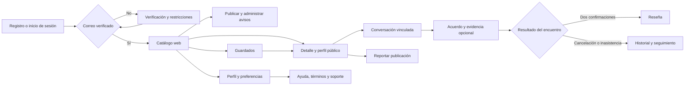

#### UG-01 · Acceder y recuperar la cuenta

**Persona:** Camila Rojas y Sebastián Torres. **Objetivo:** Ingresar con una cuenta institucional verificada y recuperar el acceso cuando sea necesario.

[Ver User Flow completo](img/web-user-flows/UG-01-user-flow.png) · [Comparar con wireflow](img/web-wireflows/UG-01-wireflow.png).

- Registro: `W-01 → W-02 → W-02c → W-03`. Enviar código; Verificar código válido; Entrar al catálogo.
- Correo o código incorrecto: `W-01a → W-01 → W-02a → W-02`. Corregir correo; Enviar código; respuesta incorrecta; Corregir y volver a verificar.
- Código vencido y restricciones: `W-02d → W-02b → W-02 → W-02c`. Completar verificación; código vencido; Solicitar otro código; Verificar el código nuevo.
- Inicio de sesión: `W-01b → W-01c → W-01b → W-03`. Credenciales incorrectas; Corregir credenciales; Credenciales correctas.
- Recuperación: `W-01d → W-01f → W-01g → W-01i → W-01b`. Solicitar enlace; Abrir enlace vigente en correo; Guardar contraseña válida; Volver al ingreso.
- Recuperación alternativa: `W-01e → W-01d → W-01h → W-01f`. Corregir dirección; Enlace abierto fuera de vigencia; Solicitar otro enlace.
- Contraseña no coincidente: `W-01g → W-01j → W-01i`. Guardar contraseñas distintas; Corregir y guardar.

#### UG-02 · Encontrar y contactar una oferta

**Persona:** Sebastián Torres · comprador. **Objetivo:** Encontrar una oferta por campus y precio, evaluar a su autor y abrir el chat correcto.

[Ver User Flow completo](img/web-user-flows/UG-02-user-flow.png) · [Comparar con wireflow](img/web-wireflows/UG-02-wireflow.png).

- Explorar y contactar: `W-03 → W-03a → W-03g → W-05 → W-10`. Seleccionar filtros; Aplicar filtros; Abrir calculadora; Contactar a Camila.
- Orden por precio: `W-03 → W-03e → W-05`. Precio menor a mayor; aplicar orden; Abrir calculadora.
- Catálogo vacío: `W-03f → W-07`. Publicar el primer aviso.
- Sin resultados: `W-03a → W-03b → W-03`. Aplicar rango sin coincidencias; Limpiar filtros.
- Error de red: `W-03d → W-03c → W-03`. Reintentar; Carga correcta.
- Disponibilidad y reputación: `W-05a → W-03 → W-05b → W-03`. Volver: reservado; Abrir enlace retirado; Explorar otra oferta.
- Evaluar a la contraparte: `W-05 → W-05c → W-05 → W-10`. Ver perfil público; Volver al aviso; Contactar.

#### UG-03 · Publicar y administrar avisos

**Persona:** Camila Rojas · vendedora. **Objetivo:** Publicar una oferta con fotos y administrar su disponibilidad conservando el contexto.

[Ver User Flow completo](img/web-user-flows/UG-03-user-flow.png) · [Comparar con wireflow](img/web-wireflows/UG-03-wireflow.png).

- Publicación: `W-07 → W-07a → W-08 → W-08a → W-06`. Continuar; Previsualizar; Publicar; Ver mi aviso.
- Validación y fotos: `W-07b → W-07 → W-07e → W-07a`. Corregir datos; Continuar; archivo rechazado; Elegir JPG o PNG válido.
- Edición y oferta continua: `W-07c → W-06 → W-07d → W-08b → W-08c → W-06h`. Guardar cambios; Editar; activar oferta continua; Revisar disponibilidad recurrente; Publicar oferta continua; Ver disponibilidad recurrente.
- Reserva: `W-06 → W-06c → W-06g`. Reservar; Seleccionar conversación de Sebastián y confirmar.
- Pausa y reactivación: `W-14a → W-06e → W-06f → W-06`. Pausar publicación; Reactivar mismo aviso; Ver publicación.
- Venta y retirada: `W-06d → W-14i → W-06a → W-06b`. Confirmar vendido; Abrir otro aviso; retirar; Confirmar retirada.

#### UG-04 · Coordinar, documentar y cerrar la entrega

**Persona:** Sebastián Torres y Camila Rojas · dos perspectivas. **Objetivo:** Acordar el encuentro, compartir evidencia opcional y cerrar con la confirmación de ambos.

[Ver User Flow completo](img/web-user-flows/UG-04-user-flow.png) · [Comparar con wireflow](img/web-wireflows/UG-04-wireflow.png).

- Encuentro: `W-10 → W-11 → W-11c → W-11b`. Proponer encuentro; Enviar propuesta; Camila revisa; Camila acepta.
- Campus y mensaje fallido: `W-11a → W-11 → W-10a → W-10`. Corregir campus; Volver al chat; envío falla; Reintentar mensaje.
- Datos de cobro y evidencia opcional: `W-10b → W-12 → W-12a → W-12d → W-12b`. Sebastián paga externamente; adjunta; Compartir captura; Camila abre evidencia; Camila declara recepción.
- Discrepancia: `W-12d → W-12c → W-12 → W-12a`. No reconozco el pago; Aclarar y corregir captura; Compartir nueva evidencia.
- Cierre bilateral: `W-13 → W-13a → W-13k → W-13b → W-13d`. Sebastián confirma entrega; Cambiar perspectiva: Camila revisa; Camila confirma; Sebastián puede calificar; Enviar reseña de Camila.
- Valoración del comprador: `W-13a → W-13j → W-14j`. Ambos confirman; Camila califica; Enviar valoración de Sebastián.
- Cancelación notificada: `W-13c → W-13g → W-13h → W-13i`. Confirmar cancelación; Camila recibe notificación; Consultar cancelación.
- Volver sin cancelar: `W-13c → W-13`. Cerrar confirmación y conservar encuentro.

#### UG-05 · Guardar y recuperar avisos

**Persona:** Sebastián Torres · comprador. **Objetivo:** Conservar ofertas de interés sin reservarlas ni modificar su disponibilidad.

[Ver User Flow completo](img/web-user-flows/UG-05-user-flow.png) · [Comparar con wireflow](img/web-wireflows/UG-05-wireflow.png).

- Guardar y abrir: `W-05 → W-04 → W-05 → W-10`. Guardar; abrir Guardados; Abrir calculadora; Contactar a Camila.
- Quitar y deshacer: `W-04 → W-04b → W-04`. Quitar de Guardados; Deshacer.
- Lista vacía: `W-04a → W-03 → W-05a`. Explorar avisos; Abrir oferta reservada.

#### UG-06 · Gestionar perfil, actividad y cobro

**Persona:** Camila Rojas y Sebastián Torres. **Objetivo:** Mantener los datos propios, revisar actividad y reputación y cerrar la sesión.

[Ver User Flow completo](img/web-user-flows/UG-06-user-flow.png) · [Comparar con wireflow](img/web-wireflows/UG-06-wireflow.png).

- Perfil y validación: `W-14 → W-14c → W-14h → W-14g`. Editar perfil; Guardar con nombre vacío; Corregir y guardar.
- Datos de cobro: `W-14e → W-14f → W-14e → W-10b`. Guardar número incompleto; Corregir número; Guardar; compartir en chat.
- Actividad y reputación: `W-14 → W-14b → W-14j → W-14a`. Consultar historial; Volver a Perfil; ver reputación; Volver a Perfil; mis publicaciones.
- Sesión: `W-14 → W-14d → W-01b`. Cerrar sesión; Confirmar salida.
- Conservar sesión: `W-14d → W-14`. Volver al perfil sin cerrar.

#### UG-07 · Comunicar una irregularidad

**Persona:** Camila Rojas y Sebastián Torres. **Objetivo:** Reportar una publicación indebida o declarar una inasistencia con contexto y sin sanciones automáticas.

[Ver User Flow completo](img/web-user-flows/UG-07-user-flow.png) · [Comparar con wireflow](img/web-wireflows/UG-07-wireflow.png).

- Reporte de aviso: `W-05 → W-05d → W-05e → W-03`. Reportar publicación; Enviar motivo y descripción; Volver al catálogo.
- Corregir reporte: `W-05f → W-05d → W-05e`. Completar motivo y descripción; Enviar reporte.
- Inasistencia: `W-13 → W-13e → W-13f → W-14b`. No se presentó; Registrar declaración; Consultar historial.

#### UG-08 · Consultar ayuda y contactar soporte

**Persona:** Visitante, Camila Rojas o Sebastián Torres. **Objetivo:** Comprender las reglas y solicitar ayuda por un canal identificado.

[Ver User Flow completo](img/web-user-flows/UG-08-user-flow.png) · [Comparar con wireflow](img/web-wireflows/UG-08-wireflow.png).

- Ayuda y condiciones: `W-15 → W-17 → W-15`. Consultar términos y privacidad; Volver a Ayuda.
- Contacto: `W-15 → W-16 → W-16b → W-15`. Contactar soporte; Enviar solicitud completa; Volver a Ayuda.
- Formulario incompleto: `W-16a → W-16 → W-16b`. Corregir campos indicados; Enviar solicitud.

Los [recorridos HTML](design/web/flows.html) permiten ampliar cada pantalla. Las miniaturas sitúan el recorrido; la galería permite leer la vista completa en escritorio y móvil. El [resultado de QA](img/web-mockups/qa.json) registra la revisión de las 96 vistas en ambas fidelidades y anchuras, las referencias de flujos, filtros de galería, fuentes y desbordamiento.

Son evidencias de **diseño estático de 4.6**. La interacción con datos, validación y persistencia, así como las grabaciones de navegación, corresponden al prototipo de 4.7.

## 4.7. Web Applications Prototyping

El prototipo de la aplicación web debe implementar la interacción de los ocho User Goals de 4.6 en Desktop Web Browser y Mobile Web Browser. Mantendrá el contexto del aviso, los participantes, los filtros y los borradores al navegar; la adaptación responsive debe conservar las acciones y el orden semántico. La [galería de 4.6](design/web/index.html) ofrece estados estáticos enlazados para revisión y no demuestra validación ni persistencia funcional.

El guion comienza con registro, verificación, ingreso y recuperación; continúa con búsqueda, guardados, publicación y administración; muestra las dos perspectivas del chat, acuerdo, evidencia opcional, cierre bilateral y cancelación; termina con perfil, reportes y ayuda. Se debe repetir en escritorio y navegador móvil, incluyendo rutas alternativas, idioma, teclado y foco. **Evidencia pendiente:** prototipo interactivo, URL accesible, captura tomada del video y enlace Microsoft Stream para la aplicación web. La publicación de la landing y sus propias evidencias se revisan por separado en 4.3.

## 4.8. Domain-Driven Software Architecture

La arquitectura objetivo separa el dominio de la interfaz y de los proveedores externos. Los contextos delimitados son **Identity & Access**, **Marketplace**, **Communication**, **Transactions & Reputation** y **Media**. La demo React no se reutiliza como arquitectura productiva: sirve como referencia de interacción para la aplicación Flutter.

| Bounded Context | Responsabilidad | Entidades principales |
|---|---|---|
| Identity & Access | Registro, OTP, sesión y perfil institucional. | Student, VerificationCode; sesión como mecanismo de autenticación. |
| Marketplace | Publicación, clasificación, búsqueda, guardados y disponibilidad. | Listing, ListingImage, Category, Favorite |
| Communication | Conversaciones y mensajes vinculados a un aviso. | Conversation, Message |
| Transactions & Reputation | Acuerdo, evidencia externa, confirmación y calificación. | Transaction, PaymentEvidence, Review |
| Media | Carga, validación y acceso controlado a imágenes. | Referencias de objeto en ListingImage y PaymentEvidence. |

### 4.8.1. Software Architecture Context Diagram

El estudiante interactúa con UPC-X desde la aplicación móvil o la aplicación web. Ambas comparten identidad, reglas de negocio y API. La plataforma envía códigos mediante un proveedor de correo y almacena imágenes; Yape y Plin quedan fuera del límite del sistema porque el pago ocurre externamente.

[Abrir diagrama de contexto en SVG](img/diagrams/chapter4-context-diagram.svg).

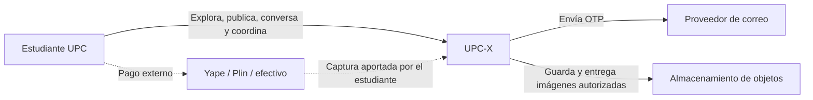

### 4.8.2. Software Architecture Container Diagrams

La aplicación Flutter y el cliente web consumen una RESTful API documentada con OpenAPI. La API concentra reglas de negocio y autorización; PostgreSQL persiste datos estructurados y el almacenamiento de objetos conserva imágenes. El cliente no incorpora credenciales de proveedores ni procesa operaciones bancarias. Las capturas e importes declarados se muestran solo a participantes autorizados; las credenciales de sesión requieren almacenamiento seguro propio de la plataforma. Se alinea el stack objetivo con 5.1.1 de develop: Angular/TypeScript para web y Spring Boot/Java para la API. Los archivos HTML/CSS/JavaScript de 4.6 son fuentes de diseño, no una implementación productiva que reemplace ese framework.

[Abrir diagrama de contenedores en SVG](img/diagrams/chapter4-container-diagram.svg).

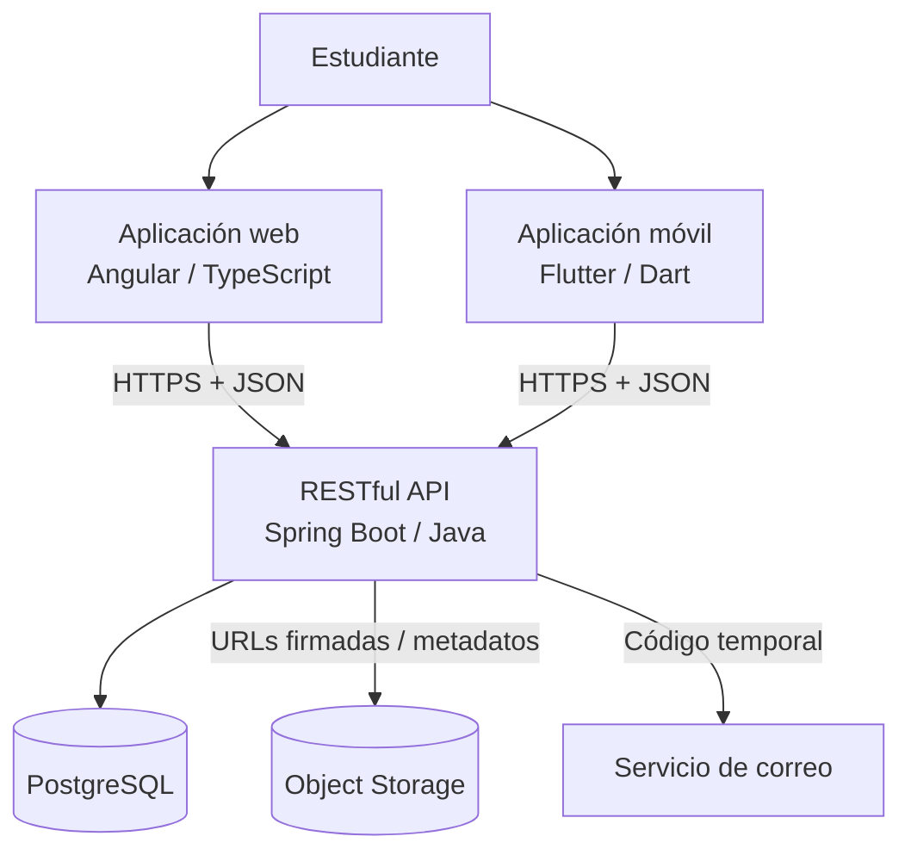

La elección es una arquitectura objetivo sujeta a validación durante la implementación. En particular, el proveedor de correo, object storage y despliegue no se consideran seleccionados hasta documentar el Spike correspondiente.

### 4.8.3. Software Architecture Components Diagrams

La API se organiza por capacidades del dominio y no por pantallas. Los controladores traducen solicitudes; los servicios de aplicación coordinan casos de uso; el dominio aplica invariantes; los repositorios aíslan la persistencia y los adaptadores encapsulan proveedores externos.

[Abrir diagrama de componentes en SVG](img/diagrams/chapter4-components-diagram.svg).

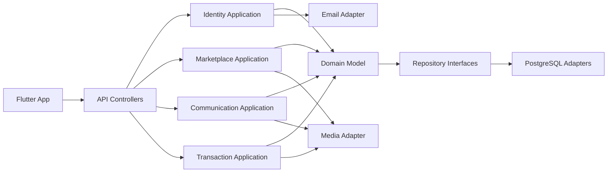

Reglas transversales: autorización por identidad verificada, validación de archivos, límites de tamaño, auditoría de cambios de estado, localización de mensajes y contrato de errores consistente. La API nunca confirma por sí misma que una captura representa un pago válido; solo registra la declaración y la confirmación de las partes.

#### Límites, agregados y decisiones de diseño

| Agregado o capacidad | Regla que protege | Pantallas relacionadas |
|---|---|---|
| Student / verificación | Correo institucional único y OTP vigente de un solo uso. | M-01, M-02, M-14 |
| Listing | Solo su propietario edita; publicar requiere datos válidos y portada. | M-03 a M-08 |
| Conversation | Un hilo por aviso y comprador; solo sus dos participantes acceden. | M-09, M-10 |
| Transaction | Acuerdo bilateral, transiciones válidas y dos confirmaciones para completar. | M-11, M-13 |
| PaymentEvidence | Captura privada, mensaje del mismo hilo y estado declarado por participante autorizado. | M-12 |
| Review | Autor participante, entrega completada y una reseña por autor/transacción. | M-13, M-14 |

La API se plantea inicialmente como una aplicación modular desplegable de forma conjunta: los bounded contexts no implican microservicios separados. Los servicios de aplicación coordinan cambios que afectan a más de un agregado; por ejemplo, completar una transacción y marcar su aviso como completado deben ejecutarse de forma atómica. Los adaptadores de correo y objetos permanecen sustituibles. Su proveedor, la estrategia de actualización de mensajes y el mecanismo de sesión se resolverán mediante decisiones de implementación documentadas.

La propuesta móvil Flutter proviene del alcance actual del equipo. Con el criterio actualizado de libertad de herramientas y lenguajes, su elección se justifica por las necesidades del producto. La landing mantiene un alcance informativo; la aplicación web de 4.6 incorpora los recorridos autenticados del marketplace sobre la misma API. La [guía web](docs/web-design.md) distingue los nuevos requisitos encontrados en develop de la cobertura móvil previa.

## 4.9. Software Object-Oriented Design

El diseño orientado a objetos de UPC-X representa las principales entidades que intervienen en las actividades de compra, venta e intercambio entre estudiantes de la Universidad Peruana de Ciencias Aplicadas.

El modelo considera al estudiante como la entidad principal del sistema. Un mismo estudiante puede desempeñarse como comprador o vendedor dependiendo de la interacción que realice dentro de la plataforma, por lo que ambos comportamientos se representan mediante la clase `Student` y no mediante entidades independientes. La identidad del usuario actual se obtiene de la sesión; no se representa mediante una bandera global como `authed` ni mediante un identificador fijado en la interfaz.

Para facilitar la comprensión del dominio, las clases se organizan en cuatro grupos principales: Identity, Marketplace, Communication y Transactions & Reputation. Asimismo, se incluye un conjunto de enumeraciones que restringe los posibles estados y tipos utilizados por determinadas entidades.

Esta organización permite representar funcionalidades como la verificación mediante correo institucional, publicación de productos, servicios y tutorías, comunicación entre estudiantes, registro de evidencias de pago, coordinación de encuentros en sedes UPC y generación de reputación a partir de las transacciones realizadas.

### 4.9.1. Class Diagrams

El diagrama de clases general de UPC-X presenta las entidades principales del dominio y sus relaciones. Para mejorar su comprensión, las clases se encuentran agrupadas de acuerdo con la responsabilidad que cumplen dentro del sistema.

El grupo `Identity` contiene las clases relacionadas con la identificación y verificación de los estudiantes. `Student` representa a un miembro de la comunidad UPC, mientras que `VerificationCode` permite registrar los códigos utilizados para comprobar la propiedad del correo institucional.

El grupo `Marketplace` contiene las clases relacionadas con la publicación y clasificación de ofertas. `Listing` representa los productos, servicios o tutorías publicados por los estudiantes, `ListingImage` mantiene sus fotografías y portada, `Category` permite clasificarlos y `Favorite` registra los avisos guardados.

El grupo `Communication` representa las interacciones entre los estudiantes. Una publicación puede generar diferentes conversaciones, identificadas además por el comprador y el vendedor. Cada mensaje conserva su `senderId`; por ello el punto de vista visual se calcula a partir de la sesión y no queda grabado como `me` o `them`. Algunos mensajes pueden incorporar una `PaymentEvidence`, utilizada para almacenar una captura y metadatos declarados de pagos realizados mediante medios externos como Yape o Plin.

Finalmente, el grupo `Transactions & Reputation` representa las operaciones acordadas entre los estudiantes. `Transaction` almacena la operación, el precio acordado, la fecha y el punto de encuentro, mientras que `Campus` identifica la sede UPC donde se realizará el intercambio. La entrega se completa únicamente después de la confirmación de ambas partes; entonces cada participante puede registrar como máximo una `Review` sobre su contraparte.

Las enumeraciones complementan el modelo restringiendo valores relacionados con el tipo y estado de las publicaciones, conversaciones, mensajes, métodos de pago y transacciones.

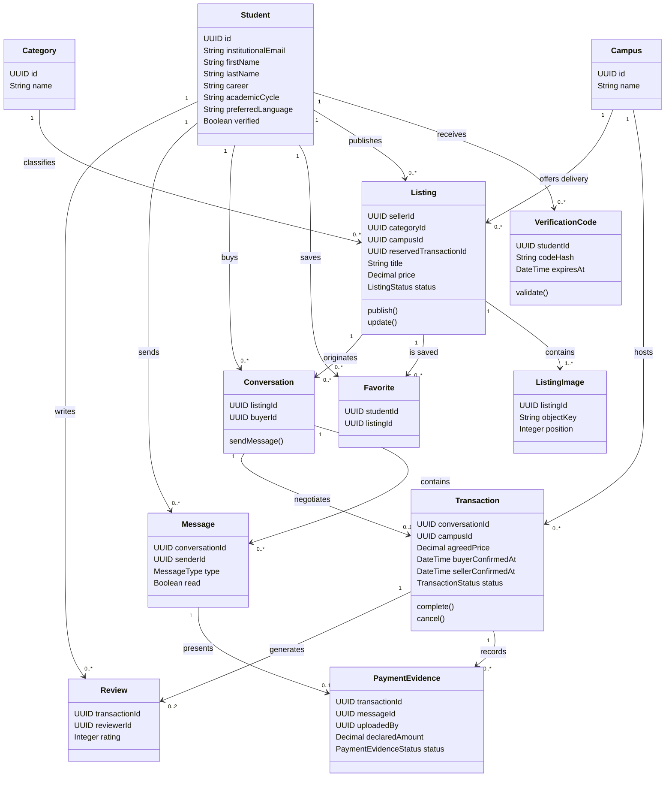

El diagrama anterior es el modelo objetivo que se utilizará al implementar. Se acompaña de una [exportación SVG del modelo de clases](img/diagrams/chapter4-class-diagram.svg) para lectores que no renderizan Mermaid. La imagen preliminar `img/diagrams/classdiagram.png` se conserva como antecedente y no sustituye este modelo. La cardinalidad de mensajes admite un hilo recién creado sin mensajes; la de reseñas se limita a dos mediante las reglas de participante y unicidad.

### 4.9.2. Class Dictionary

A continuación, se presenta el diccionario de clases correspondiente al modelo orientado a objetos de UPC-X. Para cada clase se especifican sus principales atributos, operaciones y responsabilidades dentro del dominio.

#### Student

Representa a un estudiante perteneciente a la comunidad UPC. Un estudiante puede publicar ofertas, iniciar conversaciones, realizar compras y registrar reseñas.

| Elemento | Tipo | Descripción |
|---|---|---|
| `id` | UUID | Identificador único del estudiante. |
| `institutionalEmail` | String | Correo institucional `@upc.edu.pe` utilizado para identificar y verificar al estudiante. |
| `firstName` | String | Nombres del estudiante. |
| `lastName` | String | Apellidos del estudiante. |
| `profileImageUrl` | String | Dirección de la imagen utilizada como foto de perfil. |
| `career` | String | Carrera mostrada en el perfil. |
| `academicCycle` | String | Ciclo académico declarado por el estudiante. |
| `preferredLanguage` | String | Idioma preferido: `es_419` o `en_US`. |
| `verified` | Boolean | Indica si la cuenta del estudiante fue verificada mediante correo institucional. |
| `createdAt` | DateTime | Fecha y hora de creación de la cuenta. |
| `verifyAccount()` | Método | Confirma la verificación del correo institucional del estudiante. |
| `createListing()` | Método | Permite crear una nueva publicación. |
| `startConversation()` | Método | Inicia una conversación relacionada con una publicación. |
| `createReview()` | Método | Registra una reseña después de una transacción. |

#### VerificationCode

Representa el código temporal utilizado durante el proceso de verificación del correo institucional.

| Elemento | Tipo | Descripción |
|---|---|---|
| `id` | UUID | Identificador único del código de verificación. |
| `studentId` | UUID | Estudiante al que se envió el código. |
| `codeHash` | String | Hash de un solo uso; el código original no se conserva. |
| `expiresAt` | DateTime | Fecha y hora hasta la cual el código puede ser utilizado. |
| `used` | Boolean | Indica si el código ya fue utilizado. |
| `validate()` | Método | Comprueba que el código sea válido y se encuentre vigente. |
| `expire()` | Método | Invalida el código cuando supera su periodo de vigencia. |

#### Category

Representa una categoría utilizada para organizar las publicaciones disponibles en UPC-X.

| Elemento | Tipo | Descripción |
|---|---|---|
| `id` | UUID | Identificador único de la categoría. |
| `name` | String | Nombre de la categoría. |
| `description` | String | Descripción del tipo de publicaciones agrupadas en la categoría. |

#### Listing

Representa una oferta publicada por un estudiante. La oferta puede corresponder a un producto, servicio o tutoría.

| Elemento | Tipo | Descripción |
|---|---|---|
| `id` | UUID | Identificador único de la publicación. |
| `sellerId` | UUID | Estudiante propietario del aviso. |
| `categoryId` | UUID | Categoría que clasifica el aviso. |
| `campusId` | UUID | Campus de entrega anunciado; se utiliza en búsqueda y como referencia al proponer un encuentro. |
| `reservedTransactionId` | UUID? | Transacción del hilo seleccionado al reservar; nula sin una reserva activa. |
| `title` | String | Título mostrado en la publicación. |
| `description` | String | Descripción del producto, servicio o tutoría ofrecida. |
| `price` | Decimal | Precio definido por el estudiante vendedor. |
| `type` | ListingType | Tipo de publicación: producto, servicio o tutoría. |
| `condition` | ListingCondition? | Condición del bien; no aplica a servicios o tutorías. |
| `status` | ListingStatus | Estado actual de la publicación. |
| `createdAt` | DateTime | Fecha y hora de creación de la publicación. |
| `publish()` | Método | Publica la oferta dentro del marketplace. |
| `update()` | Método | Actualiza la información de una publicación existente. |
| `markAsUnavailable()` | Método | Marca la publicación como no disponible. |

#### ListingImage

Representa una fotografía asociada a un aviso. Separarla de `Listing` permite mantener múltiples imágenes y una portada ordenada.

| Elemento | Tipo | Descripción |
|---|---|---|
| `id` | UUID | Identificador único. |
| `listingId` | UUID | Aviso al que pertenece. |
| `objectKey` | String | Clave del archivo en el almacenamiento de objetos. |
| `altText` | String | Descripción accesible de la imagen. |
| `position` | Integer | Orden dentro de la galería; la posición cero es portada. |

#### Favorite

Representa el guardado de un aviso por un estudiante. La combinación `studentId + listingId` es única.

| Elemento | Tipo | Descripción |
|---|---|---|
| `studentId` | UUID | Estudiante que guarda el aviso. |
| `listingId` | UUID | Aviso guardado. |
| `createdAt` | DateTime | Momento del guardado. |

#### Conversation

Representa una conversación iniciada por un estudiante interesado en una publicación.

| Elemento | Tipo | Descripción |
|---|---|---|
| `id` | UUID | Identificador único de la conversación. |
| `listingId` | UUID | Aviso que originó la conversación. |
| `buyerId` | UUID | Estudiante que contactó al propietario del aviso. |
| `createdAt` | DateTime | Fecha y hora en que se inició la conversación. |
| `status` | ConversationStatus | Estado actual de la conversación. |
| `sendMessage()` | Método | Permite incorporar un nuevo mensaje a la conversación. |
| `close()` | Método | Finaliza la conversación. |

#### Message

Representa un mensaje enviado por un estudiante dentro de una conversación.

| Elemento | Tipo | Descripción |
|---|---|---|
| `id` | UUID | Identificador único del mensaje. |
| `conversationId` | UUID | Conversación a la que pertenece. |
| `senderId` | UUID | Estudiante que envió el mensaje. |
| `content` | String | Contenido textual del mensaje. |
| `sentAt` | DateTime | Fecha y hora en que fue enviado. |
| `type` | MessageType | Tipo de mensaje enviado. |
| `read` | Boolean | Indica si el destinatario ha leído el mensaje. |
| `markAsRead()` | Método | Cambia el estado del mensaje a leído. |

#### PaymentEvidence

Representa la evidencia de un pago realizado mediante un medio externo a UPC-X.

| Elemento | Tipo | Descripción |
|---|---|---|
| `id` | UUID | Identificador único de la evidencia de pago. |
| `transactionId` | UUID | Transacción a la que pertenece la evidencia. |
| `messageId` | UUID | Mensaje que presenta la tarjeta dentro de la conversación. |
| `uploadedBy` | UUID | Participante que adjuntó la captura. |
| `imageObjectKey` | String | Clave de la captura almacenada de manera controlada. |
| `paymentMethod` | PaymentMethod | Medio utilizado para realizar el pago. |
| `declaredAmount` | Decimal | Importe declarado por quien adjunta la evidencia. |
| `maskedReference` | String | Referencia parcial; nunca expone datos sensibles completos. |
| `status` | PaymentEvidenceStatus | Estado declarado: enviada, recibida o con discrepancia. |
| `uploadedAt` | DateTime | Fecha y hora en que la evidencia fue incorporada a la conversación. |
| `attachEvidence()` | Método | Adjunta la evidencia de pago al mensaje correspondiente. |
| `markAsReceived()` | Método | Registra la confirmación explícita de la contraparte. |
| `reportDiscrepancy()` | Método | Registra que los datos no coinciden con lo acordado. |

UPC-X registra únicamente la evidencia proporcionada por los estudiantes y no procesa directamente las operaciones financieras realizadas mediante Yape, Plin u otros medios externos.

#### Campus

Representa una sede de la Universidad Peruana de Ciencias Aplicadas utilizada como referencia para coordinar el encuentro entre estudiantes.

| Elemento | Tipo | Descripción |
|---|---|---|
| `id` | UUID | Identificador único de la sede. |
| `name` | String | Nombre de la sede UPC. |

Inicialmente se consideran las sedes Monterrico, San Miguel, San Isidro y Villa.

#### Transaction

Representa una operación acordada entre un estudiante comprador y el propietario de una publicación.

| Elemento | Tipo | Descripción |
|---|---|---|
| `id` | UUID | Identificador único de la transacción. |
| `conversationId` | UUID | Conversación que originó el acuerdo. |
| `campusId` | UUID | Sede acordada para la entrega. |
| `agreedPrice` | Decimal | Precio finalmente acordado entre los estudiantes. |
| `meetingPoint` | String | Punto específico acordado para realizar el encuentro dentro de la sede. |
| `meetingAt` | DateTime | Fecha y hora acordadas para el encuentro. |
| `status` | TransactionStatus | Estado actual de la transacción. |
| `buyerAcceptedAt` | DateTime? | Aceptación del comprador de la propuesta vigente de encuentro. |
| `sellerAcceptedAt` | DateTime? | Aceptación del vendedor de esa misma propuesta. |
| `buyerConfirmedAt` | DateTime? | Confirmación de entrega del comprador. |
| `sellerConfirmedAt` | DateTime? | Confirmación de entrega del vendedor. |
| `createdAt` | DateTime | Fecha y hora en que se registró la operación. |
| `completedAt` | DateTime? | Fecha y hora de cierre; nula hasta completar la transacción. |
| `confirm()` | Método | Confirma el acuerdo entre los estudiantes. |
| `complete()` | Método | Registra la transacción como completada. |
| `cancel()` | Método | Cancela una transacción previamente registrada. |

La clase mantiene una relación con `Listing`, desde la cual se identifica al vendedor, y con el `buyerId` de la conversación. La operación solo cambia a `COMPLETED` cuando existen ambas confirmaciones; en caso contrario permanece pendiente o se marca `CANCELLED`.

El aviso se obtiene mediante `conversationId → Conversation.listingId`; comprador y vendedor se derivan del mismo hilo y aviso. Las aceptaciones del encuentro son distintas de las confirmaciones de entrega: ambas aceptaciones cambian `PENDING` a `AGREED`; ambas confirmaciones cambian `AGREED` a `COMPLETED`. Modificar una propuesta invalida sus aceptaciones previas y la devuelve a `PENDING`. Una operación completada o cancelada es terminal en este primer diseño.

#### Review

Representa la valoración registrada por uno de los participantes después de completar una transacción. La combinación `transactionId + reviewerId` es única y el destinatario se deriva como la contraparte.

| Elemento | Tipo | Descripción |
|---|---|---|
| `id` | UUID | Identificador único de la reseña. |
| `transactionId` | UUID | Transacción completada que habilita la reseña. |
| `reviewerId` | UUID | Participante que emite la valoración. |
| `rating` | Integer | Calificación otorgada durante la evaluación de la experiencia. |
| `comment` | String | Comentario opcional relacionado con la transacción realizada. |
| `createdAt` | DateTime | Fecha y hora en que se registró la reseña. |
| `create()` | Método | Registra la valoración asociada a una transacción completada. |

#### Enumerations

Las siguientes enumeraciones permiten restringir los valores utilizados por las principales clases del dominio.

| Enumeración | Valores | Descripción |
|---|---|---|
| `ListingType` | `PRODUCT`, `SERVICE`, `TUTORING` | Determina el tipo de oferta publicada. |
| `ListingStatus` | `ACTIVE`, `RESERVED`, `COMPLETED`, `WITHDRAWN` | Representa el estado de disponibilidad de una publicación. |
| `ListingCondition` | `NEW`, `LIKE_NEW`, `USED` | Declara la condición de un producto. |
| `ConversationStatus` | `ACTIVE`, `CLOSED` | Representa el estado de una conversación. |
| `MessageType` | `TEXT`, `IMAGE`, `PAYMENT_EVIDENCE` | Identifica el tipo de contenido enviado mediante un mensaje. |
| `PaymentMethod` | `YAPE`, `PLIN`, `CASH`, `OTHER` | Identifica el medio de pago utilizado por los estudiantes. |
| `PaymentEvidenceStatus` | `SENT`, `RECEIVED`, `DISPUTED` | Registra lo declarado por las partes; no una verificación financiera de UPC-X. |
| `TransactionStatus` | `PENDING`, `AGREED`, `COMPLETED`, `CANCELLED` | Representa las diferentes etapas de una transacción. |

## 4.10. Database Design

UPC-X empleará PostgreSQL como base de datos relacional, ya que las principales entidades del dominio mantienen relaciones y reglas de integridad claramente definidas entre estudiantes, publicaciones, conversaciones, transacciones y reseñas. Las imágenes no se guardan como binarios en la base de datos: se conserva una clave del almacenamiento de objetos y los metadatos necesarios.

El modelo se organiza alrededor de `students`. Los estudiantes pueden crear `listings`, guardar avisos mediante `favorites`, iniciar `conversations`, enviar `messages` y participar en `transactions`. Las publicaciones se clasifican mediante `categories` y contienen una o más `listing_images`; las transacciones se relacionan con `campuses`, pueden contener evidencias externas y generan hasta dos `reviews`, una por participante.

La tabla `payment_evidences` almacena la referencia a la captura, el importe y el estado declarado por los participantes. UPC-X no consulta Yape o Plin, no almacena credenciales financieras y no puede certificar que el pago ocurrió. Los códigos OTP deben almacenarse con hash y vencimiento, nunca como texto reutilizable.

### 4.10.1. Relational/Non-Relational Database Diagram

El siguiente modelo lógico representa las tablas objetivo y sus cardinalidades. El vendedor se obtiene desde `listings.seller_id`; el comprador desde `conversations.buyer_id`. La transacción referencia la conversación y no duplica esos participantes. Las restricciones únicas impiden duplicar un favorito, abrir hilos equivalentes sin control o emitir más de una reseña por participante y transacción.

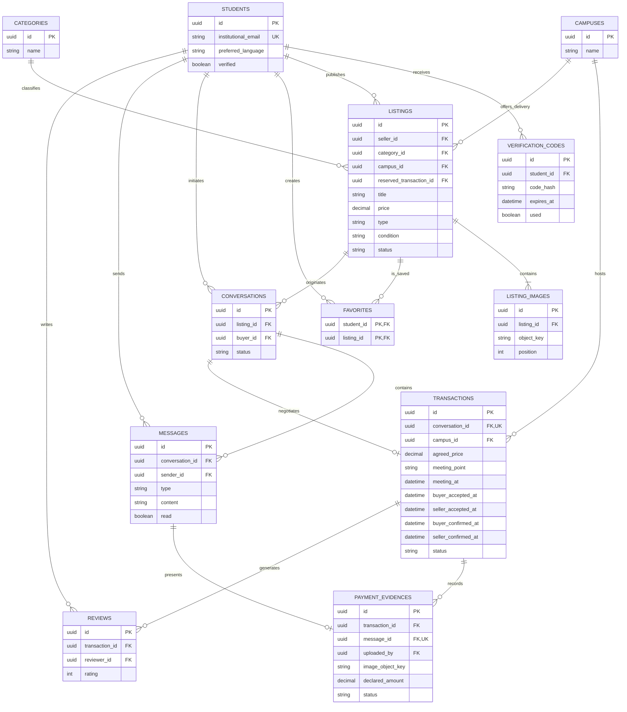

| Tabla | Claves y restricciones relevantes |
|---|---|
| `students` | PK `id`; UNIQUE `institutional_email`; `preferred_language` limitado a idiomas soportados. |
| `verification_codes` | FK `student_id`; índice por vencimiento; hash de código; un código activo por propósito. |
| `listings` | FK `seller_id`, `category_id`, `campus_id`, `reserved_transaction_id` nullable; la reserva pertenece a un hilo del mismo aviso; `price >= 0`; condición requerida para `PRODUCT` y nula para `SERVICE`/`TUTORING`. |
| `listing_images` | FK `listing_id`; UNIQUE (`listing_id`, `position`); al menos una imagen antes de publicar. |
| `favorites` | PK/UNIQUE (`student_id`, `listing_id`). |
| `conversations` | FK `listing_id`, `buyer_id`; UNIQUE (`listing_id`, `buyer_id`) para reutilizar el hilo existente. |
| `messages` | FK `conversation_id`, `sender_id`; el emisor debe ser participante del hilo. |
| `transactions` | FK `conversation_id` UNIQUE y `campus_id`; precio no negativo; aceptaciones del acuerdo separadas de confirmaciones de entrega; transiciones controladas. |
| `payment_evidences` | FK `transaction_id`, `message_id` UNIQUE y `uploaded_by`; clave de imagen privada; estado declarativo. |
| `reviews` | FK `transaction_id`, `reviewer_id`; UNIQUE (`transaction_id`, `reviewer_id`); `rating` entre 1 y 5. |

La [exportación SVG del modelo relacional](img/diagrams/chapter4-database-diagram.svg) incluye imágenes, favoritos, campus del aviso, aceptaciones y confirmaciones bilaterales. La imagen preliminar `img/diagrams/UPC-X — Relational Database Diagram.png` se conserva como antecedente. Los diagramas muestran atributos estructurales principales; el diccionario y las restricciones completan su significado. No constituyen migraciones SQL ya ejecutadas.

#### Integridad, concurrencia y consultas

Las claves foráneas y restricciones únicas se resuelven en la base de datos. Las reglas que comparan varias entidades requieren validación transaccional en la API: el comprador no puede ser propietario del aviso, el remitente debe pertenecer al hilo, la evidencia debe pertenecer a la misma conversación que la transacción, y el autor de una reseña debe ser participante de una entrega completada. La relación ER permite varias reseñas; la combinación de esas reglas con `UNIQUE (transaction_id, reviewer_id)` limita el total a dos.

Publicar requiere comprobar al menos una imagen y una portada única. Reservar debe comprobar que el aviso sigue activo y asociarse a una transacción del hilo seleccionado; dos solicitudes concurrentes no pueden reservar el mismo aviso para distintas personas. La primera confirmación de entrega conserva el estado `AGREED`; la segunda actualiza transacción y aviso conjuntamente. El reintento de publicación, envío o confirmación debe evitar duplicados mediante una clave de idempotencia o un control equivalente.

Índices previstos: `listings(status, campus_id, created_at)` para explorar, `listings(category_id, status, price)` para filtros, `messages(conversation_id, sent_at)` para lectura cronológica y `transactions(status, meeting_at)` para encuentros. La búsqueda de texto y la paginación se validarán con datos representativos; no se afirman tiempos de respuesta sin medición.

Los borradores se conservan durante la navegación y no se consideran publicaciones activas. En este diseño existe como máximo una transacción por conversación: una cancelación cierra esa coordinación. Si el equipo necesita reabrir negociaciones en el mismo hilo, deberá ampliar explícitamente la cardinalidad y sus reglas antes de implementar.

