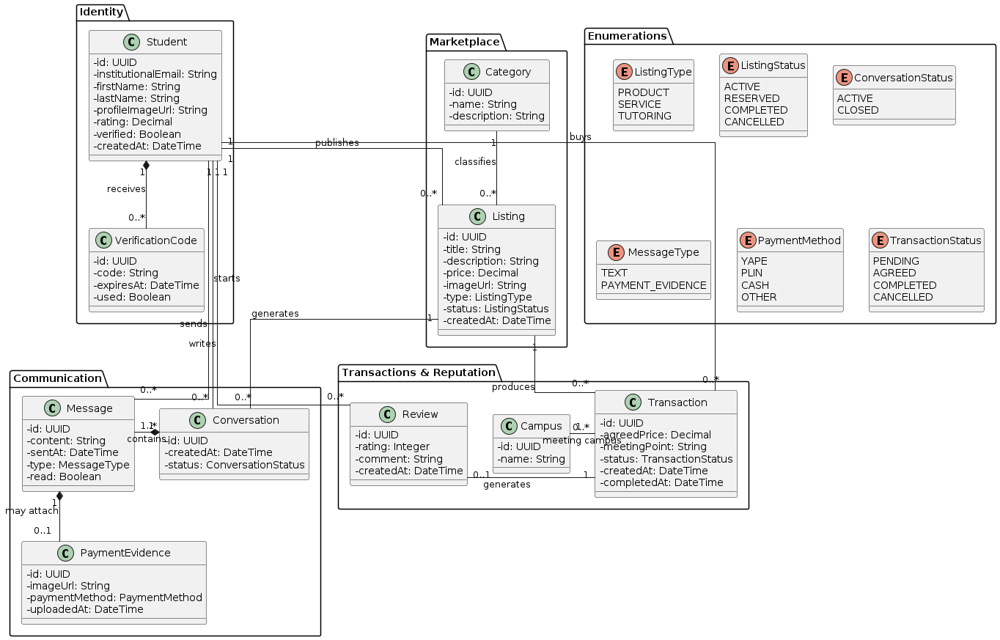

# Capítulo IV: Product Design

## 4.1. Style Guidelines

### 4.1.1. General Style Guidelines

### 4.1.2. Web Style Guidelines

### 4.1.3. Mobile Style Guidelines

#### 4.1.3.1. iOS Mobile Style Guidelines

#### 4.1.3.2. Android Mobile Style Guidelines

## 4.2. Information Architecture

### 4.2.1. Organization Systems

### 4.2.2. Labeling Systems

### 4.2.3. SEO Tags and Meta Tags

### 4.2.4. Searching Systems

### 4.2.5. Navigation Systems

## 4.3. Landing Page UI Design
Para el desarrollo de los wireframes y mockups del landing page de UPC-X, utilizaremos <b>Figma</b> como herramienta principal de diseño. Los wireframes definirán la estructura básica y navegación, mientras que los mockups mostrarán el diseño final con la identidad visual de la landing page.

### 4.3.1. Landing Page Wireframe

### 4.3.2. Landing Page Mock-up

## 4.4. Mobile Applications UX/UI Design

### 4.4.1. Mobile Applications Wireframes

### 4.4.2. Mobile Applications Wireflow Diagrams

### 4.4.3. Mobile Applications Mock-ups

### 4.4.4. Mobile Applications User Flow Diagrams

## 4.5. Mobile Applications Prototyping

### 4.5.1. Android Mobile Applications Prototyping

### 4.5.2. iOS Mobile Applications Prototyping

## 4.6. Web Applications UX/UI Design

### 4.6.1. Web Applications Wireframes

### 4.6.2. Web Applications Wireflow Diagrams

### 4.6.3. Web Applications Mock-ups

### 4.6.4. Web Applications User Flow Diagrams

## 4.7. Web Applications Prototyping

## 4.8. Domain-Driven Software Architecture

### 4.8.1. Software Architecture Context Diagram

### 4.8.2. Software Architecture Container Diagrams

### 4.8.3. Software Architecture Components Diagrams

## 4.9. Software Object-Oriented Design

## 4.9. Software Object-Oriented Design

El diseño orientado a objetos de UPC-X representa las principales entidades que intervienen en las actividades de compra, venta e intercambio entre estudiantes de la Universidad Peruana de Ciencias Aplicadas.

El modelo considera al estudiante como la entidad principal del sistema. Un mismo estudiante puede desempeñarse como comprador o vendedor dependiendo de la interacción que realice dentro de la plataforma, por lo que ambos comportamientos se representan mediante la clase `Student` y no mediante entidades independientes.

Para facilitar la comprensión del dominio, las clases se organizan en cuatro grupos principales: Identity, Marketplace, Communication y Transactions & Reputation. Asimismo, se incluye un conjunto de enumeraciones que restringe los posibles estados y tipos utilizados por determinadas entidades.

Esta organización permite representar funcionalidades como la verificación mediante correo institucional, publicación de productos, servicios y tutorías, comunicación entre estudiantes, registro de evidencias de pago, coordinación de encuentros en sedes UPC y generación de reputación a partir de las transacciones realizadas.

### 4.9.1. Class Diagrams

El diagrama de clases general de UPC-X presenta las entidades principales del dominio y sus relaciones. Para mejorar su comprensión, las clases se encuentran agrupadas de acuerdo con la responsabilidad que cumplen dentro del sistema.

El grupo `Identity` contiene las clases relacionadas con la identificación y verificación de los estudiantes. `Student` representa a un miembro de la comunidad UPC, mientras que `VerificationCode` permite registrar los códigos utilizados para comprobar la propiedad del correo institucional.

El grupo `Marketplace` contiene las clases relacionadas con la publicación y clasificación de ofertas. `Listing` representa los productos, servicios o tutorías publicados por los estudiantes, mientras que `Category` permite organizar dichas publicaciones.

El grupo `Communication` representa las interacciones entre los estudiantes. Una publicación puede generar diferentes conversaciones, las cuales contienen mensajes enviados por los participantes. Algunos mensajes pueden incorporar una `PaymentEvidence`, utilizada para almacenar la evidencia de pagos realizados mediante medios externos como Yape o Plin.

Finalmente, el grupo `Transactions & Reputation` representa las operaciones acordadas entre los estudiantes. `Transaction` almacena la información relacionada con la operación, el precio acordado y el punto de encuentro, mientras que `Campus` identifica la sede UPC donde se realizará el intercambio. Después de una transacción, el comprador puede registrar una `Review`, contribuyendo a la reputación del estudiante vendedor.

Las enumeraciones complementan el modelo restringiendo valores relacionados con el tipo y estado de las publicaciones, conversaciones, mensajes, métodos de pago y transacciones.

### 4.9.2. Class Dictionary

A continuación, se presenta el diccionario de clases correspondiente al modelo orientado a objetos de UPC-X. Para cada clase se especifican sus principales atributos, operaciones y responsabilidades dentro del dominio.

#### Student

Representa a un estudiante perteneciente a la comunidad UPC. Un estudiante puede publicar ofertas, iniciar conversaciones, realizar compras y registrar reseñas.

| Elemento | Tipo | Descripción |
|---|---|---|
| `id` | UUID | Identificador único del estudiante. |
| `institutionalEmail` | String | Correo institucional `@upc.edu.pe` utilizado para identificar y verificar al estudiante. |
| `firstName` | String | Nombres del estudiante. |
| `lastName` | String | Apellidos del estudiante. |
| `profileImageUrl` | String | Dirección de la imagen utilizada como foto de perfil. |
| `rating` | Decimal | Calificación promedio obtenida a partir de las reseñas recibidas. |
| `verified` | Boolean | Indica si la cuenta del estudiante fue verificada mediante correo institucional. |
| `createdAt` | DateTime | Fecha y hora de creación de la cuenta. |
| `verifyAccount()` | Método | Confirma la verificación del correo institucional del estudiante. |
| `createListing()` | Método | Permite crear una nueva publicación. |
| `startConversation()` | Método | Inicia una conversación relacionada con una publicación. |
| `createReview()` | Método | Registra una reseña después de una transacción. |

#### VerificationCode

Representa el código temporal utilizado durante el proceso de verificación del correo institucional.

| Elemento | Tipo | Descripción |
|---|---|---|
| `id` | UUID | Identificador único del código de verificación. |
| `code` | String | Código enviado al correo institucional del estudiante. |
| `expiresAt` | DateTime | Fecha y hora hasta la cual el código puede ser utilizado. |
| `used` | Boolean | Indica si el código ya fue utilizado. |
| `validate()` | Método | Comprueba que el código sea válido y se encuentre vigente. |
| `expire()` | Método | Invalida el código cuando supera su periodo de vigencia. |

#### Category

Representa una categoría utilizada para organizar las publicaciones disponibles en UPC-X.

| Elemento | Tipo | Descripción |
|---|---|---|
| `id` | UUID | Identificador único de la categoría. |
| `name` | String | Nombre de la categoría. |
| `description` | String | Descripción del tipo de publicaciones agrupadas en la categoría. |

#### Listing

Representa una oferta publicada por un estudiante. La oferta puede corresponder a un producto, servicio o tutoría.

| Elemento | Tipo | Descripción |
|---|---|---|
| `id` | UUID | Identificador único de la publicación. |
| `title` | String | Título mostrado en la publicación. |
| `description` | String | Descripción del producto, servicio o tutoría ofrecida. |
| `price` | Decimal | Precio definido por el estudiante vendedor. |
| `imageUrl` | String | Dirección de la imagen asociada a la publicación. |
| `type` | ListingType | Tipo de publicación: producto, servicio o tutoría. |
| `status` | ListingStatus | Estado actual de la publicación. |
| `createdAt` | DateTime | Fecha y hora de creación de la publicación. |
| `publish()` | Método | Publica la oferta dentro del marketplace. |
| `update()` | Método | Actualiza la información de una publicación existente. |
| `markAsUnavailable()` | Método | Marca la publicación como no disponible. |

#### Conversation

Representa una conversación iniciada por un estudiante interesado en una publicación.

| Elemento | Tipo | Descripción |
|---|---|---|
| `id` | UUID | Identificador único de la conversación. |
| `createdAt` | DateTime | Fecha y hora en que se inició la conversación. |
| `status` | ConversationStatus | Estado actual de la conversación. |
| `sendMessage()` | Método | Permite incorporar un nuevo mensaje a la conversación. |
| `close()` | Método | Finaliza la conversación. |

#### Message

Representa un mensaje enviado por un estudiante dentro de una conversación.

| Elemento | Tipo | Descripción |
|---|---|---|
| `id` | UUID | Identificador único del mensaje. |
| `content` | String | Contenido textual del mensaje. |
| `sentAt` | DateTime | Fecha y hora en que fue enviado. |
| `type` | MessageType | Tipo de mensaje enviado. |
| `read` | Boolean | Indica si el destinatario ha leído el mensaje. |
| `markAsRead()` | Método | Cambia el estado del mensaje a leído. |

#### PaymentEvidence

Representa la evidencia de un pago realizado mediante un medio externo a UPC-X.

| Elemento | Tipo | Descripción |
|---|---|---|
| `id` | UUID | Identificador único de la evidencia de pago. |
| `imageUrl` | String | Dirección de la imagen correspondiente al voucher o comprobante. |
| `paymentMethod` | PaymentMethod | Medio utilizado para realizar el pago. |
| `uploadedAt` | DateTime | Fecha y hora en que la evidencia fue incorporada a la conversación. |
| `attachEvidence()` | Método | Adjunta la evidencia de pago al mensaje correspondiente. |

UPC-X registra únicamente la evidencia proporcionada por los estudiantes y no procesa directamente las operaciones financieras realizadas mediante Yape, Plin u otros medios externos.

#### Campus

Representa una sede de la Universidad Peruana de Ciencias Aplicadas utilizada como referencia para coordinar el encuentro entre estudiantes.

| Elemento | Tipo | Descripción |
|---|---|---|
| `id` | UUID | Identificador único de la sede. |
| `name` | String | Nombre de la sede UPC. |

Inicialmente se consideran las sedes Monterrico, San Miguel, San Isidro y Villa.

#### Transaction

Representa una operación acordada entre un estudiante comprador y el propietario de una publicación.

| Elemento | Tipo | Descripción |
|---|---|---|
| `id` | UUID | Identificador único de la transacción. |
| `agreedPrice` | Decimal | Precio finalmente acordado entre los estudiantes. |
| `meetingPoint` | String | Punto específico acordado para realizar el encuentro dentro de la sede. |
| `status` | TransactionStatus | Estado actual de la transacción. |
| `createdAt` | DateTime | Fecha y hora en que se registró la operación. |
| `completedAt` | DateTime | Fecha y hora en que la transacción fue completada. |
| `confirm()` | Método | Confirma el acuerdo entre los estudiantes. |
| `complete()` | Método | Registra la transacción como completada. |
| `cancel()` | Método | Cancela una transacción previamente registrada. |

La clase mantiene una relación con `Listing`, desde la cual puede identificarse al estudiante vendedor. El estudiante asociado directamente a la transacción mediante la relación `buys` representa al comprador.

#### Review

Representa la valoración registrada por un estudiante después de completar una transacción.

| Elemento | Tipo | Descripción |
|---|---|---|
| `id` | UUID | Identificador único de la reseña. |
| `rating` | Integer | Calificación otorgada durante la evaluación de la experiencia. |
| `comment` | String | Comentario opcional relacionado con la transacción realizada. |
| `createdAt` | DateTime | Fecha y hora en que se registró la reseña. |
| `create()` | Método | Registra la valoración asociada a una transacción completada. |

#### Enumerations

Las siguientes enumeraciones permiten restringir los valores utilizados por las principales clases del dominio.

| Enumeración | Valores | Descripción |
|---|---|---|
| `ListingType` | `PRODUCT`, `SERVICE`, `TUTORING` | Determina el tipo de oferta publicada. |
| `ListingStatus` | `ACTIVE`, `RESERVED`, `COMPLETED`, `CANCELLED` | Representa el estado de disponibilidad de una publicación. |
| `ConversationStatus` | `ACTIVE`, `CLOSED` | Representa el estado de una conversación. |
| `MessageType` | `TEXT`, `PAYMENT_EVIDENCE` | Identifica el tipo de contenido enviado mediante un mensaje. |
| `PaymentMethod` | `YAPE`, `PLIN`, `CASH`, `OTHER` | Identifica el medio de pago utilizado por los estudiantes. |
| `TransactionStatus` | `PENDING`, `AGREED`, `COMPLETED`, `CANCELLED` | Representa las diferentes etapas de una transacción. |

## 4.10. Database Design

### 4.10.1. Relational/Non-Relational Database Diagram

