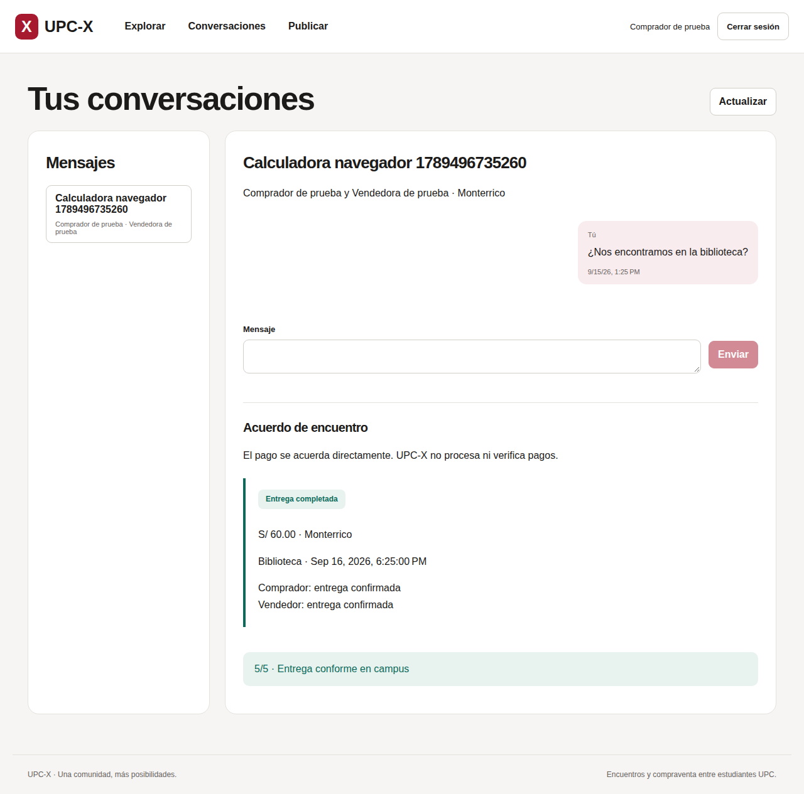

# Capítulo V: Product Implementation
En este capítulo se describe la implementación del producto <b>UPC-X</b> por parte de la startup <b>RichStudent</b>, abarcando la configuración del entorno de desarrollo, la gestión del código fuente, las convenciones de estilo, la configuración de despliegue y las evidencias de ejecución del Sprint #1, así como los acuerdos de servicio y los enlaces a los productos desplegados.

## 5.1. Software Configuration Management
El equipo ha establecido el siguiente conjunto de herramientas para asegurar una configuración de entorno de desarrollo unificada, que permita una colaboración efectiva y el cumplimiento de los objetivos del proyecto. Esas herramientas cubren las diferentes actividades del ciclo de vida del producto digital.

### 5.1.1. Software Development Environment Configuration
#### Project Management
* **Discord** - plataforma para la comunicación en tiempo real entre los miembros del equipo. A través de canales organizados por temas y funciones se realizan reuniones, coordinación diaria y soporte instantáneo durante todo el desarrollo. Ruta de referencia: https://discord.com
#### Requirements Management
* **GitHub Issues** - usado para registrar, etiquetar y dar trazabilidad a los requerimientos funcionales y no funcionales junto con los bugs y mejoras detectadas durante el desarrollo. Ruta de referencia: https://github.com
#### Product UX/UI Design
* **Figma** - herramienta principal para el diseño de interfaces gráficas (UI) y la experiencia de usuario (UX). Permite que varios miembros colaboren simultáneamente en prototipos interactivos, estructuras visuales y pruebas de diseño. Ruta de referencia: https://www.figma.com
* **UXPressia** - complementa el trabajo de UX al permitir la creación y documentación de User Personas, Customer Journey Maps y Empathy Maps, alineando las decisiones de diseño con las necesidades del usuario. Ruta de referencia: https://uxpressia.com
* **Trello** - facilita la organización visual de tareas, ideas y flujos de trabajo mediante tableros, listas y tarjetas. Permite priorizar funcionalidades centradas en el usuario y dar seguimiento al progreso. Ruta de referencia: https://trello.com
#### Software Development
* **Landing Page:** <B>HTML5 + CSS3 + Bootstrap</b>, editada en Webstorm y desplegada en GitHub Pages. Es la vitrina comercial del producto y el primer entregable del Sprint #1. Ruta de referencia: https://www.jetbrains.com/webstorm
* **Web Frontend (Aplicación Web):** <b>Angular</b> sobre VS Code, conforme a las wireframes y prototipos definidos en §4.6 y §4.7. Permite a estudiantes verificados explorar y publicar avisos, conversar, acordar encuentros en campus y confirmar entregas entre pares. Ruta de referencia: https://angular.dev
* **Mobile App:** <b>Flutter (Dart)</b> sobre <b>Android Studio</b> como IDE; SDK estable y validación inicial prevista en Samsung Galaxy S25 Ultra. Comparte con la web el acceso institucional, los avisos y la coordinación de compraventa descritos en §4.4; los pagos se realizan fuera de UPC-X. Ruta de referencia: https://flutter.dev
* **Backend / API** — Spring Boot (Java) sobre IntelliJ IDEA y JDK 21. La API aplica autenticación, permisos por participante y persistencia transaccional. Ruta de referencia: https://www.jetbrains.com/idea
* **Servicios locales** — Docker Compose con PostgreSQL y Mailpit para verificar correos sin enviarlos a destinatarios reales. Web y móvil consumen la misma API Spring Boot.
* **Base de datos** — PostgreSQL gestionada en Neon (servicio cloud serverless), con migraciones versionadas y acceso transaccional desde Spring, conforme al diagrama de despliegue del producto. Ruta de referencia: https://neon.tech
#### Software Deployment
* **Git** — sistema de control de versiones para gestionar el historial de cambios. Ruta de referencia: https://git-scm.com
* **GitKraken** — cliente Git con interfaz gráfica para gestionar visualmente ramas, commits, conflictos y flujos de trabajo. Ruta de referencia: https://www.gitkraken.com
* **GitHub Pages** — hosting estático de la Landing Page. Ruta de referencia: https://pages.github.com
* **Render** — plataforma elegida para la aplicación Angular y la API. Neon alojará PostgreSQL; Cloudflare R2, las imágenes; Resend, el correo tras verificar un dominio propio. Ruta de referencia: https://render.com
#### Software Documentation
* **GitHub** — repositorio remoto centralizado, revisiones por Pull Request, registro de incidencias y documentación viva del proyecto. Ruta de referencia: https://github.com
* **Swagger / OpenAPI** — para documentar de forma interactiva los endpoints del backend RESTful.
### 5.1.2. Source Code Management

La organización `UPC-X` conserva `report-UPC` y `Landing-Page`. El código se separa en `upcx-api`, `upcx-web` y `upcx-mobile`, con ramas `main` (versión estable), `develop` (integración) y `feature/*` (trabajo). Luis Manuel Espinoza Navarrete asume la responsabilidad inicial; revisar desde su segunda laptop constituye autorrevisión.

Los PR deben superar las pruebas automáticas del repositorio. La política inicial exige cero aprobaciones de terceros. La disponibilidad de protección de ramas se verificará según el plan y la visibilidad de GitHub. Este capítulo permanece en `feature/chapter5` hasta su integración posterior en `develop`.

Las decisiones, instrucciones locales y resultados verificables se registran en [la guía de implementación](docs/implementation.md). Los correos institucionales de prueba y las credenciales se mantienen fuera del repositorio.

### 5.1.3. Source Code Style Guide & Conventions

#### HTML
* **Cierre de etiquetas:** Cerrar todos los elementos de forma explícita.
* **Sintaxis:** Usar minúsculas para nombres de elementos y atributos para mantener la legibilidad.
* **Atributos:** Usar comillas dobles cuando los atributos contengan espacios.
* **Accesibilidad y dimensiones:** Especificar `alt`, `width` y `height` en imágenes: ``.

#### CSS
* **Nombres de clases:** Utilizar nombres breves y autodescriptivos.
* **Nomenclatura:** Separar nombres de clases e IDs con guiones (`#video-id`, `.hero-shadow`).
* **Valores nulos:** No especificar la unidad de medida cuando el valor sea `0`.
* **Estructura:** Separar declaraciones y selectores en líneas distintas para favorecer la legibilidad.

#### JavaScript (Landing)
* **Guía de estilo:** Se siguen las recomendaciones de [Airbnb JavaScript Style Guide](https://github.com/airbnb/javascript).
* **Nomenclatura:**
  * `camelCase` para variables y funciones.
  * `PascalCase` para clases.
  * `kebab-case` para nombres de archivos.
* **Framework / UI:** La landing utiliza **Bootstrap 5** como base de componentes y sistema de grid.

#### TypeScript (Angular Web App)
* **Guía de estilo:** Se sigue la [Angular Style Guide](https://angular.dev/style-guide) oficial.
* **Nomenclatura:**
  * `kebab-case` para selectores y nombres de archivos.
  * `PascalCase` para clases y componentes.
  * `camelCase` para identificadores.
* **Linter:** Configuración recomendada mediante `@angular-eslint`.

#### Dart (Flutter)
* **Guía de estilo:** Se sigue la [Effective Dart Style Guide](https://dart.dev/effective-dart) de la documentación oficial.
* **Nomenclatura:**
  * `PascalCase` para nombres de clases.
  * `camelCase` para identificadores.
  * `snake_case` para nombres de archivos y carpetas.
* **Linter:** Paquete `flutter_lints` activado por defecto.

#### Java (Spring Boot)
* **Guía de estilo:** Convenciones Java del proyecto; nombres explícitos y formato consistente.
* **Formato:** Indentación estándar de 4 espacios.
* **Nomenclatura:**
  * `PascalCase` para nombres de clases.
  * `camelCase` para métodos y variables.
  * Minúsculas continuas para nombres de paquetes.

#### Gherkin
* **Uso:** Lenguaje específico de dominio (DSL) para Behavior-Driven Development (BDD).
* **Estructura:** Uso de saltos de línea para separar escenarios y las palabras clave `Given`, `When`, `Then` y `And` para estructurar cada criterio de aceptación.

### 5.1.4. Software Deployment Configuration
El despliegue del producto se realiza diferenciando los componentes estáticos de los servicios backend.
#### Landing Page (GitHub Pages):
1. Mantener una carpeta `docs/` que aloje los archivos públicos de la landing.
2. Asegurar la nomenclatura `index.html`, `style.css`y una carpeta `img/` con los recursos.
3. Cargar los archivos al repositorio mediante commits a la rama de  despliegue (típicamente `main`).
4. En GitHub: <b>Setting > Pages</b> y seleccionar la rama (`main`) y la carpeta `/docs` como fuente.
5. Esperar la verificación de GitHub. Una vez completado, se obtiene una URL pública del tipo `https://<org>.github.io/<repo>/`.

## 5.2. Product Implementation & Deployment

### 5.2.1. Sprint Backlogs
#### Sprint 1
#### Sprint Planning Background
Dentro del framework Scrum, un Sprint representa un plazo fijo y reducido de tiempo en el que el equipo desarrolla todo el trabajo necesario para alcanzar el objetivo final del proyecto, denominado Product Goal. El Sprint #1 tiene como meta elaborar una landing page atractiva para UPC-X que capte la atención de los usuarios visitantes y comunique con claridad los principales beneficios ofrecidos por el producto.

| Campo | Detalle |
| :--- | :--- |
| **Date** | 2026-08-31 |
| **Time** | 11:00 PM |
| **Location** | Reunión virtual mediante Discord |
| **Prepared By** | Murillo, Mathias Javier |
| **Attendees** | Mathias Javier Murillo, Eduardo Jose Cossar Sanchez, Gilbert Alonso Huarcaya Matias, Luis Manuel Espinoza Navarette, Manuel Alejandro Molina Vásquez |
| **Sprint N°1 Review Summary** | Primer sprint del proyecto; no existe revisión previa. |
| **Sprint N°1 Retrospective Summary** | Al ser el primer sprint no se cuenta con retrospectiva previa. La retroalimentación y oportunidades de mejora se evaluarán al cierre del sprint. |
| **Sprint Goal** | **Our focus is on delivering a functional and engaging landing page for UPC-X. We believe it delivers a clear value proposition and generates user interest and trust in potential customers. This will be confirmed when visitors can access the site and interact with all key landing-page sections (services overview, benefits, pricing, testimonials, CTA's and support) on both desktop and mobile devices.** |
| **Sprint N°1 Velocity** | 13 |
| **Sum of Story Points** | 13 |

#### Aspect Leaders and Collaboration (LACX)
Para mejorar la organización y la comunicación se elaboró la matriz Leadership and Collaboration Matrix (LACX), donde se define quién asume el rol de líder (L) y quiénes participan como Colaboradores (C) en cada aspecto clave de la lading page.

| Team Member | Hero Section | Propuesta de Valor | Funcionalidades | Cómo Funciona | Testimonios | CTA Final |
| :--- | :---: | :---: | :---: | :---: | :---: | :---: |
| **Murillo, Mathias Javier** | **L** | C | C | C | C | **L** |
| **Eduardo Jose Cosar Sanchez** | C | **L** | C | C | L | C |
| **Gilbert Alonso Huarcaya Matias** | C | C | **L** | C | C | C |
| **Luis Manuel Espinoza Navarette** | C | C | C | **L** | C | C |
| **Manuel Alejandro Molina Vásquez** | C | C | C | C | **L** | C |

### 5.2.2. Implemented Landing Page Evidence

  <b>Landing Page desplegada — UPC-X</b>

  

  <a href="https://upc-x.github.io/Landing-Page/">Acceder a la Landing Page de UPC-X</a> · <a href="https://github.com/UPC-X/Landing-Page">Repositorio</a>

### 5.2.3. Implemented Frontend-Web Application Evidence

La primera aplicación Angular funciona en local contra la API Spring Boot. La prueba de navegador con dos cuentas sintéticas completó registro, verificación, publicación, conversación, acuerdo de encuentro, cierre bilateral y reseña. También comprobó la vista a 390 px sin desbordamiento horizontal. Esto no constituye evidencia de despliegue público.

[Vista en navegador móvil](img/img-evidence/upcx-web-delivery-mobile.png) · [Repositorio web](https://github.com/UPC-X/upcx-web) · [Verificación y límites](docs/implementation.md)

### 5.2.4. Acuerdo de Servicio - SaaS

Encabezado reservado para el acuerdo del producto. Su redacción y revisión quedan pendientes; no se declara un SLA ni disponibilidad garantizada.

### 5.2.5. Implemented Native-Mobile Application Evidence

El cliente Flutter implementa el mismo recorrido y usa la misma API. Pasaron el análisis estático, las pruebas del cliente HTTP y una integración real desde Dart que leyó una compra compartida y envió un mensaje. Se generó el APK debug y se comprobaron su firma y alineación de empaquetado. La validación física en el Samsung requiere conectar y autorizar el dispositivo; no se presenta como realizada.

[Repositorio móvil](https://github.com/UPC-X/upcx-mobile) · [Estado del APK y preparación](docs/implementation.md)

### 5.2.6. Implemented RESTful API and/or Serverless Backend Evidence

La API Spring Boot con Java 21 usa PostgreSQL, migraciones Flyway y Spring JDBC. Las pruebas locales cubren verificación institucional, sesiones web/móvil, permisos, subida de fotos, conversación, aceptación de encuentro, confirmaciones bilaterales, reseñas, reserva concurrente, cancelación y recuperación. Mailpit captura los códigos sin correo externo.

[Repositorio API](https://github.com/UPC-X/upcx-api). Los proveedores cloud todavía no están configurados; los resultados corresponden al entorno local.

### 5.2.7. RESTful API documentation

El contrato OpenAPI se encuentra en `docs/openapi.json` de `upcx-api`; la colección inicial de Bruno, en `bruno/`. El README de la API documenta variables de entorno, autorización, límites de imágenes y reglas de transición.

### 5.2.8. Team Collaboration Insights

La implementación inicial tiene un responsable y revisión propia. No se atribuye revisión independiente a la segunda laptop. Los commits se realizan con la identidad Git del responsable, sin coautoría del asistente. La integración del capítulo en `develop` se hará posteriormente.

## 5.3. Video About-the-Product

