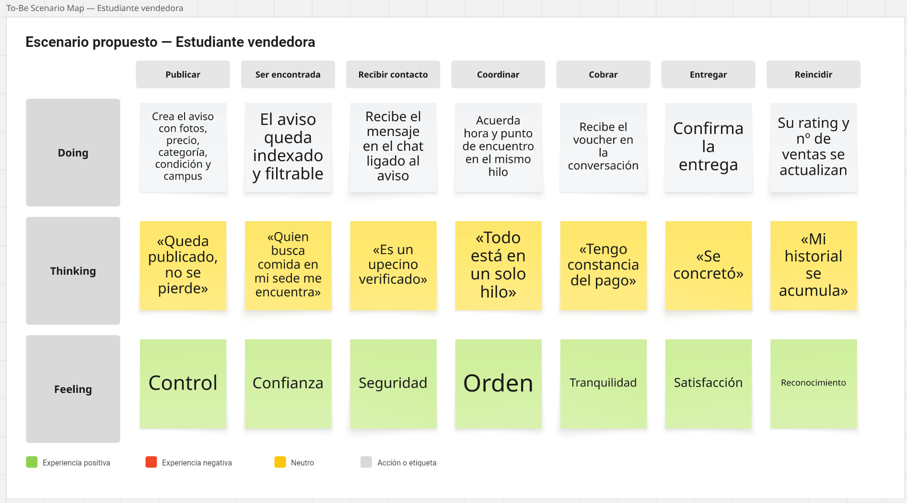
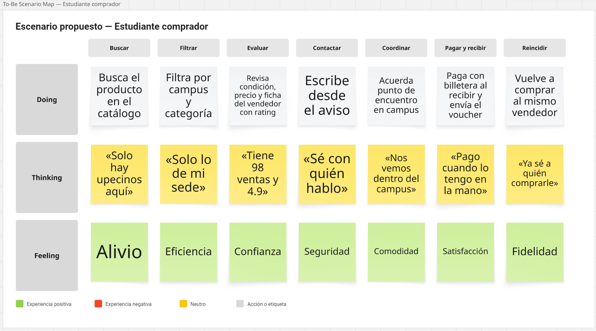
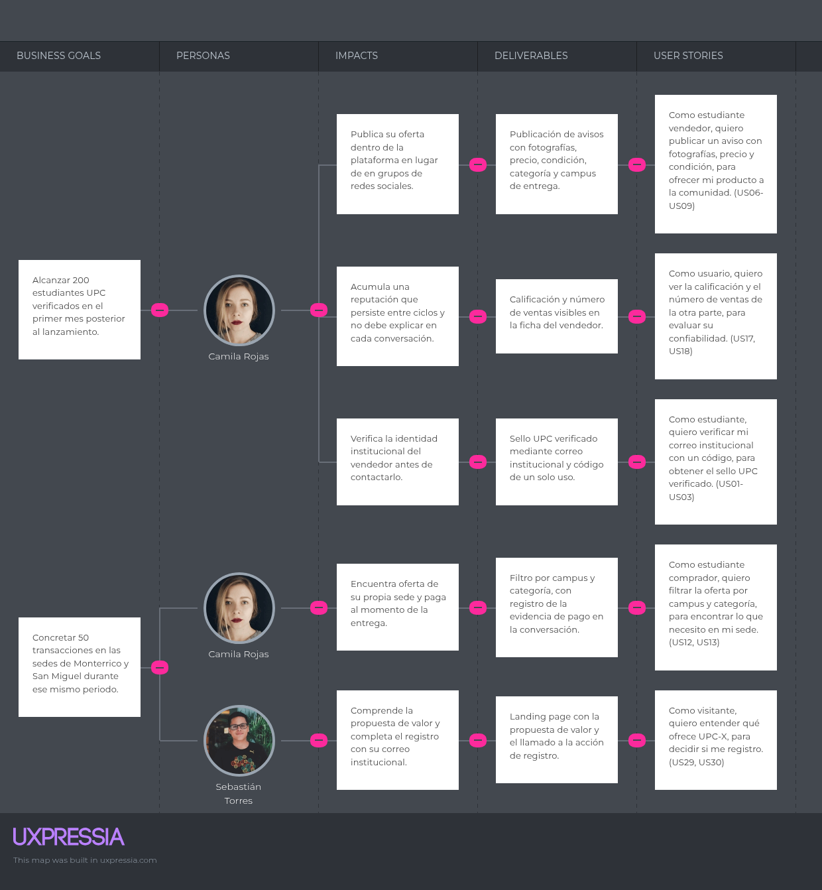

# Capítulo III: Requirements Specification

En este capítulo se especifica el estado To-Be de la solución: el escenario propuesto una vez que los segmentos utilizan UPC-X, el alcance funcional expresado en User Stories, Technical Stories y Spike Stories, la priorización del trabajo en el Product Backlog y la relación entre el objetivo de negocio y los entregables que lo hacen posible.

## 3.1. To-Be Scenario Mapping

Mientras el escenario actual documentado en la sección 2.3.5 se distribuye entre grupos de redes sociales, mensajería instantánea y encuentros no formalizados, el escenario propuesto concentra el recorrido completo dentro de la plataforma: el descubrimiento de la oferta, la verificación de la identidad institucional, la coordinación de la entrega, el registro de la evidencia de pago y la confirmación del encuentro.

**Segmento objetivo #1: Estudiantes vendedores**

**Segmento objetivo #2: Estudiantes compradores**

## 3.2. User Stories

En esta sección se especifica el conjunto de historias de usuario del producto digital UPC-X, agrupadas según los ocho Epics que definen las capacidades funcionales del sistema. Cada historia de usuario cuenta con su respectiva prioridad, rol de usuario y criterios de aceptación redactados en lenguaje Gherkin (Given-When-Then), orientados a escenarios reales y comprobables dentro del alcance de un marketplace universitario.

### Epics

| ID | Título | Descripción |
|:---|:---|:---|
| **EP01** | **Verificación e identidad institucional** | **Como** estudiante de la UPC, **quiero** registrarme e iniciar sesión exclusivamente con mi correo `@upc.edu.pe`, **para** interactuar en una plataforma cerrada donde todos los miembros están autenticados institucionalmente. |
| **EP02** | **Publicación de avisos** | **Como** estudiante vendedor, **quiero** publicar y gestionar avisos de mis productos o servicios con fotografías, precio, condición y sede, **para** ofrecerlos de forma clara a la comunidad universitaria. |
| **EP03** | **Descubrimiento de la oferta** | **Como** estudiante comprador, **quiero** buscar, categorizar y filtrar las publicaciones por campus y tipo de producto, **para** encontrar oportunamente lo que requiero en mi sede de estudio. |
| **EP04** | **Confianza y reputación** | **Como** usuario de UPC-X, **quiero** consultar calificaciones, sellos institucionales e historial de transacciones, **para** evaluar la seriedad de la contraparte antes de coordinar un intercambio. |
| **EP05** | **Mensajería y coordinación** | **Como** comprador o vendedor, **quiero** comunicarme mediante un chat interno enlazado al aviso, **para** resolver dudas y pactar un punto de encuentro físico dentro del campus universitario. |
| **EP06** | **Pago y evidencia** | **Como** usuario involucrado en un acuerdo, **quiero** registrar la constancia visual del pago digital (Yape/Plin) y confirmar la entrega del artículo, **para** cerrar la transacción con respaldo mutuo. |
| **EP07** | **Perfil y publicaciones propias** | **Como** miembro activo de la plataforma, **quiero** consultar mis datos institucionales, revisar mis publicaciones vigentes y mis métricas, **para** gestionar mi actividad en el marketplace. |
| **EP08** | **Landing page y captación** | **Como** visitante o nuevo usuario, **quiero** acceder a una página web informativa con la propuesta de valor, términos de servicio y soporte bilingüe, **para** informarme sobre la plataforma y acceder al sistema. |

---
### 3.2.1 User Stories

---
#### US01

| **Story ID** | **User** | **Priority** | **Epic** |
|:---|:---|:---|:---|
| US01 | Estudiante comprador / Estudiante vendedor | Alta | EP01 |
| **Title** | **Registro con correo institucional** |  |  |
| **Description** |  |  |  |
| **Como** estudiante comprador o vendedor de la UPC, **quiero** registrarme con mi correo institucional, **para** acceder a la plataforma universitaria. |  |  |  |
| **Acceptance Criteria** |  |  |  |
| Escenario 1: Registro con dominio institucional permitido **Given** el estudiante comprador o vendedor ingresa un correo con terminación `@upc.edu.pe` **When** solicita el registro en la plataforma **Then** el sistema valida el dominio y envía un código de activación a dicho buzón.   Escenario 2: Rechazo de correos comerciales o externos **Given** el estudiante comprador o vendedor ingresa un correo comercial (ej. Gmail, Outlook) **When** solicita el registro en la plataforma **Then** el sistema rechaza el proceso y notifica que solo se permiten cuentas `@upc.edu.pe`. |  |  |  |

---

#### US02

| **Story ID** | **User** | **Priority** | **Epic** |
|:---|:---|:---|:---|
| US02 | Estudiante comprador / Estudiante vendedor | Alta | EP01 |
| **Title** | **Verificación mediante código de un solo uso** |  |  |
| **Description** |  |  |  |
| **Como** estudiante comprador o vendedor registrado, **quiero** validar mi cuenta ingresando el código recibido por correo, **para** activar mi acceso al sistema. |  |  |  |
| **Acceptance Criteria** |  |  |  |
| Escenario 1: Código correcto y dentro del plazo de vigencia **Given** el estudiante comprador o vendedor recibe el código numérico en su buzón universitario **When** introduce el código exacto antes de que expire su validez **Then** el sistema activa la cuenta y confirma la verificación institucional.   Escenario 2: Código erróneo o expirado **Given** el código ingresado no coincide con el emitido o ya venció **When** el estudiante comprador o vendedor envía la solicitud de verificación **Then** el sistema deniega el acceso y permite solicitar un reenvío de código. |  |  |  |

---

#### US03

| **Story ID** | **User** | **Priority** | **Epic** |
|:---|:---|:---|:---|
| US03 | Estudiante comprador / Estudiante vendedor | Alta | EP01 |
| **Title** | **Inicio de sesión con credenciales institucionales** |  |  |
| **Description** |  |  |  |
| **Como** estudiante comprador o vendedor verificado, **quiero** autenticarme con mi correo y contraseña, **para** acceder a mi cuenta. |  |  |  |
| **Acceptance Criteria** |  |  |  |
| Escenario 1: Autenticación exitosa **Given** el estudiante comprador o vendedor introduce su correo `@upc.edu.pe` y contraseña correcta **When** solicita iniciar sesión **Then** el sistema valida las credenciales y da acceso al catálogo principal.   Escenario 2: Credenciales incorrectas **Given** el estudiante comprador o vendedor introduce credenciales no coincidentes **When** solicita iniciar sesión **Then** el sistema deniega el acceso e informa el error de autenticación. |  |  |  |

---

#### US04

| **Story ID** | **User** | **Priority** | **Epic** |
|:---|:---|:---|:---|
| US04 | Estudiante comprador / Estudiante vendedor | Media | EP01 |
| **Title** | **Restablecimiento de contraseña olvidada** |  |  |
| **Description** |  |  |  |
| **Como** estudiante comprador o vendedor registrado, **quiero** solicitar el restablecimiento de mi contraseña mediante mi correo institucional, **para** recuperar mi acceso. |  |  |  |
| **Acceptance Criteria** |  |  |  |
| Escenario 1: Envío de enlace de recuperación **Given** el estudiante comprador o vendedor indica su correo institucional registrado **When** solicita el restablecimiento de acceso **Then** el sistema envía un enlace o código de recuperación temporal al correo indicado.   Escenario 2: Correo inexistente en la base de datos **Given** el estudiante comprador o vendedor introduce un correo que no pertenece a ninguna cuenta activa **When** solicita la recuperación **Then** el sistema indica que no existe una cuenta asociada a esa dirección. |  |  |  |

---

#### US05

| **Story ID** | **User** | **Priority** | **Epic** |
|:---|:---|:---|:---|
| US05 | Estudiante comprador / Estudiante vendedor | Baja | EP01 |
| **Title** | **Cierre voluntario de sesión** |  |  |
| **Description** |  |  |  |
| **Como** estudiante comprador o vendedor autenticado, **quiero** cerrar mi sesión de forma manual, **para** resguardar la privacidad de mi perfil en el dispositivo. |  |  |  |
| **Acceptance Criteria** |  |  |  |
| Escenario 1: Cierre de sesión satisfactorio **Given** el estudiante comprador o vendedor mantiene una sesión activa en la aplicación **When** confirma la acción de cerrar sesión **Then** el sistema revoca el token de sesión y redirige a la pantalla inicial de bienvenida. |  |  |  |

---

#### US06

| **Story ID** | **User** | **Priority** | **Epic** |
|:---|:---|:---|:---|
| US06 | Estudiante comprador / Estudiante vendedor | Media | EP01 |
| **Title** | **Visualización de restricciones de cuenta pendiente de verificación** |  |  |
| **Description** |  |  |  |
| **Como** estudiante comprador o vendedor con verificación pendiente, **quiero** conocer las acciones restringidas en la plataforma, **para** entender por qué debo validar mi correo institucional antes de interactuar. |  |  |  |
| **Acceptance Criteria** |  |  |  |
| Escenario 1: Intento de publicación o contacto sin verificación completada **Given** el estudiante comprador o vendedor inició sesión pero mantiene pendiente la validación de su correo `@upc.edu.pe` **When** intenta publicar un aviso o iniciar una conversación con la otra parte **Then** el sistema bloquea la acción, muestra una notificación indicando que la cuenta no está verificada y ofrece la opción de completar la activación institucional. |  |  |  |

---

#### US07

| **Story ID** | **User** | **Priority** | **Epic** |
|:---|:---|:---|:---|
| US07 | Estudiante vendedor | Alta | EP02 |
| **Title** | **Creación de aviso de venta** |  |  |
| **Description** |  |  |  |
| **Como** estudiante vendedor, **quiero** crear una publicación con título, precio, categoría, condición y campus, **para** ofrecer mi producto a la comunidad. |  |  |  |
| **Acceptance Criteria** |  |  |  |
| Escenario 1: Publicación con datos completos **Given** el estudiante vendedor completa todos los campos requeridos del aviso **When** confirma la publicación **Then** el sistema guarda el aviso y lo hace visible en el catálogo de ofertas.   Escenario 2: Omisión de datos obligatorios **Given** el estudiante vendedor omite campos esenciales como el precio o el campus de entrega **When** intenta publicar el aviso **Then** el sistema detiene el proceso y resalta los campos que deben completarse. |  |  |  |

---

#### US08

| **Story ID** | **User** | **Priority** | **Epic** |
|:---|:---|:---|:---|
| US08 | Estudiante vendedor | Alta | EP02 |
| **Title** | **Carga de imagen principal del producto** |  |  |
| **Description** |  |  |  |
| **Como** estudiante vendedor, **quiero** adjuntar una fotografía clara del artículo ofertado, **para** que los compradores evalúen su estado real. |  |  |  |
| **Acceptance Criteria** |  |  |  |
| Escenario 1: Subida de archivo de imagen válido **Given** el estudiante vendedor selecciona un archivo de imagen en formato JPG o PNG de tamaño adecuado **When** guarda la publicación **Then** el sistema almacena la imagen y la asocia como portada del anuncio.   Escenario 2: Archivo de formato no soportado **Given** el estudiante vendedor intenta cargar un archivo en formato incompatible o corrupto **When** procesa la carga **Then** el sistema cancela la operación y notifica los formatos permitidos. |  |  |  |

---

#### US09

| **Story ID** | **User** | **Priority** | **Epic** |
|:---|:---|:---|:---|
| US09 | Estudiante vendedor | Media | EP02 |
| **Title** | **Declaración de la condición del artículo** |  |  |
| **Description** |  |  |  |
| **Como** estudiante vendedor, **quiero** seleccionar la condición del artículo (Nuevo, Como nuevo, Usado), **para** informar con transparencia el estado del producto. |  |  |  |
| **Acceptance Criteria** |  |  |  |
| Escenario 1: Asignación de condición del producto **Given** el estudiante vendedor redacta o modifica una publicación **When** escoge una opción del catálogo de condiciones disponibles **Then** el sistema registra el valor y lo expone en la ficha del producto. |  |  |  |

---

#### US10

| **Story ID** | **User** | **Priority** | **Epic** |
|:---|:---|:---|:---|
| US10 | Estudiante vendedor | Alta | EP02 |
| **Title** | **Asignación de campus de entrega** |  |  |
| **Description** |  |  |  |
| **Como** estudiante vendedor, **quiero** definir en qué sede de la UPC puedo entregar el bien (Monterrico, San Miguel, San Isidro o Villa), **para** acordar encuentros donde estudio. |  |  |  |
| **Acceptance Criteria** |  |  |  |
| Escenario 1: Selección de sede universitaria **Given** el estudiante vendedor dispone de sedes predefinidas en el formulario **When** marca la sede donde puede realizar la entrega **Then** el sistema vincula la publicación a dicha sede para el filtrado geográfico. |  |  |  |

---

#### US11

| **Story ID** | **User** | **Priority** | **Epic** |
|:---|:---|:---|:---|
| US11 | Estudiante vendedor | Media | EP02 |
| **Title** | **Edición de precio y descripción de aviso propio** |  |  |
| **Description** |  |  |  |
| **Como** estudiante vendedor, **quiero** actualizar el precio o detalles de un aviso activo, **para** adaptarme a la demanda de los estudiantes. |  |  |  |
| **Acceptance Criteria** |  |  |  |
| Escenario 1: Actualización de datos de la publicación **Given** el estudiante vendedor accede a un anuncio de su autoría **When** modifica el precio y confirma los cambios **Then** el sistema actualiza la información de forma inmediata en el catálogo. |  |  |  |

---

#### US12

| **Story ID** | **User** | **Priority** | **Epic** |
|:---|:---|:---|:---|
| US12 | Estudiante vendedor | Media | EP02 |
| **Title** | **Cambio de estado de aviso a "Vendido"** |  |  |
| **Description** |  |  |  |
| **Como** estudiante vendedor, **quiero** marcar una publicación como vendida, **para** que otros estudiantes no sigan consultando por ella. |  |  |  |
| **Acceptance Criteria** |  |  |  |
| Escenario 1: Desactivación de producto vendido **Given** un producto acordado y entregado **When** el estudiante vendedor cambia el estado a "Vendido" **Then** el sistema oculta el aviso de los resultados de búsqueda activa. |  |  |  |

---

#### US13

| **Story ID** | **User** | **Priority** | **Epic** |
|:---|:---|:---|:---|
| US13 | Estudiante vendedor | Baja | EP02 |
| **Title** | **Eliminación voluntaria de publicación** |  |  |
| **Description** |  |  |  |
| **Como** estudiante vendedor, **quiero** retirar definitivamente un aviso publicado por error o descarte, **para** depurar mis anuncios. |  |  |  |
| **Acceptance Criteria** |  |  |  |
| Escenario 1: Eliminación definitiva de aviso **Given** el estudiante vendedor consulta una de sus publicaciones vigentes **When** confirma la acción de eliminación **Then** el sistema remueve la publicación de la base de datos de avisos activos. |  |  |  |

---

#### US14

| **Story ID** | **User** | **Priority** | **Epic** |
|:---|:---|:---|:---|
| US14 | Estudiante vendedor | Baja | EP02 |
| **Title** | **Marcado de oferta como producto continuo** |  |  |
| **Description** |  |  |  |
| **Como** estudiante vendedor de alimentos o servicios, **quiero** señalar mi aviso como oferta continua, **para** indicar disponibilidad recurrente de stock. |  |  |  |
| **Acceptance Criteria** |  |  |  |
| Escenario 1: Distintivo de disponibilidad recurrente **Given** el estudiante vendedor publica un servicio o bien consumible periódico (ej. tutorías, snacks) **When** marca la casilla de oferta continua **Then** el sistema exhibe una insignia de producto recurrente en la ficha del aviso. |  |  |  |

---

#### US15

| **Story ID** | **User** | **Priority** | **Epic** |
|:---|:---|:---|:---|
| US15 | Estudiante comprador | Alta | EP03 |
| **Title** | **Exploración del catálogo de publicaciones recientes** |  |  |
| **Description** |  |  |  |
| **Como** estudiante comprador, **quiero** examinar las ofertas más recientes en la pantalla principal, **para** conocer los productos que se ofrecen en la universidad. |  |  |  |
| **Acceptance Criteria** |  |  |  |
| Escenario 1: Carga de listado principal **Given** existen publicaciones activas en la plataforma **When** el estudiante comprador accede al catálogo general **Then** el sistema despliega las tarjetas de ofertas con foto, título, precio, condición y campus. |  |  |  |

---

#### US16

| **Story ID** | **User** | **Priority** | **Epic** |
|:---|:---|:---|:---|
| US16 | Estudiante comprador | Alta | EP03 |
| **Title** | **Búsqueda de avisos por término clave** |  |  |
| **Description** |  |  |  |
| **Como** estudiante comprador, **quiero** buscar productos mediante palabras clave, **para** localizar un artículo específico (ej. "Calculadora", "Stewart"). |  |  |  |
| **Acceptance Criteria** |  |  |  |
| Escenario 1: Coincidencia en búsqueda **Given** existen avisos cuyo título o descripción coincide con la consulta **When** el estudiante comprador ejecuta la búsqueda **Then** el sistema presenta únicamente las publicaciones asociadas al término ingresado.   Escenario 2: Sin coincidencias encontradas **Given** ningún aviso concuerda con las palabras introducidas **When** el estudiante comprador ejecuta la búsqueda **Then** el sistema muestra un mensaje indicando que no se hallaron resultados coincidentes. |  |  |  |

---

#### US17

| **Story ID** | **User** | **Priority** | **Epic** |
|:---|:---|:---|:---|
| US17 | Estudiante comprador | Alta | EP03 |
| **Title** | **Filtrado de ofertas por campus de entrega** |  |  |
| **Description** |  |  |  |
| **Como** estudiante comprador, **quiero** filtrar las ofertas por mi sede de estudio, **para** ver únicamente lo que puedo recoger de forma presencial. |  |  |  |
| **Acceptance Criteria** |  |  |  |
| Escenario 1: Aplicación de filtro por campus **Given** un listado de publicaciones de diversas sedes **When** el estudiante comprador selecciona su campus habitual (ej. San Miguel) **Then** el sistema actualiza la vista mostrando únicamente ofertas con entrega en esa sede. |  |  |  |

---

#### US18

| **Story ID** | **User** | **Priority** | **Epic** |
|:---|:---|:---|:---|
| US18 | Estudiante comprador | Media | EP03 |
| **Title** | **Filtrado de ofertas por categoría** |  |  |
| **Description** |  |  |  |
| **Como** estudiante comprador, **quiero** segmentar las ofertas por rubro académico o servicio, **para** enfocar mi búsqueda en lo que necesito. |  |  |  |
| **Acceptance Criteria** |  |  |  |
| Escenario 1: Selección de categoría específica **Given** el estudiante comprador ingresa al panel de categorías (Libros, Tecnología, Alimentos, Tutorías) **When** selecciona una categoría de interés **Then** el sistema expone exclusivamente los avisos pertenecientes a dicha clasificación. |  |  |  |

---

#### US19

| **Story ID** | **User** | **Priority** | **Epic** |
|:---|:---|:---|:---|
| US19 | Estudiante comprador | Baja | EP03 |
| **Title** | **Ordenamiento de avisos por precio** |  |  |
| **Description** |  |  |  |
| **Como** estudiante comprador, **quiero** ordenar las publicaciones de menor a mayor precio, **para** identificar las alternativas más accesibles. |  |  |  |
| **Acceptance Criteria** |  |  |  |
| Escenario 1: Reordenamiento ascendente de precios **Given** un conjunto de resultados de búsqueda o catálogo **When** el estudiante comprador selecciona el criterio "Menor precio" **Then** el sistema reordena las tarjetas presentando primero las ofertas de menor costo monetario. |  |  |  |

---

#### US20

| **Story ID** | **User** | **Priority** | **Epic** |
|:---|:---|:---|:---|
| US20 | Estudiante comprador | Alta | EP03 |
| **Title** | **Visualización del detalle completo de la publicación** |  |  |
| **Description** |  |  |  |
| **Como** estudiante comprador, **quiero** abrir la vista detallada de un aviso, **para** analizar fotos ampliadas, descripción exhaustiva y datos del vendedor. |  |  |  |
| **Acceptance Criteria** |  |  |  |
| Escenario 1: Apertura de ficha completa **Given** el estudiante comprador localiza un aviso de interés en el catálogo **When** selecciona la publicación **Then** el sistema despliega la vista con fotografías, descripción extendida, campus, estado y perfil básico del estudiante vendedor. |  |  |  |

---

#### US21

| **Story ID** | **User** | **Priority** | **Epic** |
|:---|:---|:---|:---|
| US21 | Estudiante comprador | Baja | EP03 |
| **Title** | **Marcar el producto como favorito** |  |  |
| **Description** |  |  |  |
| **Como** estudiante comprador, **quiero** guardar avisos en mi lista personal de favoritos, **para** revisarlos o compararlos posteriormente. |  |  |  |
| **Acceptance Criteria** |  |  |  |
| Escenario 1: Inclusión en lista de guardados **Given** el estudiante comprador consulta una oferta activa **When** activa la opción de guardar en favoritos **Then** el sistema registra el aviso en la sección de favoritos del perfil del usuario. |  |  |  |

---

#### US22

| **Story ID** | **User** | **Priority** | **Epic** |
|:---|:---|:---|:---|
| US22 | Estudiante comprador | Baja | EP03 |
| **Title** | **Quitar producto de la lista de favoritos** |  |  |
| **Description** |  |  |  |
| **Como** estudiante comprador, **quiero** quitar una publicación de mis favoritos, **para** mantener depurada mi lista de artículos de interés. |  |  |  |
| **Acceptance Criteria** |  |  |  |
| Escenario 1: Exclusión de la lista personal **Given** un aviso previamente guardado en la lista de favoritos **When** el estudiante comprador decide desmarcarlo **Then** el sistema retira el aviso de dicha lista de forma inmediata. |  |  |  |

---

#### US23

| **Story ID** | **User** | **Priority** | **Epic** |
|:---|:---|:---|:---|
| US23 | Estudiante comprador | Alta | EP04 |
| **Title** | **Visualización del distintivo "UPC Verificado"** |  |  |
| **Description** |  |  |  |
| **Como** estudiante comprador, **quiero** ver el sello de verificación institucional en la ficha del vendedor, **para** confirmar que es un estudiante acreditado. |  |  |  |
| **Acceptance Criteria** |  |  |  |
| Escenario 1: Presencia del distintivo de verificación **Given** el estudiante vendedor completó la autenticación con correo `@upc.edu.pe` **When** el estudiante comprador examina su publicación o perfil **Then** el sistema exhibe el distintivo "UPC Verificado" junto al nombre del estudiante vendedor. |  |  |  |

---

#### US24

| **Story ID** | **User** | **Priority** | **Epic** |
|:---|:---|:---|:---|
| US24 | Estudiante comprador | Media | EP04 |
| **Title** | **Consulta de calificación y ventas previas del vendedor** |  |  |
| **Description** |  |  |  |
| **Como** estudiante comprador, **quiero** conocer el promedio de estrellas y número de ventas del vendedor, **para** juzgar su fiabilidad antes de comprar. |  |  |  |
| **Acceptance Criteria** |  |  |  |
| Escenario 1: Vendedor con antecedentes registrados **Given** el estudiante vendedor cuenta con operaciones previas concluidas **When** el estudiante comprador consulta el detalle de la publicación **Then** el sistema expone su puntaje promedio (escala de 1 a 5) y la cantidad de entregas realizadas.   Escenario 2: Vendedor nuevo sin historial **Given** el estudiante vendedor no registra transacciones previas en el sistema **When** el estudiante comprador consulta su aviso **Then** el sistema especifica que se trata de un "Vendedor nuevo sin historial". |  |  |  |

---

#### US25

| **Story ID** | **User** | **Priority** | **Epic** |
|:---|:---|:---|:---|
| US25 | Estudiante comprador | Alta | EP04 |
| **Title** | **Emisión de calificación con estrellas al vendedor** |  |  |
| **Description** |  |  |  |
| **Como** estudiante comprador, **quiero** calificar al vendedor tras concretar el trato, **para** contribuir a la reputación comunitaria. |  |  |  |
| **Acceptance Criteria** |  |  |  |
| Escenario 1: Calificación sobre transacción cerrada **Given** una transacción presencial confirmada en el sistema **When** el estudiante comprador registra una puntuación entre 1 y 5 estrellas **Then** el sistema almacena la calificación y recalcula el promedio del estudiante vendedor.   Escenario 2: Restricción sin transacción previa **Given** un estudiante comprador y un vendedor que no tienen un intercambio concretado **When** el comprador intenta calificar al vendedor **Then** el sistema bloquea la opción de calificación. |  |  |  |

---

#### US26

| **Story ID** | **User** | **Priority** | **Epic** |
|:---|:---|:---|:---|
| US26 | Estudiante vendedor | Media | EP04 |
| **Title** | **Calificación de cumplimiento al comprador** |  |  |
| **Description** |  |  |  |
| **Como** estudiante vendedor, **quiero** valorar el cumplimiento del comprador tras el encuentro, **para** reconocer a estudiantes responsables. |  |  |  |
| **Acceptance Criteria** |  |  |  |
| Escenario 1: Valoración de puntualidad y trato **Given** una entrega presencial culminada con éxito **When** el estudiante vendedor registra la evaluación hacia el estudiante comprador **Then** el sistema computa el registro en el historial de cumplimiento del comprador. |  |  |  |

---

#### US27

| **Story ID** | **User** | **Priority** | **Epic** |
|:---|:---|:---|:---|
| US27 | Estudiante comprador / Estudiante vendedor | Alta | EP04 |
| **Title** | **Notificación de advertencia de seguridad en campus** |  |  |
| **Description** |  |  |  |
| **Como** estudiante comprador o vendedor negociando un trato, **quiero** visualizar recomendaciones de seguridad en pantalla, **para** acordar entregas seguras en el campus. |  |  |  |
| **Acceptance Criteria** |  |  |  |
| Escenario 1: Despliegue de pauta de seguridad **Given** el estudiante comprador o vendedor accede a la vista de un aviso o al chat de acuerdo **When** la pantalla presenta el contenido **Then** el sistema muestra un mensaje informativo visible: *"Pacta siempre en zonas concurridas de la sede y paga al recibir el producto"*. |  |  |  |

---

#### US28

| **Story ID** | **User** | **Priority** | **Epic** |
|:---|:---|:---|:---|
| US28 | Estudiante comprador / Estudiante vendedor | Media | EP04 |
| **Title** | **Envío de reporte sobre publicación indebida** |  |  |
| **Description** |  |  |  |
| **Como** estudiante comprador o vendedor, **quiero** reportar una publicación que incumpla las normas, **para** alertar sobre irregularidades o bienes prohibidos. |  |  |  |
| **Acceptance Criteria** |  |  |  |
| Escenario 1: Registro de denuncia de contenido **Given** el estudiante comprador o vendedor detecta un artículo inapropiado o datos engañosos **When** envía el reporte seleccionando el motivo de la infracción **Then** el sistema confirma la recepción del reporte y marca el aviso para revisión. |  |  |  |

---

#### US29

| **Story ID** | **User** | **Priority** | **Epic** |
|:---|:---|:---|:---|
| US29 | Estudiante comprador | Alta | EP05 |
| **Title** | **Inicio de chat privado enlazado al aviso** |  |  |
| **Description** |  |  |  |
| **Como** estudiante comprador, **quiero** abrir una conversación directa desde la ficha del producto, **para** consultar disponibilidad con el vendedor. |  |  |  |
| **Acceptance Criteria** |  |  |  |
| Escenario 1: Creación de conversación vinculada **Given** el estudiante comprador se ubica en el detalle de una publicación activa **When** solicita contactar al vendedor **Then** el sistema abre una sala de chat privada vinculada específicamente a ese aviso.   Escenario 2: Reapertura de conversación existente **Given** ya existía un chat previo entre el estudiante comprador y el vendedor sobre el mismo artículo **When** el comprador solicita el contacto **Then** el sistema retoma el hilo de mensajes previo sin generar duplicados. |  |  |  |

---

#### US30

| **Story ID** | **User** | **Priority** | **Epic** |
|:---|:---|:---|:---|
| US30 | Estudiante comprador / Estudiante vendedor | Alta | EP05 |
| **Title** | **Envío y recepción de mensajes de texto en chat** |  |  |
| **Description** |  |  |  |
| **Como** estudiante comprador o vendedor en negociación, **quiero** intercambiar mensajes escritos con la contraparte, **para** pactar los detalles de la compraventa. |  |  |  |
| **Acceptance Criteria** |  |  |  |
| Escenario 1: Envío de mensaje en la sala **Given** el estudiante comprador o vendedor redacta un mensaje en la ventana de chat activa **When** confirma el envío **Then** el sistema publica el mensaje en el hilo cronológico con su marca temporal. |  |  |  |

---

#### US31

| **Story ID** | **User** | **Priority** | **Epic** |
|:---|:---|:---|:---|
| US31 | Estudiante comprador / Estudiante vendedor | Alta | EP05 |
| **Title** | **Visualización de bandeja general de conversaciones** |  |  |
| **Description** |  |  |  |
| **Como** estudiante comprador o vendedor activo, **quiero** acceder a la lista consolidada de mis conversaciones, **para** gestionar mis compras y ventas pendientes. |  |  |  |
| **Acceptance Criteria** |  |  |  |
| Escenario 1: Carga de bandeja de mensajes **Given** el estudiante comprador o vendedor mantiene conversaciones activas **When** accede a su bandeja de mensajes **Then** el sistema expone las conversaciones ordenadas por fecha de último mensaje, indicando el producto y la contraparte. |  |  |  |

---

#### US32

| **Story ID** | **User** | **Priority** | **Epic** |
|:---|:---|:---|:---|
| US32 | Estudiante comprador / Estudiante vendedor | Media | EP05 |
| **Title** | **Distintivo visual de mensajes no leídos** |  |  |
| **Description** |  |  |  |
| **Como** estudiante comprador o vendedor, **quiero** visualizar un indicador de mensajes entrantes, **para** responder a tiempo a mis acuerdos de compra o venta. |  |  |  |
| **Acceptance Criteria** |  |  |  |
| Escenario 1: Presencia de contenido no leído **Given** la contraparte remite un nuevo mensaje al chat **When** el estudiante comprador o vendedor visualiza su bandeja o menú de navegación **Then** el sistema exhibe un distintivo visual que alerta sobre mensajes pendientes de lectura. |  |  |  |

---

#### US33

| **Story ID** | **User** | **Priority** | **Epic** |
|:---|:---|:---|:---|
| US33 | Estudiante comprador / Estudiante vendedor | Alta | EP05 |
| **Title** | **Selección de punto de encuentro predefinido en sede** |  |  |
| **Description** |  |  |  |
| **Como** estudiante comprador o vendedor negociando un intercambio, **quiero** seleccionar un punto físico oficial de la sede (Cafetería, Rotonda, Biblioteca), **para** fijar un lugar seguro y visible. |  |  |  |
| **Acceptance Criteria** |  |  |  |
| Escenario 1: Pacto de punto en campus **Given** un estudiante comprador y un estudiante vendedor coordinan la entrega en la sede San Miguel **When** eligen un punto físico de la lista de zonas concurridas autorizadas **Then** el sistema fija dicho punto en la cabecera del chat como lugar oficial de entrega. |  |  |  |

---

#### US34

| **Story ID** | **User** | **Priority** | **Epic** |
|:---|:---|:---|:---|
| US34 | Estudiante comprador / Estudiante vendedor | Media | EP05 |
| **Title** | **Coordinación de fecha y hora para el encuentro** |  |  |
| **Description** |  |  |  |
| **Como** estudiante comprador o vendedor negociando un intercambio, **quiero** registrar la hora y día pactados, **para** conciliar el encuentro entre horarios de clase. |  |  |  |
| **Acceptance Criteria** |  |  |  |
| Escenario 1: Registro formal de horario **Given** el estudiante comprador y el estudiante vendedor concuerdan un momento de entrega presencial **When** confirman la fecha y rango horario acordado **Then** el sistema actualiza la ficha del acuerdo con los datos de tiempo pactados. |  |  |  |

---

#### US35

| **Story ID** | **User** | **Priority** | **Epic** |
|:---|:---|:---|:---|
| US35 | Estudiante comprador / Estudiante vendedor | Baja | EP05 |
| **Title** | **Cancelación mutua de coordinación pactada** |  |  |
| **Description** |  |  |  |
| **Como** estudiante comprador o vendedor con imprevisto justificado, **quiero** cancelar el encuentro pactado informando a la otra parte, **para** desestimar el compromiso sin penalizaciones. |  |  |  |
| **Acceptance Criteria** |  |  |  |
| Escenario 1: Cancelación antes del encuentro **Given** una coordinación fijada previamente en el chat **When** el estudiante comprador o vendedor confirma la cancelación del encuentro **Then** el sistema notifica a la contraparte y cambia el estado de la coordinación a "Cancelada". |  |  |  |

---

#### US36

| **Story ID** | **User** | **Priority** | **Epic** |
|:---|:---|:---|:---|
| US36 | Estudiante comprador | Alta | EP06 |
| **Title** | **Carga de imagen de constancia de pago** |  |  |
| **Description** |  |  |  |
| **Como** estudiante comprador, **quiero** adjuntar la captura del voucher de transferencia en el chat, **para** dejar respaldo fehaciente del dinero enviado. |  |  |  |
| **Acceptance Criteria** |  |  |  |
| Escenario 1: Subida de captura de transferencia **Given** el estudiante comprador completó la transferencia bancaria mediante billetera digital **When** carga la captura del comprobante en la conversación **Then** el sistema publica la imagen destacada como "Voucher de pago" en el hilo del acuerdo. |  |  |  |

---

#### US37

| **Story ID** | **User** | **Priority** | **Epic** |
|:---|:---|:---|:---|
| US37 | Estudiante vendedor | Alta | EP06 |
| **Title** | **Confirmación de recepción de constancia de pago** |  |  |
| **Description** |  |  |  |
| **Como** estudiante vendedor, **quiero** verificar el comprobante y marcar "Pago validado", **para** certificar que el dinero ingresó a mi cuenta. |  |  |  |
| **Acceptance Criteria** |  |  |  |
| Escenario 1: Vendedor valida saldo recibido **Given** el voucher se encuentra cargado en el hilo de la conversación **When** el estudiante vendedor coteja su saldo y confirma la recepción **Then** el sistema actualiza el estado del pago a "Verificado por el vendedor". |  |  |  |

---

#### US38

| **Story ID** | **User** | **Priority** | **Epic** |
|:---|:---|:---|:---|
| US38 | Estudiante comprador / Estudiante vendedor | Alta | EP06 |
| **Title** | **Confirmación de entrega presencial concretada** |  |  |
| **Description** |  |  |  |
| **Como** estudiante comprador o vendedor, **quiero** registrar "Entrega completada", **para** dar por concluida la compraventa presencial en el campus. |  |  |  |
| **Acceptance Criteria** |  |  |  |
| Escenario 1: Cierre mutuo de la operación física **Given** el estudiante comprador y el estudiante vendedor se encuentran y completan el intercambio **When** ambos confirman la entrega en la aplicación **Then** el sistema registra el estado como "Completada" y habilita la pantalla de calificación mutua. |  |  |  |

---

#### US39

| **Story ID** | **User** | **Priority** | **Epic** |
|:---|:---|:---|:---|
| US39 | Estudiante comprador / Estudiante vendedor | Media | EP06 |
| **Title** | **Registro de inasistencia al punto de encuentro ("No-Show")** |  |  |
| **Description** |  |  |  |
| **Como** estudiante comprador o vendedor que asistió al lugar pactado, **quiero** reportar si la otra parte no se presentó, **para** dejar registro del incumplimiento. |  |  |  |
| **Acceptance Criteria** |  |  |  |
| Escenario 1: Reporte por inasistencia presencial **Given** transcurrido el tiempo límite de espera convenido sin presencia de la contraparte **When** el estudiante comprador o vendedor presente confirma la opción "No se presentó" **Then** el sistema cancela la entrega y registra la incidencia en el perfil de la contraparte. |  |  |  |

---

#### US40

| **Story ID** | **User** | **Priority** | **Epic** |
|:---|:---|:---|:---|
| US40 | Estudiante comprador / Estudiante vendedor | Baja | EP06 |
| **Title** | **Consulta de historial de transacciones finalizadas** |  |  |
| **Description** |  |  |  |
| **Como** estudiante comprador o vendedor, **quiero** consultar el resumen de mis transacciones concluidas, **para** llevar seguimiento de mis gastos o ingresos del ciclo. |  |  |  |
| **Acceptance Criteria** |  |  |  |
| Escenario 1: Listado cronológico de transacciones **Given** el estudiante comprador o vendedor completó intercambios en la plataforma **When** consulta su historial de operaciones cerradas **Then** el sistema presenta la relación de transacciones pasadas con fecha, importe y artículo. |  |  |  |

---

#### US41

| **Story ID** | **User** | **Priority** | **Epic** |
|:---|:---|:---|:---|
| US41 | Estudiante comprador / Estudiante vendedor | Alta | EP07 |
| **Title** | **Edición de datos de contacto y preferencias de sede** |  |  |
| **Description** |  |  |  |
| **Como** estudiante comprador o vendedor, **quiero** actualizar mi campus frecuente de entrega y mi nombre visible, **para** mantener mis canales de coordinación al día en futuras operaciones. |  |  |  |
| **Acceptance Criteria** |  |  |  |
| Escenario 1: Actualización exitosa de campus habitual y nombre **Given** el estudiante comprador o vendedor se ubica en el formulario de edición de su cuenta **When** modifica su campus preferente (Monterrico, San Miguel, San Isidro o Villa) o su nombre visible y guarda los cambios **Then** el sistema almacena los nuevos valores y los refleja en sus publicaciones o solicitudes activas. |  |  |  |

---

#### US42

| **Story ID** | **User** | **Priority** | **Epic** |
|:---|:---|:---|:---|
| US42 | Estudiante vendedor | Media | EP07 |
| **Title** | **Configuración de número telefónico de cobro** |  |  |
| **Description** |  |  |  |
| **Como** estudiante vendedor, **quiero** registrar o actualizar mi número de billetera digital en mi cuenta, **para** compartirlo con un solo toque dentro del chat durante una negociación. |  |  |  |
| **Acceptance Criteria** |  |  |  |
| Escenario 1: Registro de número de cobro válido **Given** el estudiante vendedor introduce un número de teléfono celular de 9 dígitos **When** confirma el guardado en sus opciones de cuenta **Then** el sistema valida el formato y habilita el botón de envío rápido de datos de abono en los chats donde actúa como vendedor. |  |  |  |

---

#### US43

| **Story ID** | **User** | **Priority** | **Epic** |
|:---|:---|:---|:---|
| US43 | Estudiante vendedor | Alta | EP07 |
| **Title** | **Gestión integral de mis publicaciones** |  |  |
| **Description** |  |  |  |
| **Como** estudiante vendedor, **quiero** acceder a un panel con mis avisos clasificados por estado (activos, pausados y vendidos), **para** controlar el stock y republicar ofertas sin reescribir la información. |  |  |  |
| **Acceptance Criteria** |  |  |  |
| Escenario 1: Cambio rápido de estado de publicación desde el panel **Given** el estudiante vendedor revisa su catálogo de avisos propios **When** selecciona una publicación activa y conmuta su estado a "Pausado" **Then** el sistema actualiza de inmediato la disponibilidad del artículo ocultándolo temporalmente del catálogo público. |  |  |  |

---

#### US44

| **Story ID** | **User** | **Priority** | **Epic** |
|:---|:---|:---|:---|
| US44 | Estudiante comprador / Estudiante vendedor | Baja | EP07 |
| **Title** | **Consulta de valoraciones y resumen de reputación propia** |  |  |
| **Description** |  |  |  |
| **Como** estudiante comprador o vendedor, **quiero** revisar el promedio de estrellas y el desglose de calificaciones que me dejaron otros compañeros, **para** conocer mi nivel de fiabilidad dentro de la comunidad. |  |  |  |
| **Acceptance Criteria** |  |  |  |
| Escenario 1: Despliegue de métricas de reputación acumuladas **Given** el estudiante comprador o vendedor completó intercambios calificados por contrapartes **When** ingresa a su resumen de reputación **Then** el sistema muestra la cantidad de operaciones cerradas, el promedio general obtenido (escala 1 a 5) y el total de valoraciones positivas registradas. |  |  |  |

---

#### US45

| **Story ID** | **User** | **Priority** | **Epic** |
|:---|:---|:---|:---|
| US45 | Estudiante comprador potencial / Estudiante vendedor potencial | Alta | EP08 |
| **Title** | **Visualización de la propuesta de valor en la Landing Page** |  |  |
| **Description** |  |  |  |
| **Como** estudiante comprador o vendedor potencial que visita la página, **quiero** navegar por una landing page clara y moderna, **para** conocer los beneficios de comprar y vender seguro dentro de la UPC. |  |  |  |
| **Acceptance Criteria** |  |  |  |
| Escenario 1: Carga de contenidos comerciales informativos **Given** un estudiante comprador o vendedor potencial accede al portal público mediante navegador web **When** carga la página de inicio **Then** el sistema despliega la sección principal (Hero), explicación del funcionamiento, ventajas de seguridad y testimonios de estudiantes. |  |  |  |

---

#### US46

| **Story ID** | **User** | **Priority** | **Epic** |
|:---|:---|:---|:---|
| US46 | Estudiante comprador potencial / Estudiante vendedor potencial | Alta | EP08 |
| **Title** | **Acceso rápido mediante llamada a la acción** |  |  |
| **Description** |  |  |  |
| **Como** estudiante comprador o vendedor potencial, **quiero** contar con enlaces visibles para iniciar sesión o registrarme, **para** acceder directamente a la aplicación web o móvil. |  |  |  |
| **Acceptance Criteria** |  |  |  |
| Escenario 1: Redirección desde botón de acción principal **Given** el estudiante comprador o vendedor potencial examina la landing page informativa **When** confirma la acción en el botón principal ("Comenzar" o "Registrarme") **Then** el sistema lo redirige de inmediato al flujo de acceso de la aplicación. |  |  |  |

---

#### US47

| **Story ID** | **User** | **Priority** | **Epic** |
|:---|:---|:---|:---|
| US47 | Estudiante comprador potencial / Estudiante vendedor potencial | Media | EP08 |
| **Title** | **Selector de idioma (Español / Inglés)** |  |  |
| **Description** |  |  |  |
| **Como** estudiante comprador o vendedor potencial, **quiero** cambiar el idioma de la página entre Inglés y Español, **para** consultar la información en mi lengua de preferencia. |  |  |  |
| **Acceptance Criteria** |  |  |  |
| Escenario 1: Alternancia de idioma de visualización **Given** la página se carga en su idioma por defecto (Inglés) **When** el estudiante comprador o vendedor potencial selecciona Español en el conmutador de idioma **Then** el sistema actualiza dinámicamente todos los encabezados y párrafos informativos al idioma seleccionado. |  |  |  |

---

#### US48

| **Story ID** | **User** | **Priority** | **Epic** |
|:---|:---|:---|:---|
| US48 | Estudiante comprador potencial / Estudiante vendedor potencial | Media | EP08 |
| **Title** | **Consulta de Términos de Servicio y Normas Éticas** |  |  |
| **Description** |  |  |  |
| **Como** estudiante comprador o vendedor de la comunidad, **quiero** consultar los términos y condiciones de servicio en el pie de página, **para** conocer mis derechos, privacidad de datos y normas de uso. |  |  |  |
| **Acceptance Criteria** |  |  |  |
| Escenario 1: Despliegue de acuerdos legales y de convivencia **Given** el estudiante comprador o vendedor navega por el pie de página de la landing page o de la aplicación **When** selecciona el enlace "Términos y Condiciones" **Then** el sistema presenta el documento completo con las políticas de privacidad y los lineamientos éticos de la comunidad. |  |  |  |

---

#### US49

| **Story ID** | **User** | **Priority** | **Epic** |
|:---|:---|:---|:---|
| US49 | Estudiante comprador potencial / Estudiante vendedor potencial | Media | EP08 |
| **Title** | **Consulta de preguntas frecuentes** |  |  |
| **Description** |  |  |  |
| **Como** estudiante comprador o vendedor con dudas, **quiero** consultar una sección de preguntas frecuentes, **para** comprender cómo se realizan los pagos y las entregas seguras. |  |  |  |
| **Acceptance Criteria** |  |  |  |
| Escenario 1: Despliegue de respuesta sobre entregas en campus **Given** el estudiante comprador o vendedor explora el bloque de preguntas frecuentes de la landing **When** selecciona una duda sobre lugares de encuentro **Then** el sistema expande el contenido explicando las reglas de coordinación presencial en sedes. |  |  |  |

---

#### US50

| **Story ID** | **User** | **Priority** | **Epic** |
|:---|:---|:---|:---|
| US50 | Estudiante comprador potencial / Estudiante vendedor potencial | Baja | EP08 |
| **Title** | **Formulario de contacto y soporte técnico** |  |  |
| **Description** |  |  |  |
| **Como** estudiante comprador o vendedor con dudas específicas, **quiero** enviar un mensaje mediante un formulario de contacto, **para** comunicarme con el equipo de soporte de RichStudent. |  |  |  |
| **Acceptance Criteria** |  |  |  |
| Escenario 1: Envío de formulario de consulta **Given** el estudiante comprador o vendedor completa su correo institucional y su mensaje de duda **When** envía el formulario de soporte **Then** el sistema valida los campos y muestra un mensaje confirmando que la consulta fue remitida exitosamente. |  |  |  |

### 3.2.2 Technical Stories

---
#### TS01

| **Story ID** | **User** | **Priority** | **Epic** |
|:---|:---|:---|:---|
| TS01 | Developer | Alta | EP01 |
| **Title** | **Servicio de inicio de sesión con correo universitario** |  |  |
| **Description** |  |  |  |
| **Como** desarrollador del equipo, **quiero** programar el servicio de ingreso con la cuenta universitaria, **para** comprobar que el estudiante pertenece a la UPC y permitirle entrar al sistema de forma segura. |  |  |  |
| **Acceptance Criteria** |  |  |  |
| Escenario 1: Ingreso exitoso con cuenta institucional válida **Given** el desarrollador envía el correo `@upc.edu.pe` y la clave correcta al servicio de ingreso **When** el sistema revisa la información recibida **Then** el sistema confirma que los datos son válidos y entrega el pase de acceso con los datos del estudiante.   Escenario 2: Rechazo por contraseña equivocada **Given** el desarrollador envía una contraseña equivocada al servicio de ingreso **When** el sistema revisa la clave **Then** el sistema niega la entrada y avisa que los datos son incorrectos. |  |  |  |

---

#### TS02

| **Story ID** | **User** | **Priority** | **Epic** |
|:---|:---|:---|:---|
| TS02 | Developer | Alta | EP02 |
| **Title** | **Servicio para guardar nuevos avisos de venta** |  |  |
| **Description** |  |  |  |
| **Como** desarrollador del equipo, **quiero** programar el servicio que guarda las publicaciones, **para** que los anuncios de los vendedores con fotos, precio, campus y estado queden guardados en el sistema. |  |  |  |
| **Acceptance Criteria** |  |  |  |
| Escenario 1: Guardado correcto de un aviso completo **Given** el desarrollador envía el título, precio, sede de entrega, categoría y condición del producto junto con la sesión activa del vendedor **When** el sistema revisa que la información esté completa **Then** el sistema guarda el aviso y responde confirmando que el anuncio fue creado con su código respectivo.   Escenario 2: Rechazo por datos obligatorios vacíos **Given** el desarrollador envía un aviso sin precio o sin sede de entrega **When** el sistema revisa los campos **Then** el sistema rechaza la solicitud y muestra qué datos faltan completar. |  |  |  |

---

#### TS03

| **Story ID** | **User** | **Priority** | **Epic** |
|:---|:---|:---|:---|
| TS03 | Developer | Alta | EP03 |
| **Title** | **Servicio para buscar y filtrar ofertas por sede y categoría** |  |  |
| **Description** |  |  |  |
| **Como** desarrollador del equipo, **quiero** programar el servicio de búsqueda y filtrado, **para** mostrarle a los compradores los avisos disponibles según su campus y el tipo de producto que buscan. |  |  |  |
| **Acceptance Criteria** |  |  |  |
| Escenario 1: Búsqueda con productos disponibles en la sede **Given** el desarrollador pide la lista de avisos eligiendo la sede San Miguel y la sección de libros **When** el sistema busca las publicaciones activas con esas características **Then** el sistema responde entregando únicamente los avisos que coinciden con esa sede y sección.   Escenario 2: Búsqueda sin productos coincidentes **Given** el desarrollador busca avisos con filtros que no tienen ninguna publicación activa **When** el sistema revisa las publicaciones **Then** el sistema responde con una lista vacía sin generar caídas. |  |  |  |

---

#### TS04

| **Story ID** | **User** | **Priority** | **Epic** |
|:---|:---|:---|:---|
| TS04 | Developer | Alta | EP05 |
| **Title** | **Servicio para enviar y guardar mensajes del chat** |  |  |
| **Description** |  |  |  |
| **Como** desarrollador del equipo, **quiero** programar el servicio de mensajería interna, **para** guardar las conversaciones entre el comprador y el vendedor sobre un aviso en particular. |  |  |  |
| **Acceptance Criteria** |  |  |  |
| Escenario 1: Envío y guardado de un mensaje en la conversación **Given** el desarrollador envía el texto del mensaje con el número de conversación correspondiente **When** el sistema confirma que el usuario es parte de ese trato **Then** el sistema guarda el mensaje y devuelve el texto con la hora y fecha de envío.   Escenario 2: Bloqueo a personas ajenas a la conversación **Given** el desarrollador intenta mandar o ver mensajes de un chat donde no participa **When** el sistema verifica quién realiza la acción **Then** el sistema impide el paso y avisa que no tiene permiso para entrar a esa conversación. |  |  |  |

---

#### TS05

| **Story ID** | **User** | **Priority** | **Epic** |
|:---|:---|:---|:---|
| TS05 | Developer | Alta | EP06 |
| **Title** | **Servicio para adjuntar la foto del comprobante de pago** |  |  |
| **Description** |  |  |  |
| **Como** desarrollador del equipo, **quiero** programar el servicio para subir la imagen del comprobante, **para** dejar constancia del dinero transferido en la orden de compra. |  |  |  |
| **Acceptance Criteria** |  |  |  |
| Escenario 1: Registro exitoso de la foto del comprobante **Given** el desarrollador envía la imagen del comprobante para una compra que está pendiente de abono **When** el sistema valida que el pedido sigue abierto **Then** el sistema guarda la imagen y cambia el estado de la compra a pago registrado.   Escenario 2: Rechazo de comprobante en compras ya cerradas **Given** el desarrollador intenta mandar una imagen para una compra que ya terminó o se canceló antes **When** el sistema revisa el estado del pedido **Then** el sistema rechaza la acción y avisa que la compra ya no acepta comprobantes. |  |  |  |

---

#### TS06

| **Story ID** | **User** | **Priority** | **Epic** |
|:---|:---|:---|:---|
| TS06 | Developer | Media | EP04 |
| **Title** | **Servicio para calificar al vendedor y actualizar sus estrellas** |  |  |
| **Description** |  |  |  |
| **Como** desarrollador del equipo, **quiero** programar el servicio de calificaciones, **para** guardar las estrellas que recibe el vendedor y calcular su nuevo puntaje en su perfil. |  |  |  |
| **Acceptance Criteria** |  |  |  |
| Escenario 1: Registro de estrellas tras una entrega completada **Given** el desarrollador envía una puntuación del 1 al 5 sobre una compra finalizada en el campus **When** el sistema comprueba que el intercambio ya terminó y que todavía no se había calificado **Then** el sistema guarda la nota, actualiza el promedio de estrellas del vendedor y confirma el registro.   Escenario 2: Rechazo de notas fuera del rango permitido **Given** el desarrollador intenta registrar una puntuación menor a 1 o mayor a 5 **When** el sistema evalúa el número enviado **Then** el sistema detiene el proceso y avisa que la nota debe estar entre 1 y 5 estrellas. |  |  |  |

---
### 3.2.3 Spike Stories

---
#### SP-01

| **Story ID** | **User** | **Priority** | **Epic** |
|:---|:---|:---|:---|
| SP-01 | Developer | Alta | EP01 |
| **Title** | **Investigación de opciones para verificar correos universitarios** |  |  |
| **Description** |  |  |  |
| **Como** desarrollador del equipo, **quiero** investigar formas sencillas de comprobar cuentas `@upc.edu.pe`, **para** elegir un método seguro y fácil de armar para el proyecto. |  |  |  |
| **Acceptance Criteria** |  |  |  |
| Escenario 1: Comparación de opciones revisadas **Given** el equipo revisa alternativas para enviar códigos al correo institucional **When** termina la revisión técnica **Then** el equipo deja un documento corto comparando el envío de códigos por correo frente a enlaces directos, explicando cuál es más fácil de usar para los estudiantes.   Escenario 2: Elección del método de trabajo **Given** las opciones ya fueron comparadas **When** el equipo se reúne a decidir **Then** se deja por escrito la opción elegida y se arma una prueba pequeña que demuestre que el código llega al correo. |  |  |  |

---

#### SP-02

| **Story ID** | **User** | **Priority** | **Epic** |
|:---|:---|:---|:---|
| SP-02 | Developer | Media | EP06 |
| **Title** | **Investigación del manejo de fotos de comprobantes de pago** |  |  |
| **Description** |  |  |  |
| **Como** desarrollador del equipo, **quiero** averiguar cómo guardar y mostrar las capturas de transferencias en el chat, **para** definir la forma más práctica de respaldar el pago sin complicar el sistema. |  |  |  |
| **Acceptance Criteria** |  |  |  |
| Escenario 1: Prueba de guardado de imágenes **Given** el equipo busca dónde almacenar las fotos de los comprobantes **When** se realizan pruebas con carpetas del servidor y servicios en la nube **Then** el equipo anota qué opción carga más rápido y gasta menos espacio.   Escenario 2: Definición del flujo en la aplicación **Given** los resultados de las pruebas de almacenamiento **When** se define cómo funcionará el chat **Then** el equipo acuerda que el comprador subirá la foto manualmente y el vendedor confirmará si le llegó el dinero a su cuenta bancaria. |  |  |  |

---

#### SP-03

| **Story ID** | **User** | **Priority** | **Epic** |
|:---|:---|:---|:---|
| SP-03 | Developer | Media | EP08 |
| **Title** | **Investigación de herramientas para publicar la página web** |  |  |
| **Description** |  |  |  |
| **Como** desarrollador del equipo, **quiero** revisar opciones gratuitas para publicar la página de presentación en internet, **para** que cualquier estudiante pueda verla desde su celular o computadora sin pagar servidores caros. |  |  |  |
| **Acceptance Criteria** |  |  |  |
| Escenario 1: Comparación de sitios de publicación **Given** el equipo revisa plataformas gratuitas para páginas web como GitHub Pages **When** se evalúa la facilidad de configuración y la velocidad de carga **Then** el equipo anota los puntos a favor y en contra de cada plataforma.   Escenario 2: Publicación de una página de prueba **Given** la plataforma para la página ya fue seleccionada **When** se sube el código inicial **Then** la página queda visible en un enlace público y carga correctamente en navegadores móviles y de computadora. |  |  |  |

---
## 3.3. Product Backlog

El Product Backlog reúne las historias de usuario priorizadas según el valor que aportan a la propuesta y su dependencia técnica. El orden establecido refleja que las historias de verificación de identidad institucional constituyen una precondición para todas las demás: sin una identidad verificada no es posible publicar un aviso ni contactar a otro estudiante. A continuación se ubican las capacidades de publicación y de descubrimiento, que habilitan el encuentro entre la oferta y la demanda, y posteriormente las de mensajería, coordinación y evidencia de pago, que permiten concretar la transacción.

La estimación se expresa en Story Points siguiendo la secuencia de Fibonacci, donde un valor mayor indica mayor esfuerzo y complejidad relativa.

| # Orden | User Story Id | Título | Descripción | Story Points (1 / 2 / 3 / 5 / 8) |
|:---:|:---:|:---|:---|:---:|
| 1 | US45 | Visualización de la propuesta de valor en la Landing Page | Como estudiante comprador o vendedor potencial que visita la página, quiero navegar por una landing page clara y moderna, para conocer los beneficios de comprar y vender seguro dentro de la UPC. | 3 |
| 2 | US46 | Acceso rápido mediante llamada a la acción | Como estudiante comprador o vendedor potencial, quiero contar con enlaces visibles para iniciar sesión o registrarme, para acceder directamente a la aplicación web o móvil. | 2 |
| 3 | US47 | Selector de idioma (Español / Inglés) | Como estudiante comprador o vendedor potencial, quiero cambiar el idioma de la página entre Inglés y Español, para consultar la información en mi lengua de preferencia. | 2 |
| 4 | US48 | Consulta de Términos de Servicio y Normas Éticas | Como estudiante comprador o vendedor de la comunidad, quiero consultar los términos y condiciones de servicio en el pie de página, para conocer mis derechos, privacidad de datos y normas de uso. | 2 |
| 5 | US01 | Registro con correo institucional | Como estudiante comprador o vendedor de la UPC, quiero registrarme con mi correo institucional, para acceder a la plataforma universitaria. | 5 |
| 6 | US02 | Verificación mediante código de un solo uso | Como estudiante comprador o vendedor registrado, quiero validar mi cuenta ingresando el código recibido por correo, para activar mi acceso al sistema. | 5 |
| 7 | US03 | Inicio de sesión con credenciales institucionales | Como estudiante comprador o vendedor verificado, quiero autenticarme con mi correo y contraseña, para acceder a mi cuenta. | 3 |
| 8 | US06 | Visualización de restricciones de cuenta pendiente de verificación | Como estudiante comprador o vendedor con verificación pendiente, quiero conocer las acciones restringidas en la plataforma, para entender por qué debo validar mi correo institucional antes de interactuar. | 2 |
| 9 | US07 | Creación de aviso de venta | Como estudiante vendedor, quiero crear una publicación con título, precio, categoría, condición y campus, para ofrecer mi producto a la comunidad. | 8 |
| 10 | US08 | Carga de imagen principal del producto | Como estudiante vendedor, quiero adjuntar una fotografía clara del artículo ofertado, para que los compradores evalúen su estado real. | 5 |
| 11 | US09 | Declaración de la condición del artículo | Como estudiante vendedor, quiero seleccionar la condición del artículo (Nuevo, Como nuevo, Usado), para informar con transparencia el estado del producto. | 2 |
| 12 | US10 | Asignación de campus de entrega | Como estudiante vendedor, quiero definir en qué sede de la UPC puedo entregar el bien (Monterrico, San Miguel, San Isidro o Villa), para acordar encuentros donde estudio. | 3 |
| 13 | US15 | Exploración del catálogo de publicaciones recientes | Como estudiante comprador, quiero examinar las ofertas más recientes en la pantalla principal, para conocer los productos que se ofrecen en la universidad. | 5 |
| 14 | US16 | Búsqueda de avisos por término clave | Como estudiante comprador, quiero buscar productos mediante palabras clave, para localizar un artículo específico (ej. "Calculadora", "Stewart"). | 5 |
| 15 | US17 | Filtrado de ofertas por campus de entrega | Como estudiante comprador, quiero filtrar las ofertas por mi sede de estudio, para ver únicamente lo que puedo recoger de forma presencial. | 3 |
| 16 | US18 | Filtrado de ofertas por categoría | Como estudiante comprador, quiero segmentar las ofertas por rubro académico o servicio, para enfocar mi búsqueda en lo que necesito. | 3 |
| 17 | US20 | Visualización del detalle completo de la publicación | Como estudiante comprador, quiero abrir la vista detallada de un aviso, para analizar fotos ampliadas, descripción exhaustiva y datos del vendedor. | 5 |
| 18 | US23 | Visualización del distintivo "UPC Verificado" | Como estudiante comprador, quiero ver el sello de verificación institucional en la ficha del vendedor, para confirmar que es un estudiante acreditado. | 2 |
| 19 | US27 | Notificación de advertencia de seguridad en campus | Como estudiante comprador o vendedor negociando un trato, quiero visualizar recomendaciones de seguridad en pantalla, para acordar entregas seguras en el campus. | 1 |
| 20 | US29 | Inicio de chat privado enlazado al aviso | Como estudiante comprador, quiero abrir una conversación directa desde la ficha del producto, para consultar disponibilidad con el vendedor. | 8 |
| 21 | US30 | Envío y recepción de mensajes de texto en chat | Como estudiante comprador o vendedor en negociación, quiero intercambiar mensajes escritos con la contraparte, para pactar los detalles de la compraventa. | 5 |
| 22 | US31 | Visualización de bandeja general de conversaciones | Como estudiante comprador o vendedor activo, quiero acceder a la lista consolidada de mis conversaciones, para gestionar mis compras y ventas pendientes. | 5 |
| 23 | US32 | Distintivo visual de mensajes no leídos | Como estudiante comprador o vendedor, quiero visualizar un indicador de mensajes entrantes, para responder a tiempo a mis acuerdos de compra o venta. | 2 |
| 24 | US33 | Selección de punto de encuentro predefinido en sede | Como estudiante comprador o vendedor negociando un intercambio, quiero seleccionar un punto físico oficial de la sede (Cafetería, Rotonda, Biblioteca), para fijar un lugar seguro y visible. | 5 |
| 25 | US34 | Coordinación de fecha y hora para el encuentro | Como estudiante comprador o vendedor negociando un intercambio, quiero registrar la hora y día pactados, para conciliar el encuentro entre horarios de clase. | 3 |
| 26 | US36 | Carga de imagen de constancia de pago | Como estudiante comprador, quiero adjuntar la captura del voucher de transferencia en el chat, para dejar respaldo fehaciente del dinero enviado. | 5 |
| 27 | US37 | Confirmación de recepción de constancia de pago | Como estudiante vendedor, quiero verificar el comprobante y marcar "Pago validado", para certificar que el dinero ingresó a mi cuenta. | 3 |
| 28 | US38 | Confirmación de entrega presencial concretada | Como estudiante comprador o vendedor, quiero registrar "Entrega completada", para dar por concluida la compraventa presencial en el campus. | 5 |
| 29 | US24 | Consulta de calificación y ventas previas del vendedor | Como estudiante comprador, quiero conocer el promedio de estrellas y número de ventas del vendedor, para juzgar su fiabilidad antes de comprar. | 3 |
| 30 | US25 | Emisión de calificación con estrellas al vendedor | Como estudiante comprador, quiero calificar al vendedor tras concretar el trato, para contribuir a la reputación comunitaria. | 5 |
| 31 | US26 | Calificación de cumplimiento al comprador | Como estudiante vendedor, quiero valorar el cumplimiento del comprador tras el encuentro, para reconocer a estudiantes responsables. | 3 |
| 32 | US11 | Edición de precio y descripción de aviso propio | Como estudiante vendedor, quiero actualizar el precio o detalles de un aviso activo, para adaptarme a la demanda de los estudiantes. | 3 |
| 33 | US12 | Cambio de estado de aviso a "Vendido" | Como estudiante vendedor, quiero marcar una publicación como vendida, para que otros estudiantes no sigan consultando por ella. | 2 |
| 34 | US41 | Edición de datos de contacto y preferencias de sede | Como estudiante comprador o vendedor, quiero actualizar mi campus frecuente de entrega y mi nombre visible, para mantener mis canales de coordinación al día en futuras operaciones. | 3 |
| 35 | US42 | Configuración de número telefónico de cobro | Como estudiante vendedor, quiero registrar o actualizar mi número de billetera digital en mi cuenta, para compartirlo con un solo toque dentro del chat durante una negociación. | 3 |
| 36 | US43 | Gestión integral de mis publicaciones | Como estudiante vendedor, quiero acceder a un panel con mis avisos clasificados por estado (activos, pausados y vendidos), para controlar el stock y republicar ofertas sin reescribir la información. | 5 |
| 37 | US19 | Ordenamiento de avisos por precio | Como estudiante comprador, quiero ordenar las publicaciones de menor a mayor precio, para identificar las alternativas más accesibles. | 2 |
| 38 | US21 | Marcar el producto como favorito | Como estudiante comprador, quiero guardar avisos en mi lista personal de favoritos, para revisarlos o compararlos posteriormente. | 2 |
| 39 | US22 | Quitar producto de la lista de favoritos | Como estudiante comprador, quiero quitar una publicación de mis favoritos, para mantener depurada mi lista de artículos de interés. | 2 |
| 40 | US14 | Marcado de oferta como producto continuo | Como estudiante vendedor de alimentos o servicios, quiero señalar mi aviso como oferta continua, para indicar disponibilidad recurrente de stock. | 2 |
| 41 | US35 | Cancelación mutua de coordinación pactada | Como estudiante comprador o vendedor con imprevisto justificado, quiero cancelar el encuentro pactado informando a la otra parte, para desestimar el compromiso sin penalizaciones. | 2 |
| 42 | US39 | Registro de inasistencia al punto de encuentro ("No-Show") | Como estudiante comprador o vendedor que asistió al lugar pactado, quiero reportar si la otra parte no se presentó, para dejar registro del incumplimiento. | 3 |
| 43 | US40 | Consulta de historial de transacciones finalizadas | Como estudiante comprador o vendedor, quiero consultar el resumen de mis transacciones concluidas, para llevar seguimiento de mis gastos o ingresos del ciclo. | 3 |
| 44 | US44 | Consulta de valoraciones y resumen de reputación propia | Como estudiante comprador o vendedor, quiero revisar el promedio de estrellas y el desglose de calificaciones que me dejaron otros compañeros, para conocer mi nivel de fiabilidad dentro de la comunidad. | 3 |
| 45 | US13 | Eliminación voluntaria de publicación | Como estudiante vendedor, quiero retirar definitivamente un aviso publicado por error o descarte, para depurar mis anuncios. | 2 |
| 46 | US28 | Envío de reporte sobre publicación indebida | Como estudiante comprador o vendedor, quiero reportar una publicación que incumpla las normas, para alertar sobre irregularidades o bienes prohibidos. | 3 |
| 47 | US04 | Restablecimiento de contraseña olvidada | Como estudiante comprador o vendedor registrado, quiero solicitar el restablecimiento de mi contraseña mediante mi correo institucional, para recuperar mi acceso. | 3 |
| 48 | US05 | Cierre voluntario de sesión | Como estudiante comprador o vendedor autenticado, quiero cerrar mi sesión de forma manual, para resguardar la privacidad de mi perfil en el dispositivo. | 1 |
| 49 | US49 | Consulta de preguntas frecuentes | Como estudiante comprador o vendedor con dudas, quiero consultar una sección de preguntas frecuentes, para comprender cómo se realizan los pagos y las entregas seguras. | 2 |
| 50 | US50 | Formulario de contacto y soporte técnico | Como estudiante comprador o vendedor con dudas específicas, quiero enviar un mensaje mediante un formulario de contacto, para comunicarme con el equipo de soporte de RichStudent. | 2 |
## 3.4. Impact Mapping

El objetivo de negocio planteado para el primer incremento consiste en alcanzar doscientos estudiantes UPC verificados y cincuenta transacciones concretadas durante el primer mes posterior al lanzamiento en las sedes de Monterrico y San Miguel. Los actores considerados son el estudiante vendedor, el estudiante comprador y el visitante que aún no se ha registrado.

