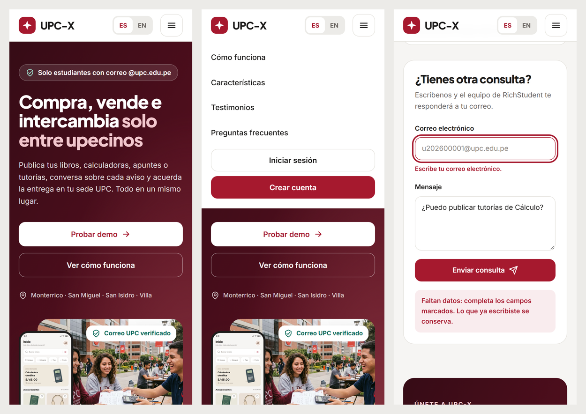
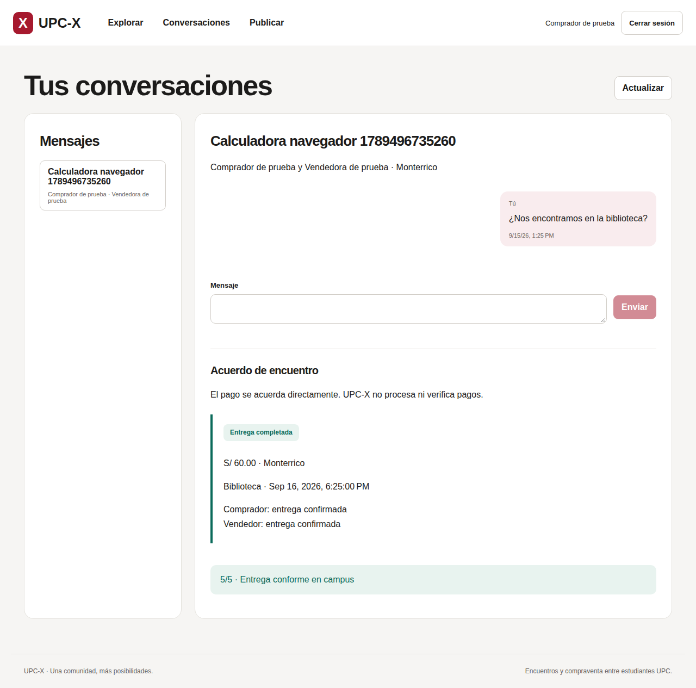
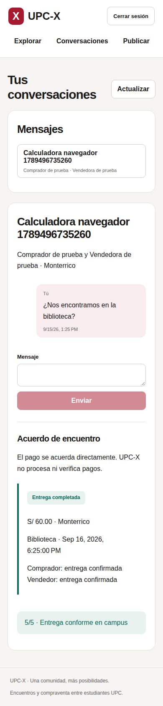

# Capítulo V: Product Implementation
En este capítulo se describe la implementación del producto <b>UPC-X</b> por parte de la startup <b>RichStudent</b>, abarcando la configuración del entorno de desarrollo, la gestión del código fuente, las convenciones de estilo, la configuración de despliegue y las evidencias de ejecución del Sprint #1, así como los acuerdos de servicio y los enlaces a los productos desplegados.

## 5.1. Software Configuration Management
El equipo ha establecido el siguiente conjunto de herramientas para asegurar una configuración de entorno de desarrollo unificada, que permita una colaboración efectiva y el cumplimiento de los objetivos del proyecto. Esas herramientas cubren las diferentes actividades del ciclo de vida del producto digital.

### 5.1.1. Software Development Environment Configuration
#### Project Management
* **Discord** - plataforma para la comunicación en tiempo real entre los miembros del equipo. A través de canales organizados por temas y funciones se realizan reuniones, coordinación diaria y soporte instantáneo durante todo el desarrollo. Ruta de referencia: https://discord.com
#### Requirements Management
* **GitHub Issues** - usado para registrar, etiquetar y dar trazabilidad a los requerimientos funcionales y no funcionales junto con los bugs y mejoras detectadas durante el desarrollo. Ruta de referencia: https://github.com
#### Product UX/UI Design
* **Figma** - herramienta principal para el diseño de interfaces gráficas (UI) y la experiencia de usuario (UX). Permite que varios miembros colaboren simultáneamente en prototipos interactivos, estructuras visuales y pruebas de diseño. Archivos del proyecto: [UPC-X · Diseño y prototipos](https://www.figma.com/design/QGamFXN1K46XmRBrmCYpq9/UPC-X-Diseno-y-prototipos) (aplicaciones móvil y web) y [UPC-X · Landing Page](https://www.figma.com/design/tBrjbqyscC9ipYJxQLYy12/UPC-X-Landing-Page). Ruta de referencia: https://www.figma.com
* **UXPressia** - complementa el trabajo de UX al permitir la creación y documentación de User Personas, Customer Journey Maps y Empathy Maps, alineando las decisiones de diseño con las necesidades del usuario. Ruta de referencia: https://uxpressia.com
* **Trello** - facilita la organización visual de tareas, ideas y flujos de trabajo mediante tableros, listas y tarjetas. Permite priorizar funcionalidades centradas en el usuario y dar seguimiento al progreso. Ruta de referencia: https://trello.com
#### Software Development
* **Landing Page:** <b>HTML5, CSS3 y JavaScript</b> sin frameworks, editada en WebStorm y desplegada en GitHub Pages. Es la vitrina comercial del producto y el primer entregable del Sprint #1. Ruta de referencia: https://www.jetbrains.com/webstorm
* **Web Frontend (Aplicación Web):** <b>Angular</b> sobre VS Code, conforme a los wireframes y prototipos definidos en §4.6 y §4.7. Permite a estudiantes verificados explorar y publicar avisos, conversar, acordar encuentros en campus y confirmar entregas entre pares. Ruta de referencia: https://angular.dev
* **Mobile App:** <b>Flutter 3.47.4 (Dart 3.13.3)</b> sobre <b>Android Studio</b>. Implementa el acceso institucional, la publicación de avisos y la coordinación de compraventa del primer incremento, con la paleta y la tipografía definidas en §4.1. Los pagos se acuerdan fuera de UPC-X. Ruta de referencia: https://flutter.dev
* **Backend / API** — <b>Spring Boot (Java 21)</b> sobre IntelliJ IDEA. La API aplica autenticación, permisos por participante y persistencia transaccional. Ruta de referencia: https://www.jetbrains.com/idea
* **Servicios de desarrollo** — Docker Compose con PostgreSQL y Mailpit, que captura los correos de verificación sin enviarlos a destinatarios reales. La web y la aplicación móvil consumen la misma API Spring Boot. Ruta de referencia: https://www.docker.com
* **Base de datos** — PostgreSQL 17 con migraciones versionadas mediante Flyway y acceso transaccional desde Spring. El despliegue previsto utiliza Neon, un servicio PostgreSQL cloud serverless. Ruta de referencia: https://neon.tech
#### Software Testing
* **JUnit y Spring Boot Test** — pruebas de la API, ejecutadas con `./mvnw verify`. Ruta de referencia: https://junit.org
* **Playwright** — pruebas end-to-end de la aplicación web en navegador. Ruta de referencia: https://playwright.dev
* **flutter_test** — pruebas de la aplicación móvil y de su cliente HTTP. Ruta de referencia: https://docs.flutter.dev/testing
* **Bruno** — colección de solicitudes para probar manualmente los endpoints de la API. Ruta de referencia: https://www.usebruno.com
* **GitHub Actions** — integración continua: compila y prueba cada repositorio de código en cada push y pull request. Ruta de referencia: https://github.com/features/actions
#### Software Deployment
* **Git** — sistema de control de versiones para gestionar el historial de cambios. Ruta de referencia: https://git-scm.com
* **GitKraken** — cliente Git con interfaz gráfica para gestionar visualmente ramas, commits, conflictos y flujos de trabajo. Ruta de referencia: https://www.gitkraken.com
* **GitHub Pages** — hosting estático de la Landing Page. Ruta de referencia: https://pages.github.com
* **Render** — plataforma prevista para la aplicación Angular y la API. Neon alojará PostgreSQL; Cloudflare R2, las imágenes, y Resend, el correo transaccional. Ruta de referencia: https://render.com
#### Software Documentation
* **GitHub** — repositorio remoto centralizado, revisiones por Pull Request, registro de incidencias y documentación viva del proyecto. Ruta de referencia: https://github.com
* **Swagger / OpenAPI** — para documentar los endpoints del backend RESTful. Ruta de referencia: https://swagger.io/specification

### 5.1.2. Source Code Management

El control de versiones se realiza con Git y GitHub en la organización [UPC-X](https://github.com/UPC-X). Cada producto tiene su propio repositorio:

| Producto | Repositorio |
| :--- | :--- |
| Informe del proyecto | https://github.com/UPC-X/report-UPC |
| Landing Page | https://github.com/UPC-X/Landing-Page |
| Web Services (API RESTful) | https://github.com/UPC-X/upcx-api |
| Frontend Web Application | https://github.com/UPC-X/upcx-web |
| Native Mobile Application | https://github.com/UPC-X/upcx-mobile |

El repositorio de Web Services contiene el proyecto Spring Boot junto con sus pruebas, el contrato OpenAPI y la colección de Bruno.

El flujo de trabajo aplica GitFlow, según el modelo de ramas propuesto por Vincent Driessen:

* **`main`**: versiones estables. En la landing, es la rama que publica GitHub Pages.
* **`develop`**: integración de las funcionalidades terminadas antes de pasar a `main`.
* **`feature/<descripcion-breve>`**: una rama por funcionalidad, creada desde `develop`, por ejemplo `feature/chapter5`, `feature/landing-redesign` o `feature/mobile-design-alignment`.
* **`release/<version>`**: preparación de una versión antes de integrarla en `main` y `develop`, por ejemplo `release/1.0.0`.
* **`hotfix/<descripcion-breve>`**: correcciones urgentes sobre `main`, que se integran también en `develop`.

Las versiones siguen Semantic Versioning 2.0.0 (`MAJOR.MINOR.PATCH`): `MAJOR` aumenta con cambios incompatibles, `MINOR` con funcionalidades compatibles y `PATCH` con correcciones. Los mensajes de commit siguen Conventional Commits, con los tipos `feat`, `fix`, `docs`, `test`, `ci`, `refactor` y `chore` y un ámbito opcional; por ejemplo, `feat: configurar el correo de soporte del formulario de contacto` o `docs(chapter5): redactar el acuerdo SaaS`.

En los repositorios de código, el workflow `CI` de GitHub Actions se ejecuta en cada push a `main` o `develop` y en cada pull request. Sus jobs `api-checks`, `web-checks` y `mobile-checks` compilan el proyecto y ejecutan sus pruebas antes de integrar un cambio.

### 5.1.3. Source Code Style Guide & Conventions

#### HTML
* **Cierre de etiquetas:** Cerrar todos los elementos de forma explícita.
* **Sintaxis:** Usar minúsculas para nombres de elementos y atributos para mantener la legibilidad.
* **Atributos:** Usar comillas dobles cuando los atributos contengan espacios.
* **Accesibilidad y dimensiones:** Especificar `alt`, `width` y `height` en imágenes: ``.

#### CSS
* **Nombres de clases:** Utilizar nombres breves y autodescriptivos.
* **Nomenclatura:** Separar nombres de clases e IDs con guiones (`#video-id`, `.hero-shadow`).
* **Valores nulos:** No especificar la unidad de medida cuando el valor sea `0`.
* **Estructura:** Separar declaraciones y selectores en líneas distintas para favorecer la legibilidad.

#### JavaScript (Landing)
* **Guía de estilo:** Se siguen las recomendaciones de [Airbnb JavaScript Style Guide](https://github.com/airbnb/javascript).
* **Nomenclatura:**
  * `camelCase` para variables y funciones.
  * `PascalCase` para clases.
  * `kebab-case` para nombres de archivos.
* **Framework / UI:** La landing no usa frameworks. El layout se resuelve con CSS Grid y Flexbox, y los textos en inglés se cargan desde `js/i18n.js`; el español está escrito en el HTML.

#### TypeScript (Angular Web App)
* **Guía de estilo:** Se sigue la [Angular Style Guide](https://angular.dev/style-guide) oficial.
* **Nomenclatura:**
  * `kebab-case` para selectores y nombres de archivos.
  * `PascalCase` para clases y componentes.
  * `camelCase` para identificadores.
* **Linter:** Configuración recomendada mediante `@angular-eslint`.

#### Dart (Flutter)
* **Guía de estilo:** Se sigue la [Effective Dart Style Guide](https://dart.dev/effective-dart) de la documentación oficial.
* **Nomenclatura:**
  * `PascalCase` para nombres de clases.
  * `camelCase` para identificadores.
  * `snake_case` para nombres de archivos y carpetas.
* **Linter:** Paquete `flutter_lints` activado por defecto.

#### Java (Spring Boot)
* **Guía de estilo:** Convenciones estándar de Java, con nombres descriptivos en inglés y formato consistente.
* **Formato:** Indentación estándar de 4 espacios.
* **Nomenclatura:**
  * `PascalCase` para nombres de clases.
  * `camelCase` para métodos y variables.
  * Minúsculas continuas para nombres de paquetes.

#### Gherkin
* **Uso:** Lenguaje específico de dominio (DSL) para Behavior-Driven Development (BDD).
* **Estructura:** Uso de saltos de línea para separar escenarios y las palabras clave `Given`, `When`, `Then` y `And` para estructurar cada criterio de aceptación.

### 5.1.4. Software Deployment Configuration
El despliegue del producto diferencia los componentes estáticos de los servicios backend.

#### Landing Page (GitHub Pages)
GitHub Pages publica la rama `main` del repositorio `UPC-X/Landing-Page` desde su carpeta raíz.

1. Los archivos públicos (`index.html`, `terminos.html` y las carpetas `css/`, `js/` y `assets/`) se mantienen en la raíz del repositorio.
2. Los cambios se desarrollan en una rama `feature/*` y se integran en `main`.
3. En **Settings > Pages**, la fuente de publicación es la rama **main** y la carpeta **/ (root)**.
4. GitHub Pages publica el sitio en [https://upc-x.github.io/Landing-Page/](https://upc-x.github.io/Landing-Page/).

#### Web Services (API RESTful)
1. La API se compila y prueba con Maven (`./mvnw verify`).
2. El `Dockerfile` genera una imagen en dos etapas basada en Eclipse Temurin 21, que se ejecuta con un usuario sin privilegios y expone el puerto 8080.
3. La configuración se recibe por variables de entorno: conexión a PostgreSQL (`DB_URL`, `DB_USER`, `DB_PASSWORD`), servidor de correo (`MAIL_HOST`, `MAIL_PORT`, `MAIL_USER`, `MAIL_PASSWORD`, `MAIL_FROM`), origen permitido de la aplicación web (`WEB_ORIGIN`), cookies seguras (`COOKIE_SECURE`), puerto (`PORT`) y directorio de imágenes (`UPLOAD_DIR`).
4. Flyway aplica las migraciones pendientes de la base de datos al iniciar la aplicación.
5. En desarrollo, Docker Compose levanta PostgreSQL, Mailpit y, opcionalmente, la propia API. El despliegue previsto ejecuta la imagen en Render, con PostgreSQL en Neon y el correo en Resend.

#### Frontend Web Application
1. La aplicación se compila con `npm run build`, que genera los archivos estáticos de producción.
2. En desarrollo, `npm start` sirve la aplicación y redirige las solicitudes `/api` a la API mediante `proxy.conf.json`, de modo que web y API comparten origen.
3. En el despliegue previsto, la web y la API se publican bajo el mismo sitio HTTPS para conservar la cookie de sesión `SameSite=Lax`.

#### Native Mobile Application
1. La aplicación se compila con `flutter build apk`; la dirección de la API se define con `--dart-define=API_URL=<url>`.
2. El workflow `CI` del repositorio genera en cada ejecución un APK de depuración, disponible como artefacto `upcx-android-debug`.

## 5.2. Product Implementation & Deployment

### 5.2.1. Sprint Backlogs
#### Sprint 1
#### Sprint Planning Background
Dentro del framework Scrum, un Sprint representa un plazo fijo y reducido de tiempo en el que el equipo desarrolla todo el trabajo necesario para alcanzar el objetivo final del proyecto, denominado Product Goal. El Sprint #1 tiene como meta elaborar una landing page atractiva para UPC-X que capte la atención de los usuarios visitantes y comunique con claridad los principales beneficios ofrecidos por el producto.

| Campo | Detalle |
| :--- | :--- |
| **Date** | 2026-08-31 |
| **Time** | 11:00 PM |
| **Location** | Reunión virtual mediante Discord |
| **Prepared By** | Murillo, Mathias Javier |
| **Attendees** | Mathias Javier Murillo, Eduardo Jose Cossar Sanchez, Gilbert Alonso Huarcaya Matias, Luis Manuel Espinoza Navarrete, Manuel Alejandro Molina Vásquez |
| **Sprint N°1 Review Summary** | Primer sprint del proyecto; no existe revisión previa. |
| **Sprint N°1 Retrospective Summary** | Al ser el primer sprint no se cuenta con retrospectiva previa. La retroalimentación y oportunidades de mejora se evaluarán al cierre del sprint. |
| **Sprint Goal** | **Our focus is on delivering a functional and engaging landing page for UPC-X. We believe it delivers a clear value proposition and generates user interest and trust in potential customers. This will be confirmed when visitors can access the site and interact with all key landing-page sections (services overview, benefits, pricing, testimonials, CTA's and support) on both desktop and mobile devices.** |
| **Sprint N°1 Velocity** | 13 |
| **Sum of Story Points** | 13 |

#### Aspect Leaders and Collaboration (LACX)
Para mejorar la organización y la comunicación se elaboró la matriz Leadership and Collaboration Matrix (LACX), donde se define quién asume el rol de líder (L) y quiénes participan como colaboradores (C) en cada aspecto clave de la landing page.

| Team Member | Hero Section | Propuesta de Valor | Funcionalidades | Cómo Funciona | Testimonios | CTA Final |
| :--- | :---: | :---: | :---: | :---: | :---: | :---: |
| **Murillo, Mathias Javier** | **L** | C | C | C | C | **L** |
| **Cossar Sanchez, Eduardo Jose** | C | **L** | C | C | L | C |
| **Huarcaya Matias, Gilbert Alonso** | C | C | **L** | C | C | C |
| **Espinoza Navarrete, Luis Manuel** | C | C | C | **L** | C | C |
| **Molina Vásquez, Manuel Alejandro** | C | C | C | C | **L** | C |

### 5.2.2. Implemented Landing Page Evidence

La landing implementa el diseño de la sección 4.3 en `UPC-X/Landing-Page`: ocho bloques con la propuesta de valor, el problema, las características, el funcionamiento, testimonios, preguntas frecuentes con formulario de contacto, un llamado a la acción y el pie de página, además de la página `terminos.html` con términos, privacidad y normas de la comunidad. El selector ES/EN cambia textos, `lang` y metadatos, y recuerda la elección. **Crear cuenta** e **Iniciar sesión** abren el acceso del prototipo web y **Probar demo**, el prototipo móvil.

La landing se revisó en Microsoft Edge a 1440 px y a 390 px, sin desplazamiento horizontal ni errores de consola. Una prueba automatizada comprobó el idioma inicial y el recordado, el menú móvil, el destino de cada llamado a la acción, la validación del formulario sin perder el texto y los términos en ambos idiomas. El formulario valida los campos y abre la aplicación de correo del visitante con la consulta dirigida al correo de soporte del equipo; la landing no requiere un backend propio. El sitio se publica en GitHub Pages desde la rama `main`.

  <b>Landing Page de UPC-X — escritorio (1440 px)</b>

  

  <b>Navegador móvil (390 px): portada, menú y validación del formulario</b>

  

  <a href="https://upc-x.github.io/Landing-Page/">Acceder a la Landing Page de UPC-X</a> · <a href="https://github.com/UPC-X/Landing-Page">Repositorio</a> · <a href="https://www.figma.com/design/tBrjbqyscC9ipYJxQLYy12/UPC-X-Landing-Page">Diseño en Figma</a>

### 5.2.3. Implemented Frontend-Web Application Evidence

La aplicación web en Angular implementa el recorrido principal del primer incremento sobre la API Spring Boot: registro, verificación del correo institucional, publicación de un aviso con foto, conversación, acuerdo de encuentro, confirmación bilateral de la entrega y reseña. Una prueba end-to-end con Playwright recorre ese flujo con dos cuentas de prueba y comprueba que la vista a 390 px no presenta desbordamiento horizontal. Las pruebas unitarias y la compilación de producción se ejecutan en el workflow `CI` del repositorio. La ejecución mostrada corresponde al entorno de desarrollo, con la API y la base de datos en Docker.

  <b>Confirmación bilateral de la entrega — escritorio</b>

  

  <b>Confirmación bilateral de la entrega — navegador móvil (390 px)</b>

  

  <a href="https://github.com/UPC-X/upcx-web">Repositorio de la aplicación web</a>

### 5.2.4. Acuerdo de Servicio - SaaS

El acuerdo de servicio de UPC-X se publica en la sección de términos de la landing: [Términos, privacidad y normas de la comunidad](https://upc-x.github.io/Landing-Page/terminos.html). La página está disponible en español y en inglés, y cada bloque cuenta con un enlace directo desde el pie de página de la landing.

| Bloque | Qué establece |
|---|---|
| Términos y condiciones | UPC-X es un marketplace web y móvil de estudiantes UPC, desarrollado como proyecto académico y sin vínculo oficial con la universidad. Solo pueden registrarse quienes verifican un correo `@upc.edu.pe`. Quien publica responde por la veracidad del aviso. La plataforma no procesa pagos: el pago se acuerda fuera de UPC-X y una constancia compartida solo se conserva como evidencia de la conversación. Las entregas se coordinan en una sede UPC de Lima y se completan cuando ambas personas confirman. Las reseñas exigen una entrega confirmada por las dos partes, los reportes son revisados por el equipo y UPC-X no es parte de las transacciones. |
| Política de privacidad | Enumera los datos tratados, su finalidad, quién los ve y su conservación. Reconoce los derechos de acceso, rectificación, cancelación y oposición conforme a la Ley N.º 29733, Ley de Protección de Datos Personales del Perú, que se ejercen por el formulario de contacto. No se solicita DNI y no se ceden datos con fines publicitarios. |
| Normas de la comunidad | Siete reglas de trato respetuoso, avisos prohibidos, entregas en lugares concurridos del campus, pagos, confirmación honesta de la entrega y reporte de incumplimientos. |

El acuerdo describe el funcionamiento del servicio durante el piloto, que no tiene costo para los estudiantes, y no establece un SLA ni una disponibilidad garantizada. Su redacción usa títulos jerárquicos, lenguaje directo y enlaces internos para facilitar la lectura y la navegación con teclado; el tratamiento de datos personales se alinea con la Ley N.º 29733.

### 5.2.5. Implemented Native-Mobile Application Evidence

La aplicación móvil `upcx-mobile`, desarrollada en Flutter, consume la misma API que la aplicación web. Se organiza en tres destinos principales —Explorar, Publicar y Conversaciones— y aplica la paleta y la tipografía definidas en la sección 4.1. El primer incremento implementa:

- **Cuenta:** registro con correo `@upc.edu.pe`, verificación con un código de seis dígitos y reenvío, inicio de sesión, recuperación de contraseña y cierre de sesión. La contraseña tiene al menos 12 caracteres y la sesión se conserva en el almacenamiento seguro del dispositivo.
- **Explorar:** búsqueda por texto, sede y categoría; detalle del aviso y contacto con el vendedor cuando el aviso está disponible y no es propio.
- **Publicar:** aviso con una foto JPEG o PNG, previsualización y confirmación.
- **Conversaciones:** mensajes, propuesta de encuentro con precio, punto del campus y fecha, aceptación, confirmación de la entrega por cada participante, cancelación y reseña tras el cierre bilateral. La conversación abierta se actualiza cada cinco segundos.
- **Pagos:** la interfaz indica que el pago se acuerda fuera de UPC-X.

Favoritos, evidencia de pago, perfil público y reportes forman parte de los siguientes incrementos.

El código se verifica con `flutter analyze` y con pruebas del cliente HTTP mediante `flutter test`. Una prueba de humo (`tool/api_smoke.dart`) ejecuta contra la API el inicio de sesión, la consulta de una compra completada, el envío de un mensaje y el cierre de sesión. El workflow `CI` repite el formato, el análisis y las pruebas, y compila un APK de depuración en cada push y pull request. El APK se instaló mediante depuración USB en un Samsung Galaxy S25 Ultra (SM-S938B), donde la aplicación inicia en la pantalla de acceso con la identidad visual de UPC-X.

  <a href="https://github.com/UPC-X/upcx-mobile">Repositorio de la aplicación móvil</a>

### 5.2.6. Implemented RESTful API and/or Serverless Backend Evidence

La API RESTful de UPC-X está implementada con Spring Boot y Java 21. Usa PostgreSQL 17 con migraciones Flyway y accede a los datos mediante Spring JDBC, con bloqueos explícitos dentro de transacciones. Atiende a los dos clientes: la aplicación web se autentica con una cookie HttpOnly y la aplicación móvil, con un token bearer.

Las pruebas (`./mvnw verify` y una prueba de humo de extremo a extremo) cubren la verificación institucional, las sesiones web y móvil, los permisos entre participantes, la propiedad de las fotos, los mensajes, la aceptación del encuentro, las confirmaciones bilaterales, la reseña única, las reservas concurrentes, la cancelación, la protección CSRF y la recuperación de contraseña. En el entorno de desarrollo, Mailpit captura los códigos de verificación sin enviarlos a destinatarios reales. La API se distribuye también como imagen Docker, que se ejecuta con un usuario sin privilegios. El job `api-checks` del workflow `CI` ejecuta estas verificaciones con PostgreSQL y Mailpit en cada push y pull request.

  <a href="https://github.com/UPC-X/upcx-api">Repositorio de la API</a>

### 5.2.7. RESTful API documentation

El contrato de la API está documentado con OpenAPI 3.0.3 en `docs/openapi.json` del repositorio `upcx-api`, y la colección de Bruno en `bruno/` permite probar las solicitudes. Todas las rutas parten de `/api`. Las operaciones de escritura incluyen el encabezado `X-UPCX-Client` (`web` o `mobile`), que determina si la sesión se entrega como cookie o como token. Las entradas usan `camelCase` y las respuestas, `snake_case`.

| Método | Endpoint | Descripción |
| :--- | :--- | :--- |
| POST | `/api/auth/register` | Registra una cuenta con correo `@upc.edu.pe` y envía el código de verificación. |
| POST | `/api/auth/verify` | Verifica el correo con el código de seis dígitos. |
| POST | `/api/auth/resend` | Reenvía el código, con una espera mínima de un minuto. |
| POST | `/api/auth/login` | Inicia sesión: cookie para la web o token para la aplicación móvil. |
| POST | `/api/auth/forgot` | Solicita la recuperación de contraseña, con una respuesta genérica. |
| POST | `/api/auth/reset` | Cambia la contraseña y revoca las sesiones activas. |
| GET | `/api/auth/me` | Devuelve la identidad de la sesión actual. |
| POST | `/api/auth/logout` | Revoca la sesión actual. |
| GET | `/api/listings` | Consulta hasta 100 avisos recientes, con filtros `q`, `campus` y `category`. |
| POST | `/api/listings` | Publica un aviso con una imagen propia. |
| POST | `/api/listings/{id}/contact` | Abre la conversación con el vendedor del aviso. |
| GET | `/api/conversations` | Lista las conversaciones del estudiante. |
| GET | `/api/conversations/{id}` | Devuelve los mensajes, el acuerdo y las reseñas de una conversación propia. |
| POST | `/api/conversations/{id}/messages` | Envía un mensaje. |
| POST | `/api/conversations/{id}/deal` | Propone un encuentro futuro en el campus del aviso. |
| POST | `/api/conversations/{id}/deal/accept` | Registra la aceptación del participante y reserva el aviso cuando ambos aceptan. |
| POST | `/api/conversations/{id}/deal/confirm` | Confirma la entrega del participante actual. |
| POST | `/api/conversations/{id}/deal/cancel` | Cancela el acuerdo y libera la reserva si corresponde. |
| POST | `/api/conversations/{id}/reviews` | Registra la reseña después del cierre bilateral. |
| POST | `/api/images` | Sube una imagen JPEG o PNG de hasta 5 MB y devuelve su identificador. |
| GET | `/api/images/{id}` | Devuelve la imagen recodificada en PNG. |

### 5.2.8. Team Collaboration Insights

La landing del Sprint 1 se organizó con la matriz LACX de la sección 5.2.1, que asignó un líder y colaboradores a cada bloque. El informe y la landing se trabajan en ramas `feature/*` que se integran en `develop` y luego en `main`. La implementación inicial de la API, la aplicación web y la aplicación móvil estuvo a cargo de Luis Manuel Espinoza Navarrete, siguiendo el flujo GitFlow descrito en la sección 5.1.2. En los repositorios de código, cada push y pull request ejecuta el workflow de integración continua antes de integrar los cambios.

## 5.3. Video About-the-Product

